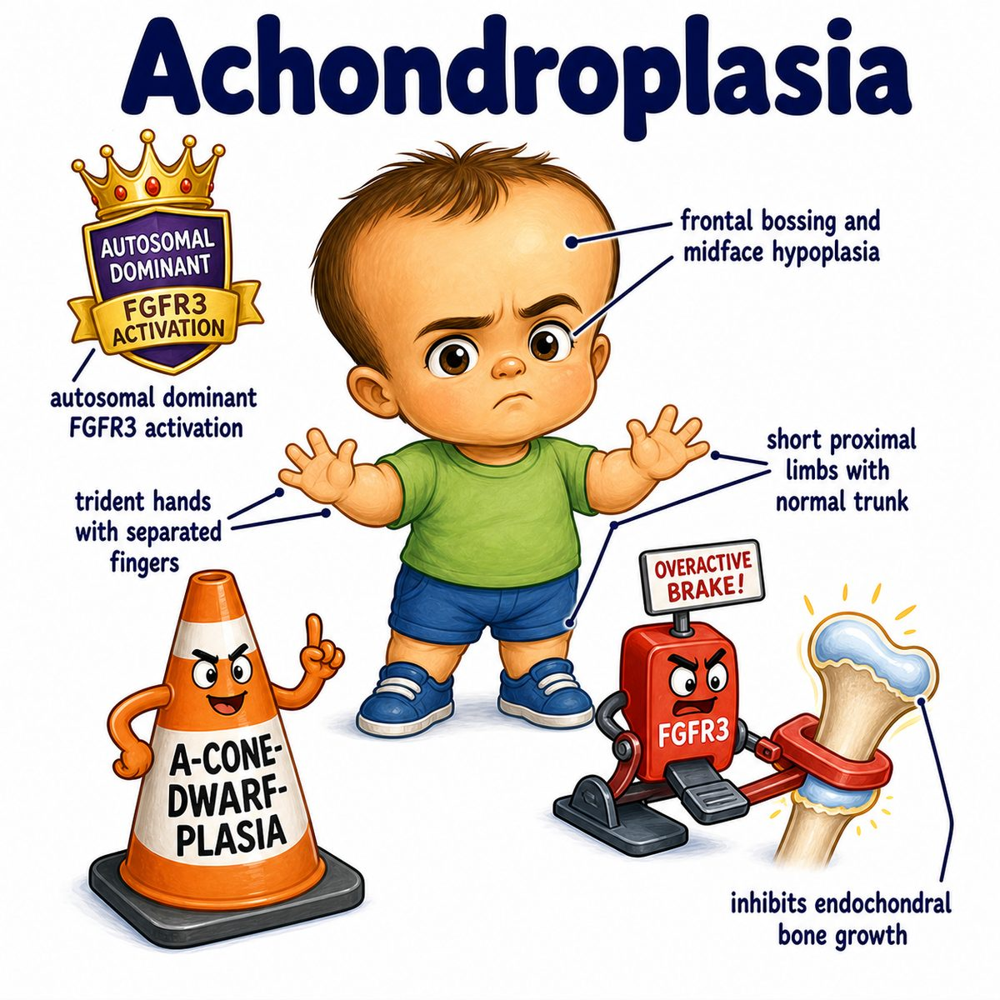

# Achondroplasia

Achondroplasia is the most common cause of disproportionate short stature.

The key problem is impaired endochondral ossification (bone formation through a cartilage model), especially in long bones.

So the classic body pattern is:

* short limbs
* relatively normal trunk
* short upper arms/thighs = rhizomelic shortening (proximal limb shortening)
* large head = macrocephaly (large head size)
* frontal bossing (prominent forehead)
* trident hand (extra separation between middle and ring fingers)

---

### Core cause

Achondroplasia is due to a gain-of-function mutation in:

* FGFR3 (fibroblast growth factor receptor 3)

FGFR3 normally acts like a brake on cartilage growth.

In achondroplasia, the brake is overactive.

So cartilage cells in the growth plate do not proliferate normally, which means long bones cannot lengthen properly.

---

### Why the skull is big but limbs are short

This is the classic Step 1 reasoning point:

* long bones grow by endochondral ossification (cartilage gets replaced by bone)
* much of the skull vault grows by intramembranous ossification (bone forms directly without a cartilage model)

So:

* limbs are very affected
* skull vault is relatively spared

That is why patients can have short limbs with a relatively large head.

---

### Inheritance

Achondroplasia is usually:

* AD (autosomal dominant)

But most cases are new mutations, meaning neither parent has to be affected.

Advanced paternal age increases risk because more sperm cell divisions means more chance for new mutations.

---

## One-line intuition

Achondroplasia = overactive FGFR3 brake on growth plates, causing poor long-bone lengthening.

---

## Pearl 🔥

Achondroplasia affects endochondral ossification, not intramembranous ossification — that is why long bones are short but the skull can be relatively large.