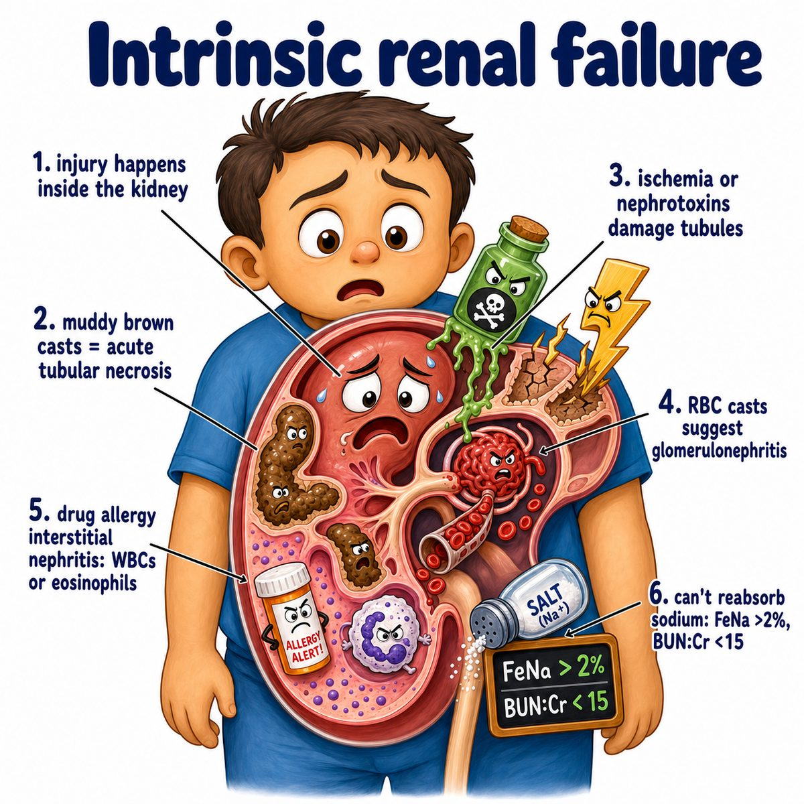
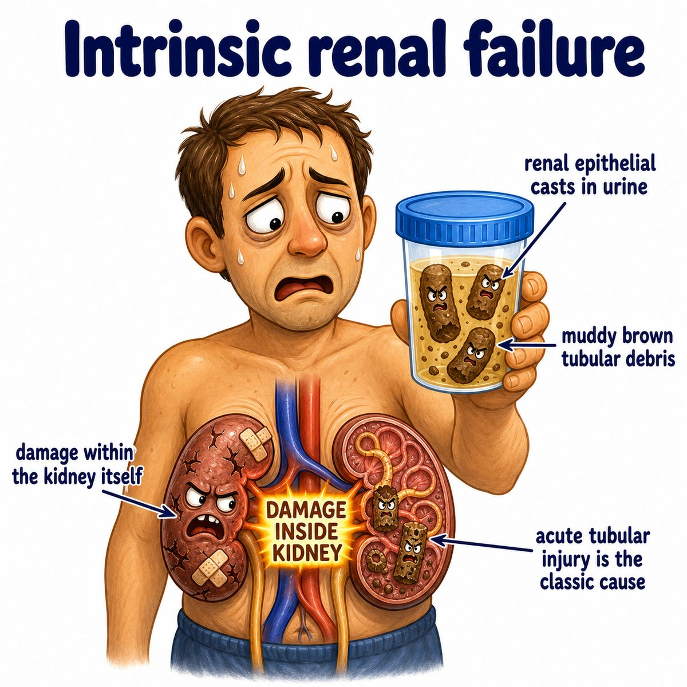

# Acute kidney injury

Acute kidney injury, or **AKI (acute kidney injury)**, means a sudden drop in kidney function.

Basically:

* kidneys suddenly filter less blood
* creatinine rises
* urine output may drop
* waste, acid, potassium, and fluid can build up

Creatinine is a blood marker of kidney filtration.

---

### Core idea

The kidney's job is to filter blood through nephrons.

Nephrons are the tiny filtering units of the kidney.

In **AKI (acute kidney injury)**, something suddenly makes the nephron filtration system fail.

---

### Big 3 causes

Think:

* **prerenal:** problem before the kidney
* **intrinsic renal:** problem inside the kidney
* **postrenal:** problem after the kidney

---

### Prerenal AKI

This is decreased blood flow to the kidney.

Examples:

* dehydration
* blood loss
* heart failure
* shock

Why kidney function drops:

Less blood reaches the glomerulus, so less blood gets filtered.

Glomerulus = capillary tuft where filtration starts.

The kidney tissue is not dead yet, so this can reverse quickly if perfusion improves.

---

### Intrinsic AKI

This means the kidney itself is damaged.

Most classic Step 1 example:

* acute tubular necrosis

**ATN (acute tubular necrosis)** = death/injury of tubular epithelial cells.

Why this causes AKI:

The tubules normally reabsorb and secrete substances after filtration. If tubular cells are injured, filtrate leaks/backflows, tubules clog with dead cells, and kidney filtration worsens.

Classic clue:

* muddy brown granular casts

Casts = tube-shaped material formed inside renal tubules and seen in urine.

---

### Postrenal AKI

This is obstruction after urine is made.

Examples:

* kidney stone
* benign prostatic hyperplasia
* tumor compressing urinary tract

**BPH (benign prostatic hyperplasia)** = noncancerous enlargement of the prostate.

Why kidney function drops:

Urine cannot drain, so pressure backs up into the kidney and opposes filtration.

---

### What builds up?

Because filtration drops:

* BUN rises
* creatinine rises
* potassium rises
* acid rises
* fluid can build up

**BUN (blood urea nitrogen)** = urea waste level in blood.

So AKI can cause:

* hyperkalemia
* metabolic acidosis
* edema/pulmonary edema
* uremic symptoms

Hyperkalemia = high potassium.

Metabolic acidosis = too much acid in the blood from a metabolic/kidney problem.

Uremia = symptoms from buildup of nitrogenous waste products.

---

## One-line intuition

AKI is the kidney suddenly failing to filter because blood flow is low, the kidney is damaged, or urine is blocked.

---

## Pearl 🔥

Prerenal AKI usually has **BUN:Cr > 20:1** because low flow makes the kidney reabsorb more urea with water, while creatinine is not reabsorbed much.

**Cr (creatinine)** = blood marker used to estimate kidney filtration.