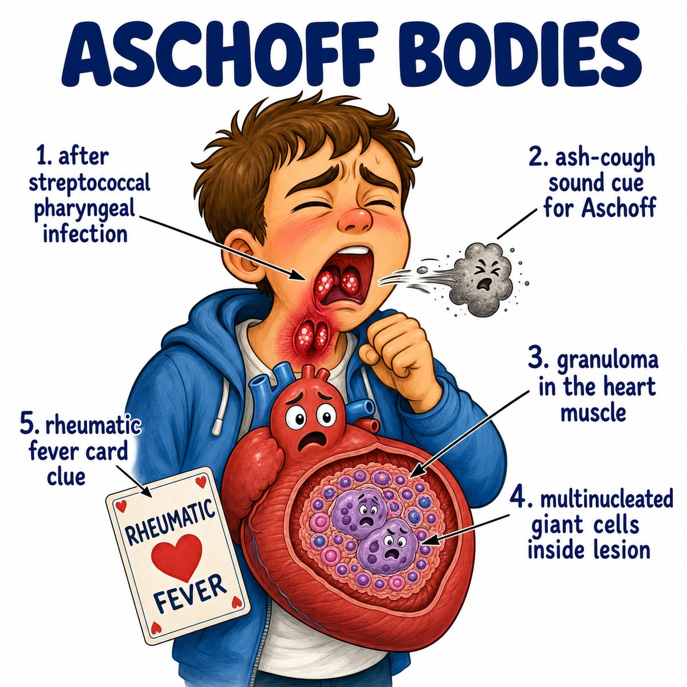

# Acute rheumatic fever

Acute rheumatic fever is an autoimmune inflammatory disease that happens after untreated Group A Streptococcus pharyngitis (strep throat infection caused by Streptococcus pyogenes).

The key idea:

* strep throat happens first
* the immune system makes antibodies against strep
* those antibodies accidentally attack human tissue

This is called molecular mimicry (immune cross-reaction because a microbe looks similar to human tissue).

---

### What gets attacked?

Main targets:

* heart
* joints
* skin
* brain

Think:

> strep throat triggers immune confusion, and the immune system starts inflaming the heart, joints, skin, and brain.

---

### Classic findings

Use Jones criteria (diagnostic criteria for acute rheumatic fever).

Major findings:

* migratory polyarthritis (joint inflammation that moves from joint to joint)
* carditis (heart inflammation)
* Sydenham chorea (involuntary dance-like movements)
* erythema marginatum (non-itchy ring-shaped rash)
* subcutaneous nodules (firm bumps under the skin)

Minor findings:

* fever
* arthralgia (joint pain without clear inflammation)
* elevated ESR/CRP (erythrocyte sedimentation rate/C-reactive protein; inflammation markers)
* prolonged PR interval on ECG (electrocardiogram; delayed AV node conduction)

---

### Why the heart matters so much

Acute rheumatic fever can cause pancarditis (inflammation of all 3 heart layers):

* endocardium (inner heart lining/valves)
* myocardium (heart muscle)
* pericardium (outer heart sac)

The valves are the big long-term issue.

Early on, valve inflammation can cause mitral regurgitation (leaky mitral valve).

Years later, scarring can cause mitral stenosis (narrow mitral valve).

So:

> acute inflammation = leaky valve  
> chronic scarring = narrow valve

---

### One-line intuition

Acute rheumatic fever is a delayed immune reaction after strep throat where anti-strep antibodies accidentally attack the heart, joints, skin, and brain.

---

## Pearl 🔥

Rheumatic fever follows strep throat, not skin infection.

Post-strep glomerulonephritis (kidney inflammation after strep) can follow throat or skin infection, but acute rheumatic fever classically follows pharyngitis (throat infection).