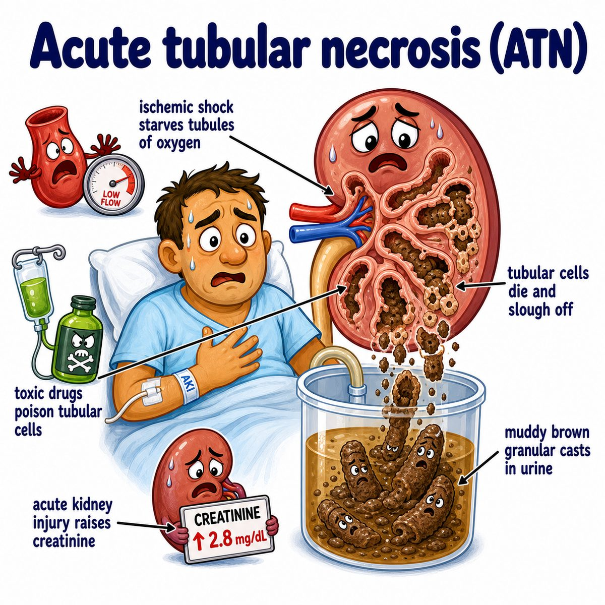

# Acute tubular necrosis

### Core idea

Acute tubular necrosis (ATN) = acute kidney injury (AKI, sudden drop in kidney function) caused by damage/death of renal tubular epithelial cells.

The problem is mainly in the tubules, not the glomerulus.

So think:

> bad blood flow or toxins injure tubule cells -> tubules cannot reabsorb normally -> dead cells slough off -> muddy brown casts.

---

### Main causes

* **Ischemia** (low oxygen/blood flow): shock, sepsis, severe hypotension, hemorrhage
* **Nephrotoxins** (kidney-toxic substances): aminoglycosides, cisplatin, radiocontrast, myoglobin from rhabdomyolysis, hemoglobin from hemolysis

Ischemia classically injures the proximal tubule and thick ascending limb because they use lots of ATP (adenosine triphosphate, cell energy).

---

### Why the findings happen

* **Muddy brown granular casts:** injured tubular cells slough into the lumen and clump with protein
* **FeNa (fractional excretion of sodium) > 2%:** damaged tubules cannot reabsorb sodium well, so sodium spills into urine
* **BUN:Cr (blood urea nitrogen to creatinine ratio) < 15:** tubules cannot reabsorb urea efficiently
* **Oliguria sometimes:** tubular debris blocks flow and filtrate can leak backward through injured epithelium

Contrast with prerenal azotemia (kidney hypoperfusion before structural damage):

* tubules still work
* sodium is avidly reabsorbed
* FeNa is low

---

## One-line intuition

ATN is when shock or toxins damage the kidney tubules, so the tubules lose reabsorptive function and shed muddy brown casts into the urine.

---

## Pearl 🔥

ATN is an **intrinsic renal** cause of AKI with **muddy brown casts**, **FeNa > 2%**, and **BUN:Cr < 15**; prerenal AKI has **FeNa < 1%** and **BUN:Cr > 20** because the tubules are still intact and trying to conserve volume.