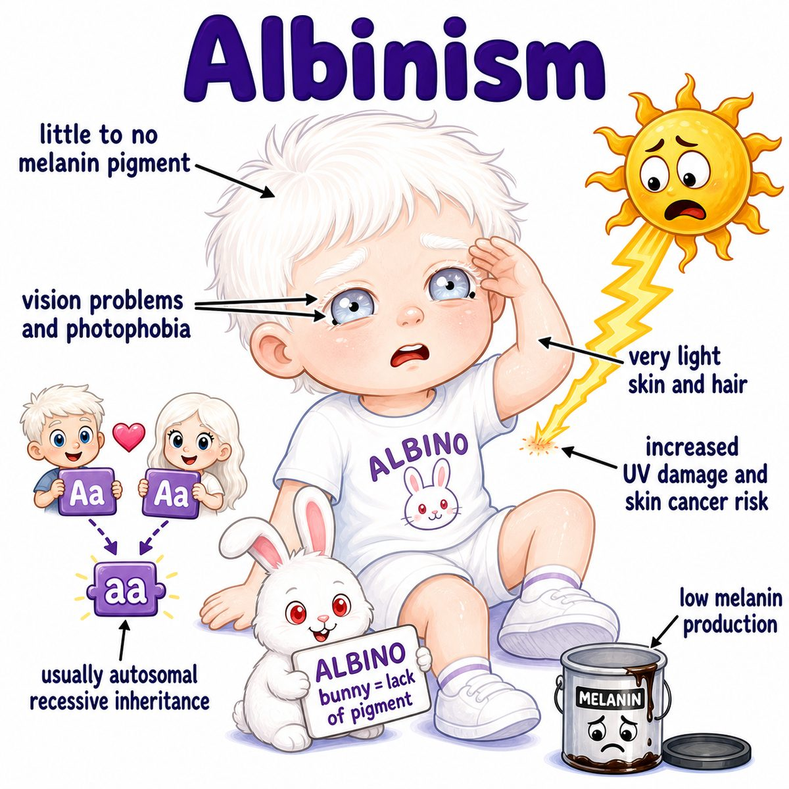

# Albinism

### Core idea

Albinism = inherited decreased or absent melanin production.

Melanin is the pigment that gives color to:

* skin
* hair
* iris/retina of the eye

So albinism causes hypopigmentation (less pigment) plus eye problems.

---

### Main types

* **OCA (oculocutaneous albinism):** affects eyes + skin + hair
* **OA (ocular albinism):** mainly affects the eyes

Most OCA is **AR (autosomal recessive)**, meaning both gene copies need to be affected.

---

### Why the findings happen

Melanin synthesis depends on tyrosinase, an enzyme that helps convert tyrosine into melanin.

If tyrosinase or melanosome function is abnormal:

* less melanin in skin/hair -> pale skin and light hair
* less melanin in iris -> photophobia (light sensitivity), because light scatters through the iris
* less retinal pigment -> abnormal fovea development
* abnormal optic nerve routing -> poor depth perception/strabismus

The key eye finding is **foveal hypoplasia**.

Break it down:

* fovea = central retina for sharp vision
* hypoplasia = underdevelopment

So foveal hypoplasia means the sharp-vision center of the retina does not fully develop.

---

### Classic eye findings

* nystagmus (involuntary rhythmic eye movements)
* decreased visual acuity (reduced sharpness of vision)
* photophobia (light sensitivity)
* iris transillumination (light passes through a poorly pigmented iris)
* foveal hypoplasia
* strabismus (eye misalignment)

---

## One-line intuition

Albinism is not just "pale skin" -- it is defective melanin production, and melanin is also needed for normal eye/retina development.

---

## Pearl

HY Step 1 association: **Hermansky-Pudlak syndrome** = albinism + bleeding tendency due to platelet dense granule defect.