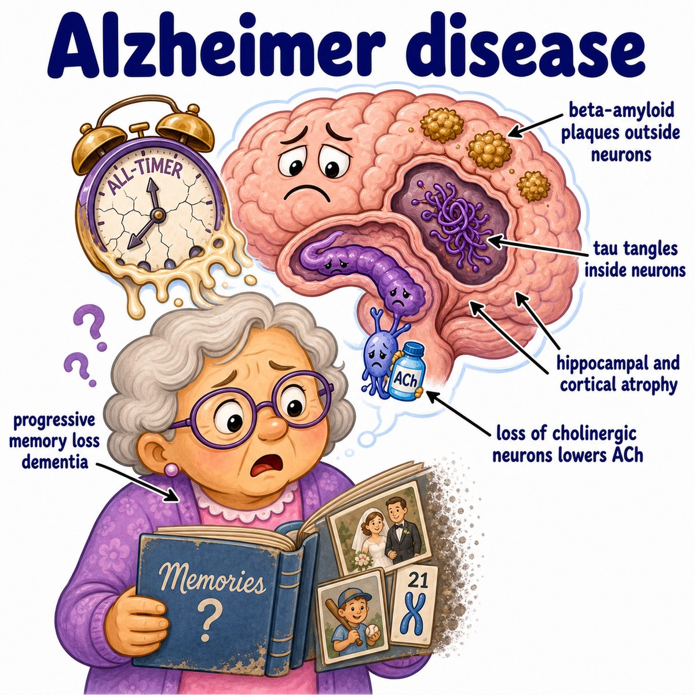
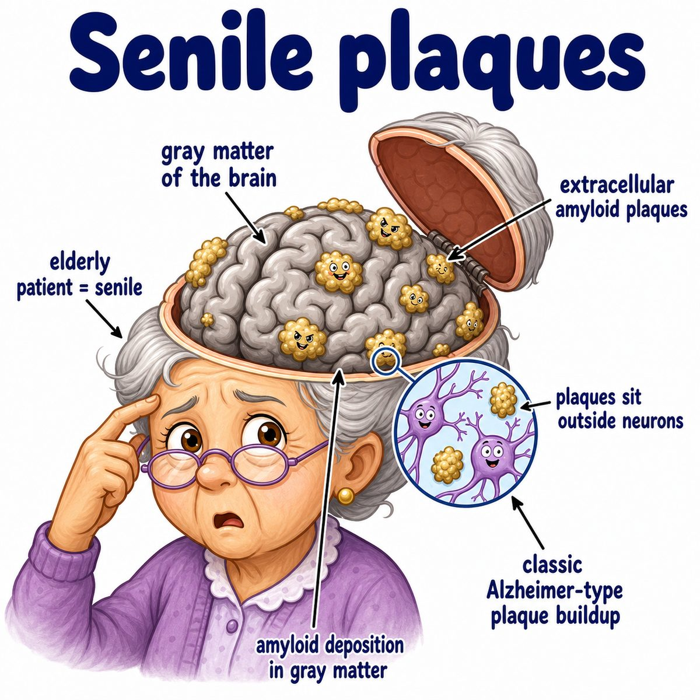
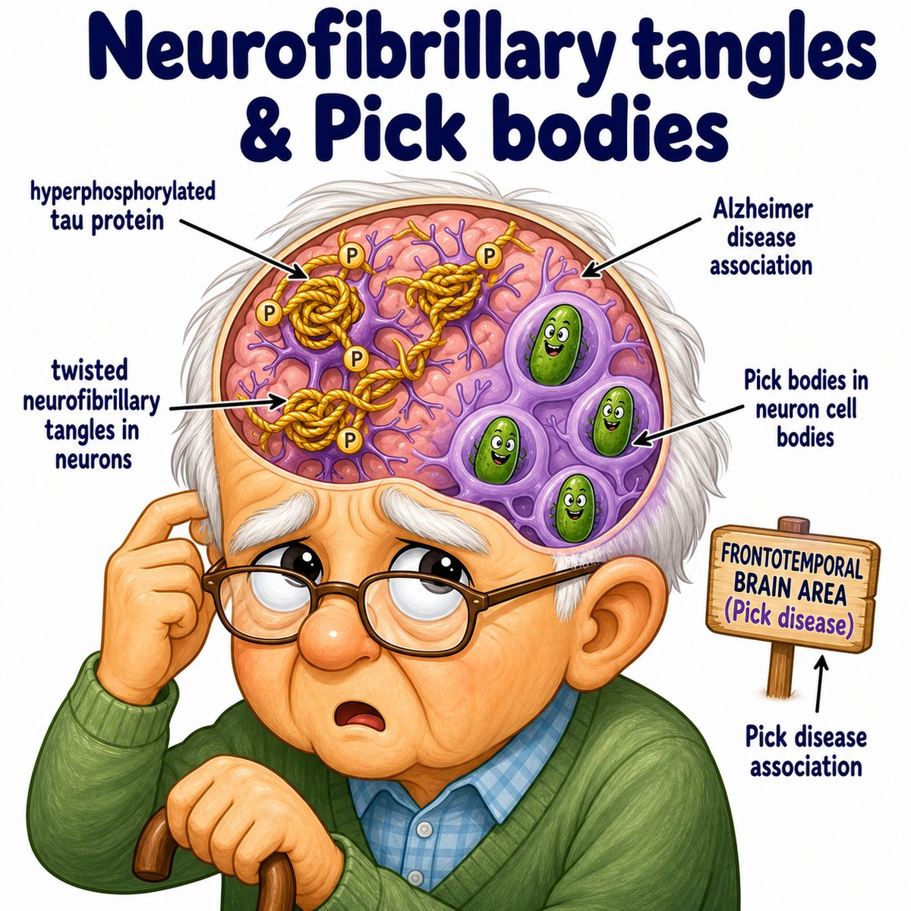

# Alzheimer disease

Alzheimer disease is a progressive neurodegenerative disease, meaning neurons slowly die over time.

It is the most common cause of dementia, which means decline in memory/thinking severe enough to impair daily life.

Classic findings:

* progressive memory loss
* confusion/disorientation
* language problems
* impaired daily functioning
* later personality/behavior changes

---

### Core pathology

Two big protein problems:

* beta-amyloid plaques outside neurons
* neurofibrillary tangles inside neurons

Beta-amyloid plaques are extracellular deposits, meaning protein junk builds up outside cells.

Neurofibrillary tangles are intracellular tangles of tau protein, meaning abnormal protein buildup inside neurons.

---

### Why memory is hit early

Alzheimer disease commonly affects the hippocampus early.

The hippocampus is the brain region important for forming new memories.

So the classic early symptom is:

> trouble making new memories

That is why patients may repeat questions, forget recent conversations, or get lost in familiar places.

---

### Why acetylcholine matters

There is decreased acetylcholine, which is a neurotransmitter important for memory and attention.

This is why acetylcholinesterase inhibitors are used.

Acetylcholinesterase inhibitors block the enzyme that breaks down acetylcholine, so more acetylcholine stays available.

Examples:

* donepezil
* rivastigmine
* galantamine

They help symptoms but do not cure the disease.

---

## One-line intuition

Alzheimer disease is brain atrophy from toxic protein buildup, especially hitting memory circuits early.

---

## Pearl 🔥

Alzheimer disease is associated with decreased choline acetyltransferase, which means decreased acetylcholine production.