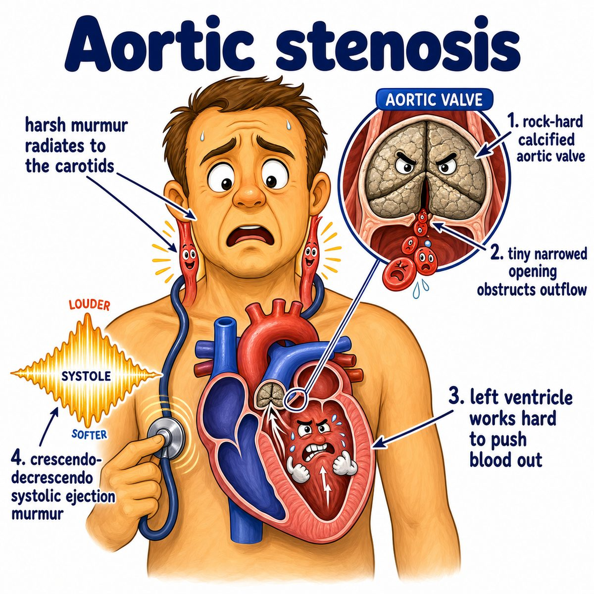

# Aortic stenosis

### Core idea

Aortic stenosis is narrowing of the aortic valve, so blood has trouble leaving the left ventricle (main pumping chamber) into the aorta (big artery carrying blood to the body).

Think:

* stiff, calcified valve
* small opening
* left ventricle has to push harder

---

### Why the findings happen

The left ventricle is trying to force blood through a tight valve.

That causes:

* **Systolic crescendo-decrescendo murmur:** blood is loudly ejected through a narrowed valve during systole (ventricular contraction)
* **Radiates to carotids:** the turbulent jet goes from the aortic valve into the aorta and up toward the neck arteries
* **Left ventricular hypertrophy:** the ventricle gets thick because it is pumping against high pressure
* **Angina:** thick ventricle needs more oxygen, but coronary blood supply may not keep up
* **Syncope:** fixed narrow valve cannot increase cardiac output (blood pumped per minute) during exercise
* **Dyspnea/heart failure:** chronic pressure overload eventually makes the ventricle stiff and weak

---

### Classic symptoms

The big triad is:

* angina
* syncope
* dyspnea

Intuition:

> The valve is a tight exit door, so the heart strains to push blood out.

---

### Causes

Common causes:

* age-related calcification
* bicuspid aortic valve (congenital valve with 2 cusps instead of 3)
* rheumatic heart disease

Rheumatic aortic stenosis usually comes with other valve disease too, especially mitral valve disease.

---

### Buzzwords

* harsh systolic murmur
* right upper sternal border
* radiation to carotids
* pulsus parvus et tardus (weak and delayed pulse)
* soft or absent S2 (second heart sound) in severe disease

---

## One-line intuition

Aortic stenosis is like putting a tight nozzle on the left ventricle's outflow tract: pressure builds behind it, and less blood gets forward.

---

## Pearl 🔥

In aortic stenosis, left ventricular hypertrophy is **concentric** because the problem is pressure overload.

Concentric hypertrophy = wall gets thick inward, like the ventricle is building muscle to push against high resistance.