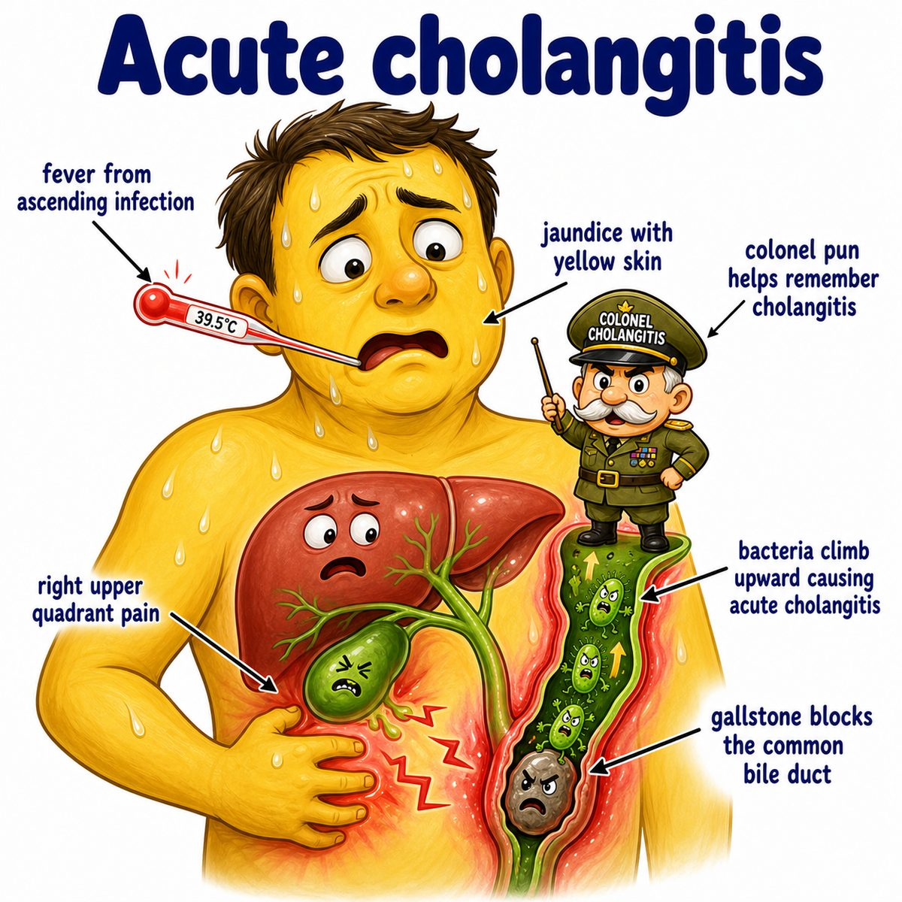

# Ascending cholangitis

Ascending cholangitis is an infection of the bile ducts.

Break it down:

* ascending = bacteria travel upward from the intestine
* chol- = bile
* angitis = vessel/duct inflammation

So the idea is:

> bacteria ascend from the duodenum into an obstructed biliary tree.

Usually the obstruction is a gallstone stuck in the common bile duct.

Common bile duct = the tube that drains bile from the liver/gallbladder into the duodenum (first part of the small intestine).

---

### Why obstruction causes infection

Normally bile flows downward into the duodenum.

If a stone blocks the duct:

* bile backs up
* pressure rises in the biliary tree
* bacteria can climb upward from the gut
* infected bile can spill bacteria into the bloodstream

That is why this can become sepsis (life-threatening systemic infection).

---

### Classic presentation

Charcot triad:

* fever
* jaundice
* RUQ pain

RUQ = right upper quadrant of the abdomen.

Why these happen:

* fever: infection
* jaundice: blocked bile cannot drain, so bilirubin builds up
* RUQ pain: inflamed/distended biliary ducts

If it gets severe, add:

* hypotension
* altered mental status

That is Reynolds pentad.

Pentad = 5 findings.

---

### Treatment intuition

You need:

* antibiotics to kill bacteria
* biliary drainage to relieve the blockage

Drainage is often done with ERCP (endoscopic retrograde cholangiopancreatography), which is an endoscopic procedure that can remove a common bile duct stone or place a stent.

---

## One-line intuition

Ascending cholangitis = blocked bile duct + bacteria climbing upward = infected, pressurized biliary tree.

---

## Pearl 🔥

Ascending cholangitis is a medical emergency because antibiotics alone may not fix it if the duct stays blocked; the HY move is urgent biliary drainage, usually with ERCP (endoscopic retrograde cholangiopancreatography).