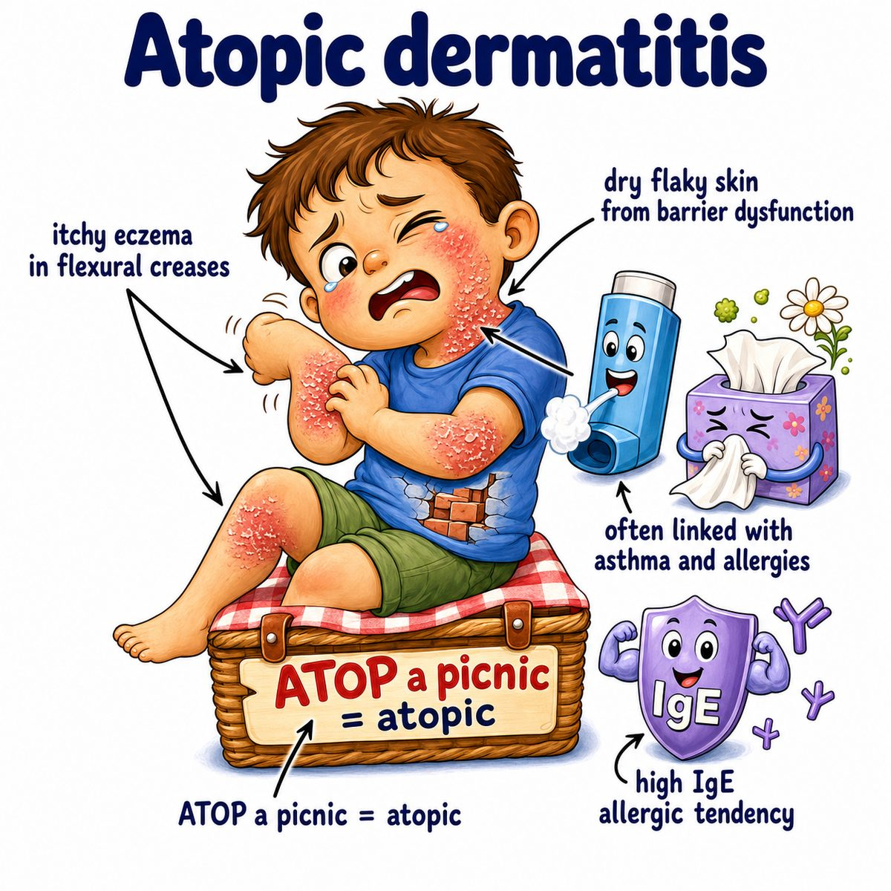

# Atopic dermatitis

Atopic dermatitis is chronic itchy eczema due to a weak skin barrier + allergic-type inflammation.

Break it down:

* atopic = allergy-prone
* dermatitis = skin inflammation

So the core idea is:

> the skin barrier is leaky, so irritants/allergens get in more easily and trigger inflammation + itching.

Why it happens:

* defective skin barrier, often from filaggrin problems
* increased water loss from skin, causing dryness
* Th2 inflammation, meaning T helper 2 immune response
* IgE, meaning immunoglobulin E, often elevated because this is associated with allergy

Classic findings:

* very itchy rash
* dry, red, scaly skin
* flexural areas in older kids/adults, like elbows and behind knees
* cheeks/extensor surfaces in infants
* lichenification, meaning thick leathery skin from chronic scratching

Why scratching makes it worse:

Scratching damages the already weak barrier even more, so more irritants enter, more inflammation happens, and the itch-scratch cycle continues.

Associated with the atopic triad:

* atopic dermatitis
* asthma
* allergic rhinitis, meaning hay fever-type nasal allergies

## One-line intuition

Atopic dermatitis is “leaky dry skin” plus allergic inflammation, causing intense itch and chronic eczema.

## Pearl 🔥

HY Step 1 association: filaggrin loss-of-function mutations weaken the epidermal barrier and predispose to atopic dermatitis.