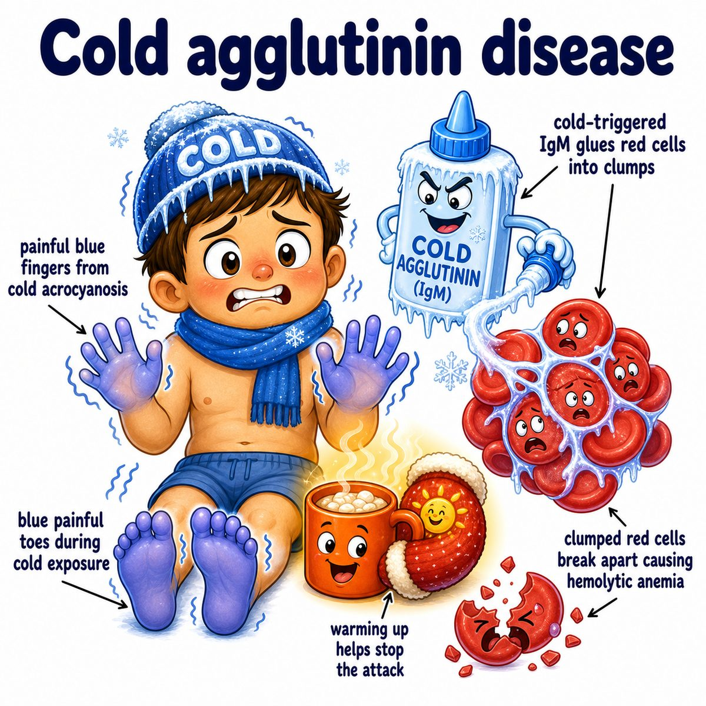

# Autoimmune hemolytic anemia

Autoimmune hemolytic anemia means:

* autoimmune = your immune system attacks yourself
* hemolytic = red blood cells are being destroyed
* anemia = low red blood cell mass/low hemoglobin

So the core idea is:

> antibodies bind your own red blood cells, and then those red blood cells get destroyed.

---

### Main types

**Warm autoimmune hemolytic anemia**

* usually **IgG (immunoglobulin G)**
* reacts best at body temperature
* destroyed mostly by splenic macrophages
* causes **extravascular hemolysis** (red blood cell destruction outside blood vessels, mainly in spleen/liver)

**Cold autoimmune hemolytic anemia**

* usually **IgM (immunoglobulin M)**
* reacts best in cold peripheral areas like fingers/toes
* strongly activates complement
* associated with **Mycoplasma pneumoniae** and **EBV (Epstein-Barr virus)**

---

### Why spherocytes happen

In warm autoimmune hemolytic anemia, IgG (immunoglobulin G) coats the red blood cell.

Splenic macrophages bite off pieces of the red blood cell membrane.

The cell loses membrane but keeps much of its volume, so it rounds up into a **spherocyte** (small round red blood cell without central pallor).

That is why autoimmune hemolytic anemia can look like hereditary spherocytosis on smear.

The key difference:

* autoimmune hemolytic anemia = positive Coombs test
* hereditary spherocytosis = negative Coombs test

---

### Coombs test

The **direct Coombs test** checks whether antibodies or complement are already stuck to the patient’s red blood cells.

Positive direct Coombs test = immune system is coating red blood cells.

That fits autoimmune hemolytic anemia.

---

### Lab pattern

Because red blood cells are being destroyed:

* increased indirect bilirubin
* increased LDH (lactate dehydrogenase)
* decreased haptoglobin
* increased reticulocytes

Reticulocytes are immature red blood cells.

They increase because the bone marrow is trying to replace the red blood cells being destroyed.

---

## One-line intuition

Autoimmune hemolytic anemia is when antibodies tag your own red blood cells for destruction, especially by the spleen.

---

## Pearl 🔥

Warm autoimmune hemolytic anemia is classically **IgG-mediated extravascular hemolysis with spherocytes and a positive direct Coombs test**.