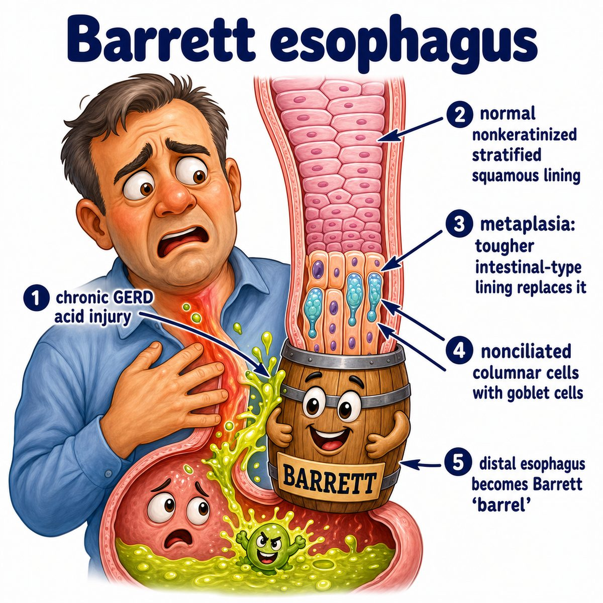

# Barrett esophagus

### Core idea

Barrett esophagus is when the lower esophagus changes its lining because of chronic GERD (gastroesophageal reflux disease).

Normal esophagus has:

* stratified squamous epithelium (flat protective cells)

But in Barrett esophagus, it becomes:

* intestinal-type columnar epithelium (tall mucus-producing intestinal-like cells)

This is called metaplasia (one mature cell type changes into another mature cell type).

---

### Why it happens

Chronic acid reflux repeatedly injures the lower esophagus.

The body adapts by replacing the normal squamous lining with columnar lining, because columnar/mucus-producing tissue handles acid better.

So the intuition is:

> acid keeps burning the esophagus, so the esophagus tries to become more like stomach/intestine lining.

---

### Why it matters

Barrett esophagus is premalignant (can become cancer later).

The cancer risk is:

* esophageal adenocarcinoma

Break that down:

* adeno- = gland-forming
* carcinoma = cancer from epithelial cells (lining cells)

So Barrett is important because intestinal-type glandular lining in the esophagus can progress:

* metaplasia -> dysplasia -> adenocarcinoma

Dysplasia means abnormal-looking cells that are not fully cancer yet.

---

### Diagnosis

Diagnosed with:

* upper endoscopy (camera down the esophagus)
* biopsy (tissue sample)

On biopsy, the key finding is:

* goblet cells

Goblet cells are mucus-producing intestinal cells, and they should not normally be in the esophagus.

---

## One-line intuition

Barrett esophagus = chronic acid reflux makes the lower esophagus trade its flat protective lining for intestinal-type glandular lining, which increases risk of esophageal adenocarcinoma.

---

## HY pearl

Barrett esophagus is associated with adenocarcinoma, while smoking/alcohol are classically associated with squamous cell carcinoma of the esophagus.