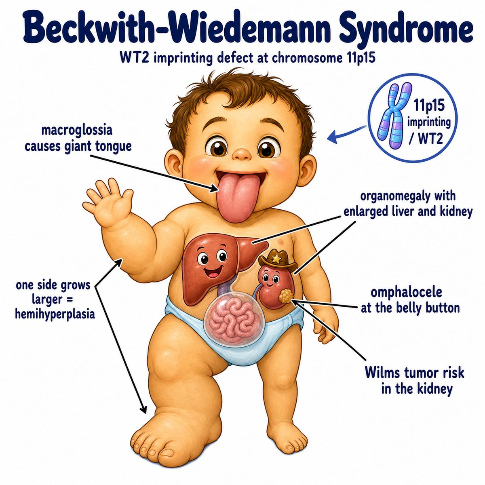

# Beckwith-Wiedemann syndrome

### Core idea

Beckwith-Wiedemann syndrome, or BWS (Beckwith-Wiedemann syndrome), is an overgrowth syndrome.

Think:

* big baby
* big tongue
* big organs
* abdominal wall defect
* increased childhood tumor risk

Classic findings:

* macroglossia (large tongue)
* macrosomia (large body size)
* visceromegaly (enlarged internal organs)
* omphalocele (abdominal organs herniate into the umbilical cord, covered by a membrane)
* neonatal hypoglycemia (low blood glucose in a newborn)
* hemihyperplasia (one side or part of the body grows more than the other)

---

### Why it happens

The key problem is abnormal genomic imprinting (parent-specific gene expression) on chromosome 11p15.

Normally, growth genes are tightly balanced:

* IGF2 (insulin-like growth factor 2) promotes fetal growth
* CDKN1C (cyclin-dependent kinase inhibitor 1C) slows cell growth

In BWS, there is too much growth signaling and/or too little growth braking.

So the baby gets overgrowth:

* large tongue
* enlarged organs
* large body size
* asymmetric overgrowth

---

### Why hypoglycemia happens

BWS can cause pancreatic islet cell hyperplasia (increased insulin-producing pancreatic cells).

More insulin means glucose gets pushed into cells.

So:

> high insulin -> low blood glucose -> neonatal hypoglycemia

This is why a newborn with BWS may have jitteriness, seizures, or poor feeding from low glucose.

---

### Tumor risk

BWS increases risk of embryonal tumors (childhood tumors from primitive developing tissues), especially:

* Wilms tumor (pediatric kidney tumor)
* hepatoblastoma (pediatric liver tumor)

Intuition:

If fetal growth pathways are overactive, developing tissues are more likely to overgrow into tumors.

---

## One-line intuition

Beckwith-Wiedemann syndrome is a fetal overgrowth syndrome from abnormal imprinting on chromosome 11, causing big baby findings plus hypoglycemia and Wilms tumor risk.

---

## HY pearl

For Step 1, connect:

> Beckwith-Wiedemann = 11p15 imprinting defect + macroglossia + omphalocele + neonatal hypoglycemia + Wilms tumor risk.