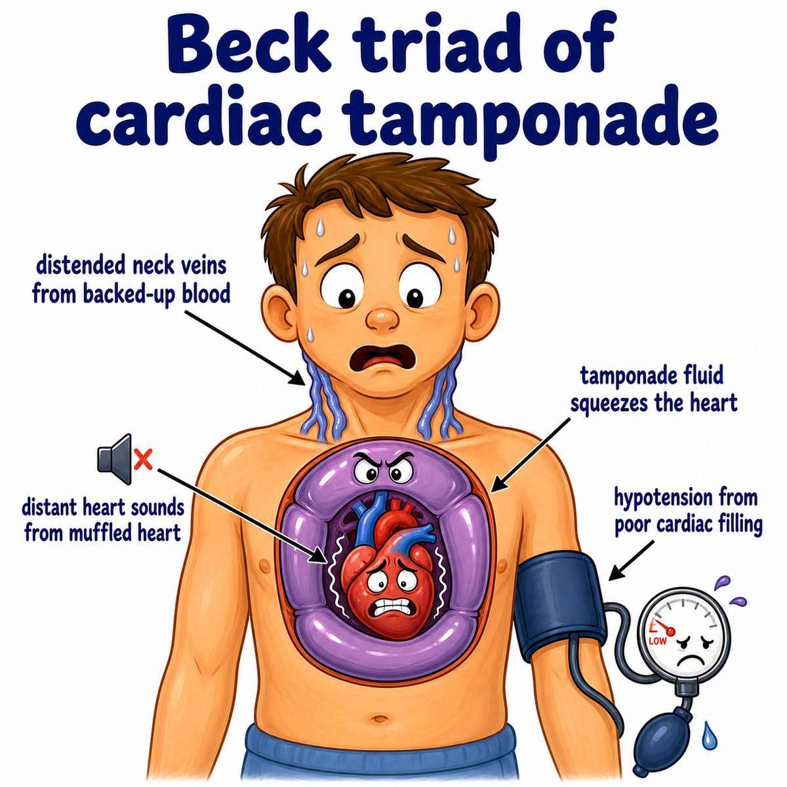
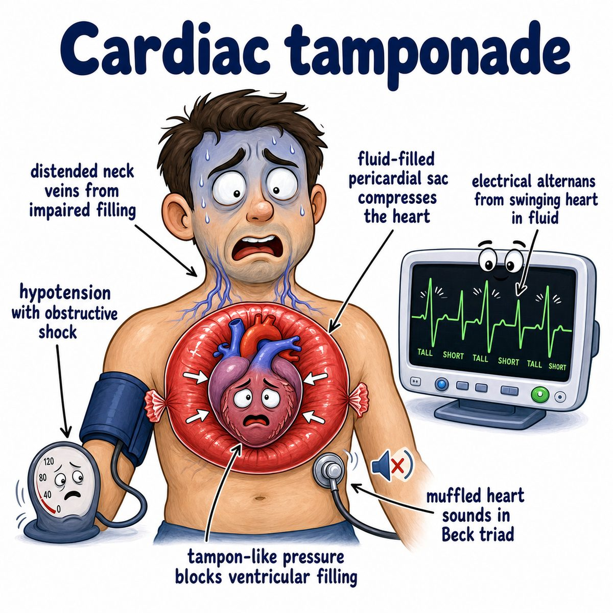

# Cardiac tamponade

### Core idea

Cardiac tamponade is when fluid or blood builds up in the pericardial sac (the fibrous sac around the heart) and compresses the heart.

The key problem is:

* the heart cannot fill during diastole (relaxation/filling phase)
* so stroke volume (blood pumped per beat) drops
* so cardiac output (blood pumped per minute) drops

---

### Why the findings happen

The pericardium is stiff, so if fluid accumulates quickly, pressure rises fast.

That pressure squeezes the thin-walled right atrium and right ventricle first because right-sided pressures are lower.

So you get:

* **hypotension:** low cardiac output
* **JVD (jugular venous distension):** blood backs up into neck veins because the right heart cannot fill
* **muffled heart sounds:** fluid around the heart dampens the sound

Together this is **Beck triad**:

* hypotension
* JVD (jugular venous distension)
* muffled heart sounds

---

### Pulsus paradoxus

Pulsus paradoxus means an exaggerated drop in systolic blood pressure (top blood pressure number) during inspiration (breathing in).

Why?

During inspiration, more blood returns to the right heart.

But in tamponade, the heart is trapped inside a tight fluid-filled sac, so the right ventricle expands into the left ventricle.

That decreases left ventricular filling, so systolic blood pressure drops.

---

### Important cause pattern

Tamponade is especially dangerous when fluid accumulates rapidly, like with:

* trauma causing hemopericardium (blood in the pericardial sac)
* aortic dissection (tear in the aorta wall)
* myocardial rupture after MI (myocardial infarction, heart attack)
* malignancy (cancer)
* uremia (high waste products from kidney failure)

---

## One-line intuition

The heart is trying to pump, but it is being squeezed from the outside, so it cannot fill.

---

## Pearl 🔥

Electrical alternans on ECG (electrocardiogram) can happen because the heart swings back and forth in a large pericardial effusion (fluid around the heart), causing alternating QRS (ventricular depolarization wave) heights.