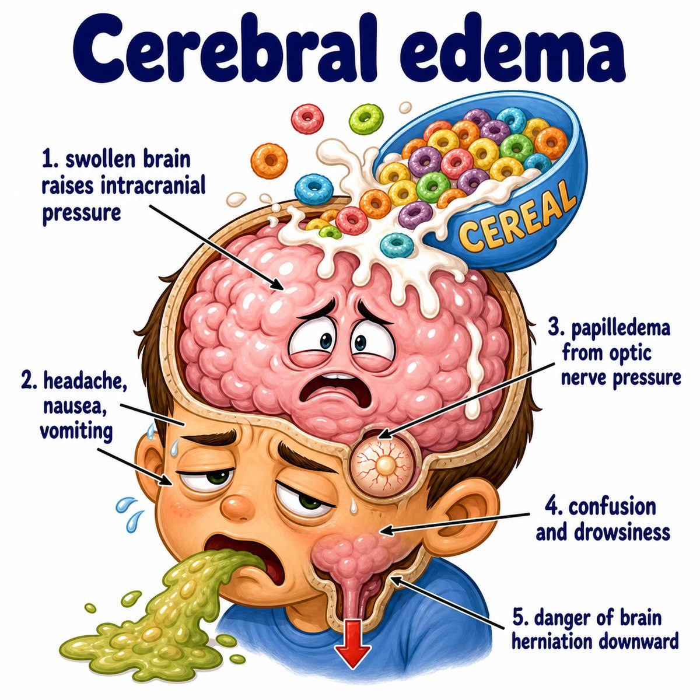

# Cerebral edema

Cerebral edema = brain swelling due to excess water in brain tissue.

Break it down:

* cerebral = brain
* edema = fluid accumulation/swelling

So cerebral edema means:

> too much fluid in the brain, making the brain swell.

---

### Why it is dangerous

The brain is trapped inside the skull, which is rigid.

So if the brain swells:

* brain volume increases
* intracranial pressure (ICP; pressure inside the skull) increases
* blood vessels can get compressed
* cerebral perfusion (blood flow to brain tissue) decreases
* severe cases can cause herniation (brain tissue being pushed into the wrong compartment)

One-line intuition:

The brain swells, but the skull cannot expand, so pressure rises fast.

---

### Main mechanisms

Two big Step 1 types:

* **Cytotoxic edema:** cells swell because Na+/K+ ATPase (sodium-potassium pump) fails
* **Vasogenic edema:** fluid leaks out because the BBB (blood-brain barrier) is disrupted

Why cytotoxic edema happens:

* ischemia (low blood flow) -> low ATP (cell energy)
* low ATP -> Na+/K+ ATPase fails
* Na+ stays inside cells
* water follows Na+
* cells swell

Why vasogenic edema happens:

* BBB becomes leaky
* plasma fluid/proteins enter brain extracellular space (space outside cells)
* fluid accumulates especially in white matter

---

### Common causes

Think brain injury/inflammation:

* stroke
* trauma
* brain tumor
* abscess/infection
* hemorrhage (bleeding)
* hyponatremia (low blood sodium)
* high-altitude cerebral edema

---

### Treatment intuition

Mannitol or hypertonic saline helps by increasing blood osmolarity (solute concentration in blood).

That pulls water:

* out of swollen brain tissue
* into blood vessels
* then out through urine

So the goal is:

> make the blood "saltier" than the brain so water leaves the brain.

---

## One-line intuition

Cerebral edema is brain water overload; because the skull is a closed box, swelling raises ICP and can compress brain tissue.

---

## HY pearl 🔥

Steroids help **vasogenic edema** from brain tumors because they stabilize the BBB (blood-brain barrier), but they are not useful for cytotoxic edema from ischemic stroke.