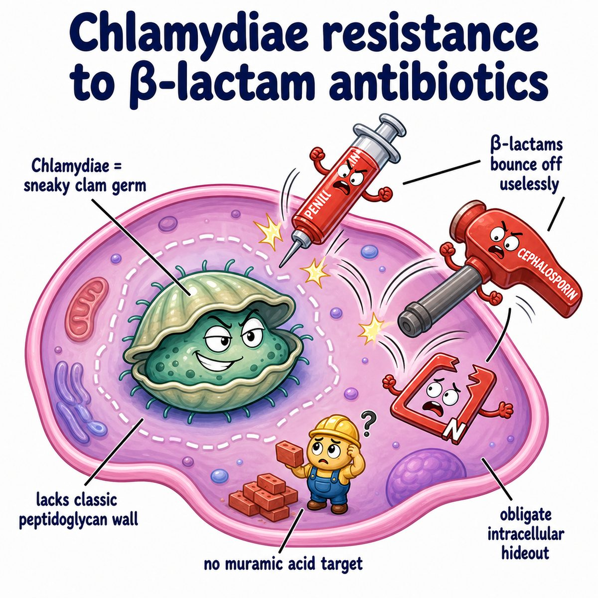

# Chlamydia trachomatis

### Core idea

**Chlamydia trachomatis** is an obligate intracellular bacterium.

Obligate intracellular = it must live and replicate inside human cells.

It commonly causes:

* urethritis (inflammation of the urethra)
* cervicitis (inflammation of the cervix)
* pelvic inflammatory disease, or PID (infection/inflammation of the upper female reproductive tract)
* neonatal conjunctivitis (eye infection in a newborn)
* neonatal pneumonia
* trachoma (chronic eye infection that can cause blindness)

---

### The key life cycle

Chlamydia has 2 major forms:

* **Elementary body, or EB** = infectious form
* **Reticulate body, or RB** = replicating form

Think:

* **EB enters**
* **RB replicates**

The EB attaches to an epithelial cell, enters the cell, turns into RBs, multiplies inside an inclusion body, then turns back into EBs and spreads.

Inclusion body = a membrane-bound pocket inside the host cell where Chlamydia grows.

---

### Why it is "atypical"

It is a bacterium, but it behaves kind of virus-like because it needs host cells to replicate.

That is why it is hard to grow on normal culture media.

So diagnosis is usually with:

* NAAT (nucleic acid amplification test), meaning a test that detects bacterial DNA or RNA

---

### Why symptoms happen

Chlamydia infects columnar epithelial cells, especially in the cervix and urethra.

That causes local inflammation:

* burning with urination
* urethral discharge
* cervical discharge
* pelvic pain if it ascends upward

But many infections are asymptomatic.

Asymptomatic = no symptoms, even though the infection is present.

That is why it spreads easily and why screening matters.

---

### Big complications

If it ascends from the cervix to the uterus and fallopian tubes, it can cause PID.

PID can lead to:

* infertility
* ectopic pregnancy
* chronic pelvic pain

Why?

Inflammation causes scarring of the fallopian tubes.

Scarred tubes can block the egg/sperm path or trap an embryo in the tube.

---

### Newborn disease

During vaginal delivery, a baby can be exposed to infected cervical secretions.

This can cause:

* conjunctivitis at 5-12 days of life
* afebrile pneumonia at 1-3 months

Afebrile = without fever.

Classic neonatal pneumonia clue:

* staccato cough
* no fever
* eosinophilia (high eosinophils, a type of white blood cell)

---

### Serovars

Serovars = different strains based on surface antigens.

High-yield groups:

* **A-C:** trachoma
* **D-K:** genital infection + neonatal conjunctivitis/pneumonia
* **L1-L3:** lymphogranuloma venereum, or LGV

LGV causes painful inguinal lymphadenopathy.

Inguinal lymphadenopathy = swollen lymph nodes in the groin.

---

## One-line intuition

Chlamydia trachomatis is an intracellular STI (sexually transmitted infection) that spreads silently, replicates inside epithelial cells, and causes damage mainly through inflammation and scarring.

---

## Pearl 🔥

Chlamydia is the classic cause of **reactive arthritis** after urethritis.

Reactive arthritis = sterile joint inflammation after an infection.

Classic triad:

* arthritis
* conjunctivitis
* urethritis

Mnemonic idea: "can't see, can't pee, can't climb a tree."