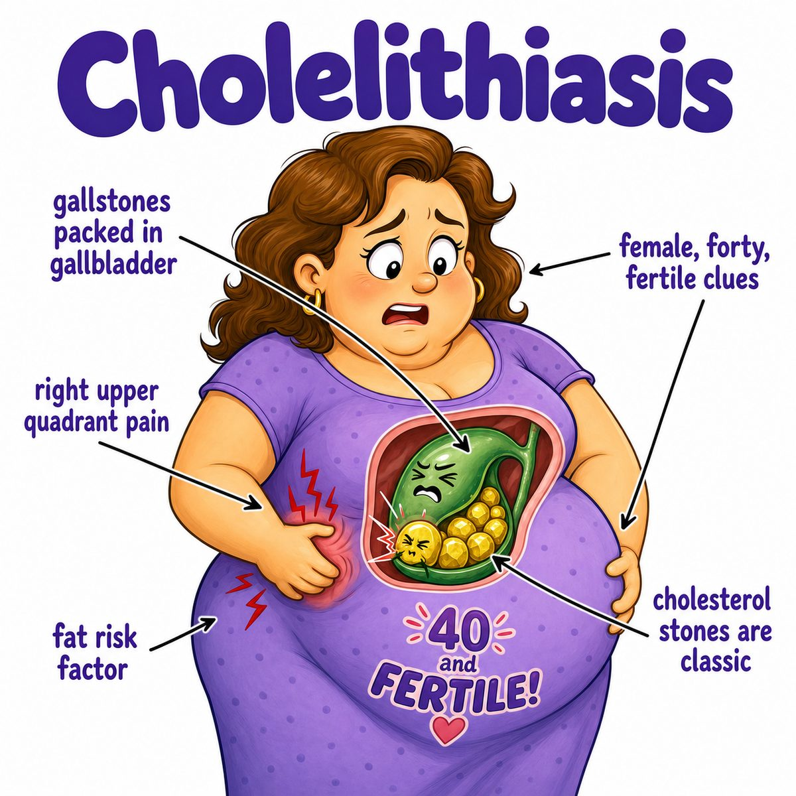

# Cholelithiasis

### Core idea

Cholelithiasis = gallstones in the gallbladder.

Break the word apart:

* chole = bile
* lith = stone
* -iasis = condition

So cholelithiasis literally means:

> a condition of bile stones.

The gallbladder stores bile, which helps digest fat. If bile becomes too concentrated or chemically imbalanced, solid stones can form.

---

### Why stones form

Most gallstones are cholesterol stones.

They form when bile has too much cholesterol compared with bile salts and phospholipids.

Think:

* too much cholesterol in bile
* not enough bile components to keep it dissolved
* cholesterol precipitates out and becomes stones

Precipitate = fall out of solution as a solid.

---

### Classic symptoms

Many patients are asymptomatic, meaning they have no symptoms.

When symptomatic, the classic presentation is biliary colic.

Biliary colic = episodic RUQ (right upper quadrant) pain from gallbladder contraction against a blocked outlet.

Why after fatty meals?

Fat in the duodenum (first part of the small intestine) triggers CCK (cholecystokinin), a hormone that makes the gallbladder squeeze.

If a stone blocks the cystic duct:

* gallbladder squeezes
* bile cannot exit well
* pressure rises
* RUQ pain happens

The pain can radiate to the right shoulder/scapula because the diaphragm and biliary area share referred pain pathways.

---

### Important complications

Gallstones can lead to:

* cholecystitis = inflammation of the gallbladder
* choledocholithiasis = stone in the CBD (common bile duct)
* ascending cholangitis = infected bile duct obstruction
* gallstone pancreatitis = pancreatic inflammation from a stone blocking near the ampulla of Vater

Ampulla of Vater = where the CBD (common bile duct) and pancreatic duct empty into the duodenum.

---

### Imaging clue

US (ultrasound) is the usual first test.

Classic US (ultrasound) finding:

* echogenic stones
* posterior acoustic shadowing

Echogenic = bright on ultrasound.

Posterior acoustic shadowing = the sound waves cannot pass through the stone well, so a dark shadow appears behind it.

---

## One-line intuition

Cholelithiasis is bile becoming solid stones inside the gallbladder, often silent until the gallbladder squeezes after a fatty meal and a stone blocks the cystic duct.

---

## Pearl 🔥

Cholesterol gallstone risk factors are the classic "4 F's": female, forty, fertile, fat; estrogen increases cholesterol secretion into bile, making cholesterol stones more likely.