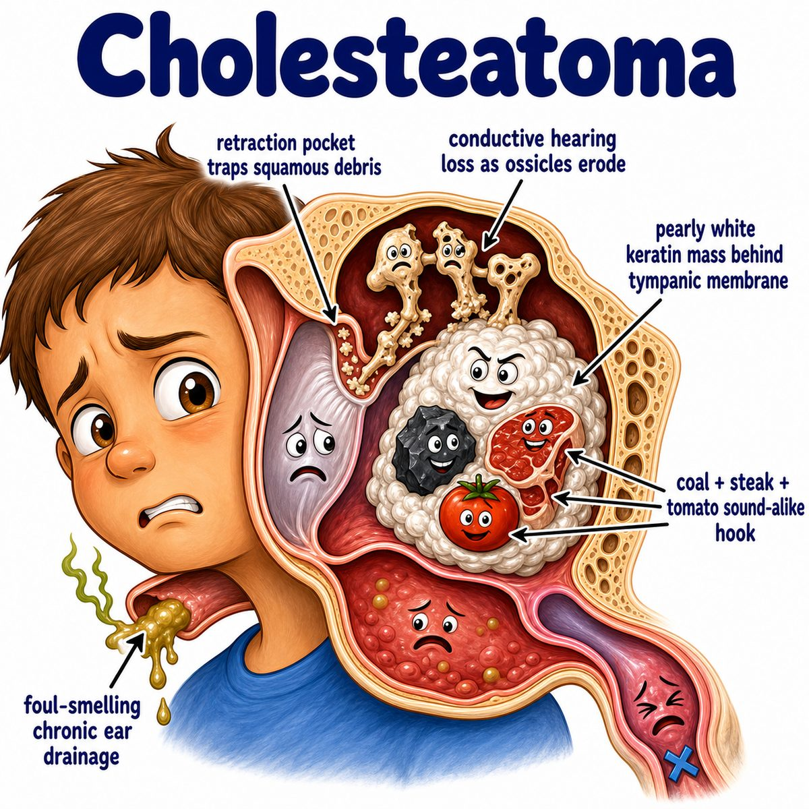

# Cholesteatoma

### Core idea

Cholesteatoma is a keratinizing squamous epithelial cyst in the middle ear/mastoid.

Even though the name says "cholesteatoma," it is **not a cholesterol tumor**.

Think:

* skin cells trapped in the middle ear
* keratin debris builds up
* the expanding mass erodes nearby bone

---

### Why it happens

Most commonly, chronic Eustachian tube dysfunction causes negative pressure in the middle ear.

That negative pressure pulls the tympanic membrane (eardrum) inward, forming a retraction pocket.

Then:

* skin/keratin gets trapped in the pocket
* the debris cannot drain normally
* the mass slowly expands
* local inflammation and pressure cause bone erosion

So the intuition is:

> the eardrum gets sucked inward, traps shedding skin, and forms a destructive keratin cyst.

---

### Classic findings

Cholesteatoma can cause:

* chronic foul-smelling ear drainage
* conductive hearing loss
* recurrent otitis media (middle ear infection)
* retracted tympanic membrane
* pearly white mass behind or near the tympanic membrane

Conductive hearing loss happens because the cholesteatoma can erode the ossicles (middle ear bones: malleus, incus, stapes).

---

### Why it is dangerous

It is benign histologically, meaning not cancer, but locally destructive.

It can erode into:

* ossicles → conductive hearing loss
* mastoid bone → mastoiditis (infection/inflammation of mastoid air cells)
* facial nerve canal → facial weakness
* inner ear → vertigo/sensorineural hearing loss
* cranial cavity → meningitis or brain abscess

---

## One-line intuition

Cholesteatoma is trapped skin in the middle ear that keeps shedding keratin and slowly eats through bone.

---

## Pearl 🔥

HY Step 1 pearl: chronic otitis media with foul-smelling otorrhea (ear drainage) + conductive hearing loss + bony erosion = think **cholesteatoma**.