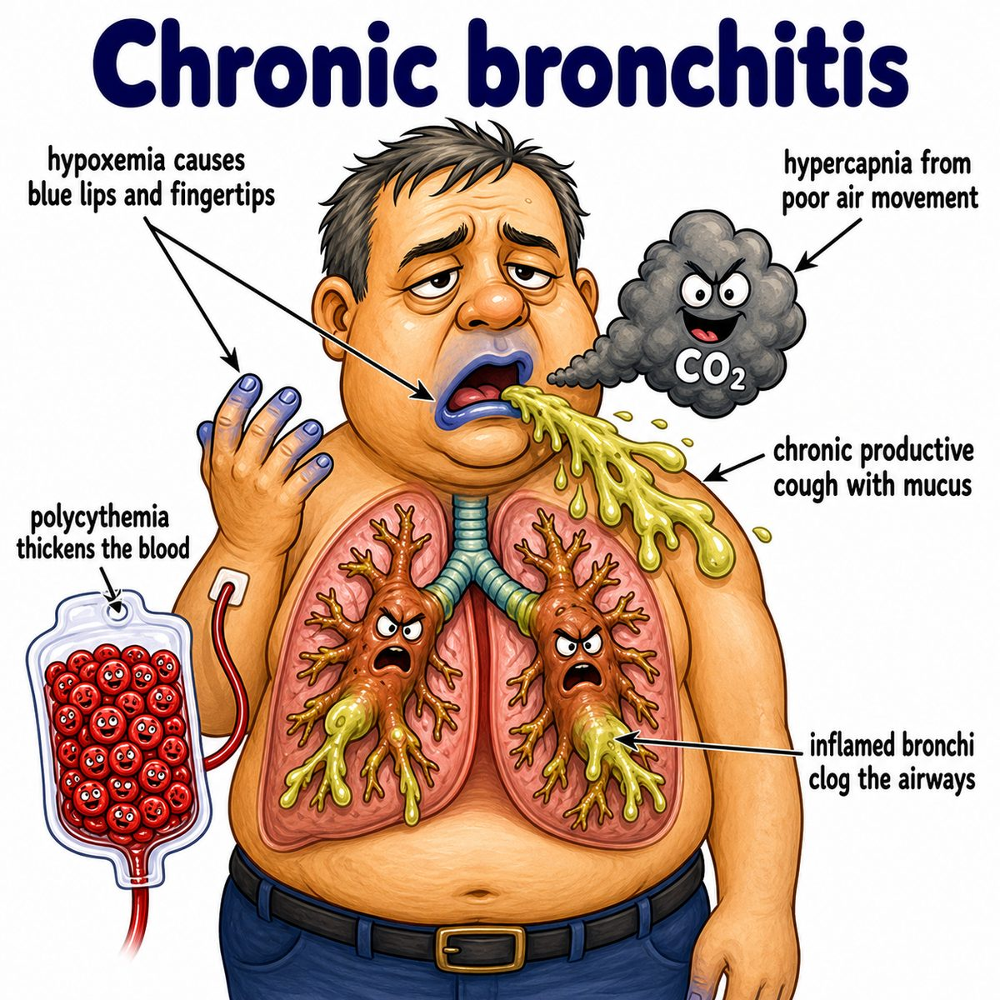

# Chronic bronchitis

Chronic bronchitis is chronic inflammation of the bronchi (large airways) causing:

* productive cough
* lots of mucus
* airway obstruction

Classic definition:

* productive cough for at least 3 months per year for 2 consecutive years

---

### Core idea

Long-term airway irritation, usually smoking, makes the bronchi respond by producing too much mucus.

The airway becomes:

* inflamed
* narrowed
* clogged with mucus

So air has trouble getting out.

---

### Why the findings happen

Smoking irritates the airway lining.

That causes:

* mucus gland hypertrophy (mucus glands get bigger)
* goblet cell hyperplasia (more mucus-producing cells)
* impaired cilia (tiny hair-like structures that move mucus upward)

So mucus builds up instead of being cleared.

That gives:

* chronic productive cough: patient keeps coughing up mucus
* wheezing: narrowed airways make turbulent airflow
* recurrent infections: trapped mucus is a good place for bacteria to grow
* hypoxemia (low blood oxygen): mucus blocks ventilation (airflow to alveoli)

---

### Reid index

Reid index = thickness of mucus gland layer / thickness of bronchial wall.

In chronic bronchitis:

* Reid index is increased
* usually > 50%

Intuition:

More mucus glands means the mucus-producing layer takes up more of the airway wall.

---

### COPD connection

Chronic bronchitis is a type of COPD (chronic obstructive pulmonary disease).

COPD means chronic airflow obstruction, especially difficulty exhaling.

Why exhaling is hard:

* mucus narrows the airway
* inflamed airways collapse more easily during expiration
* air gets trapped behind the obstruction

---

## One-line intuition

Chronic bronchitis is a smoker's airway becoming a mucus-filled, inflamed, narrowed tube.

---

## Pearl 🔥

Chronic bronchitis classically causes a "blue bloater" picture: hypoxemia (low blood oxygen) leads to cyanosis (bluish skin/lips), and chronic low oxygen can cause pulmonary hypertension (high pressure in lung arteries) leading to right-sided heart failure.