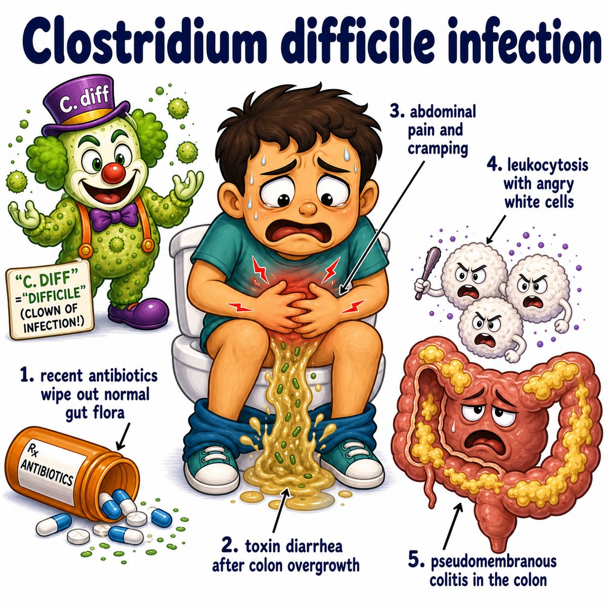

# Clostridium difficile infection

### Core idea

Clostridium difficile infection, now called **Clostridioides difficile infection**, is a colon infection that usually happens after antibiotics wipe out normal gut bacteria.

So the sequence is:

* antibiotics kill normal gut flora
* C. difficile (Clostridioides difficile) overgrows
* it releases toxins
* toxins damage colon cells
* patient gets watery diarrhea and colitis (colon inflammation)

---

### Why antibiotics cause it

Normal gut bacteria are like competition.

They keep C. difficile under control.

When antibiotics remove that competition, C. difficile gets room to grow.

Classic antibiotic associations:

* clindamycin
* cephalosporins
* fluoroquinolones
* broad-spectrum penicillins

But technically almost any antibiotic can do it.

---

### What the toxins do

C. difficile makes:

* toxin A
* toxin B

These toxins damage the colonic epithelium (colon lining cells).

Why diarrhea happens:

* damaged epithelial cells cannot absorb normally
* tight junctions break down
* inflammation pulls fluid into the gut lumen

So the colon becomes leaky and inflamed → watery diarrhea.

---

### Pseudomembranous colitis

Severe C. difficile can cause **pseudomembranous colitis**.

Break it down:

* pseudo- = false
* membranous = membrane-like layer
* colitis = colon inflammation

So pseudomembranes are yellow-white plaques sitting on damaged colon mucosa.

They are made of:

* fibrin
* mucus
* dead epithelial cells
* neutrophils (acute inflammatory cells)

That is why colonoscopy can show yellow plaques on the colon.

---

### Symptoms

Think:

* watery diarrhea
* abdominal cramping
* fever
* leukocytosis (high white blood cell count)
* recent antibiotic use or hospitalization

Severe disease can progress to:

* toxic megacolon (massively dilated, inflamed colon)
* perforation
* sepsis (life-threatening systemic infection)

---

### Diagnosis

Diagnosis is usually by stool testing for C. difficile toxins or toxin genes.

Important:

Do not test formed stool.

Reason: some people are colonized, meaning C. difficile is present but not causing disease.

You need symptoms, especially diarrhea, to call it infection.

---

### Treatment intuition

Main idea:

* stop the offending antibiotic if possible
* give an antibiotic that stays in the gut and kills C. difficile

Common treatments:

* oral vancomycin
* fidaxomicin

Why oral vancomycin?

Vancomycin given by mouth stays mostly in the gut lumen, exactly where C. difficile is.

IV (intravenous) vancomycin does not reach the colon lumen well, so it is not the main treatment for typical C. difficile colitis.

---

## One-line intuition

Antibiotics remove the normal gut bacteria, letting C. difficile overgrow and release toxins that inflame and injure the colon.

---

## HY pearl 🔥

C. difficile is a **gram-positive, spore-forming anaerobic rod**.

The spores are hard to kill, so alcohol hand sanitizer is not enough; use soap and water plus contact precautions.