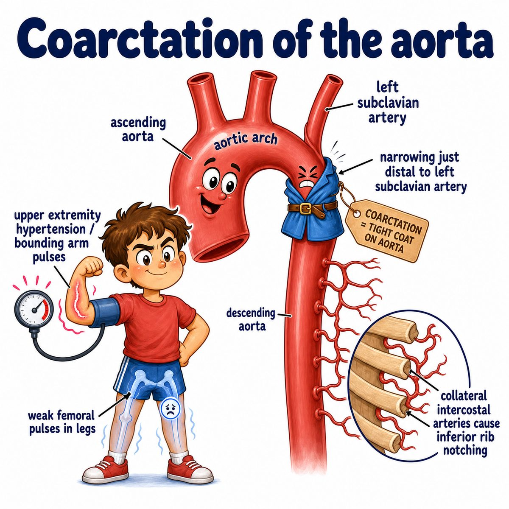

# Coarctation of the aorta

### Core idea

Coarctation of the aorta = congenital narrowing of the aorta (main artery leaving the heart).

Usually the narrowing is near the ductus arteriosus (fetal vessel connecting pulmonary artery to aorta), just after the left subclavian artery.

So blood flow becomes:

* high pressure before the narrowing
* low pressure after the narrowing

---

### What you see clinically

Before the narrowing = upper body:

* hypertension (high blood pressure) in arms
* bounding upper-extremity pulses

After the narrowing = lower body:

* weak femoral pulses
* lower blood pressure in legs
* cold legs or poor leg perfusion

Classic exam clue:

* brachiofemoral delay = radial pulse comes before femoral pulse

---

### Why rib notching happens

The body tries to bypass the narrowed aorta using collateral vessels (alternate blood-flow pathways).

Intercostal arteries (arteries running under the ribs) enlarge to carry extra blood.

Those enlarged arteries erode the inferior rib borders over time, causing:

* rib notching on chest x-ray
* "figure 3 sign" from pre-stenotic and post-stenotic aortic dilation around the narrowed segment

---

### Important associations

Coarctation is associated with:

* Turner syndrome (45,X)
* bicuspid aortic valve (aortic valve with 2 leaflets instead of 3)
* berry aneurysms (saccular brain aneurysms)

Why berry aneurysms matter:

* chronic upper-body hypertension increases risk of rupture

---

## One-line intuition

The aorta is pinched, so pressure backs up above the pinch and blood flow drops below the pinch.

---

## Pearl 🔥

In a newborn with severe coarctation, symptoms can suddenly worsen when the ductus arteriosus closes, because that fetal bypass route is gone.