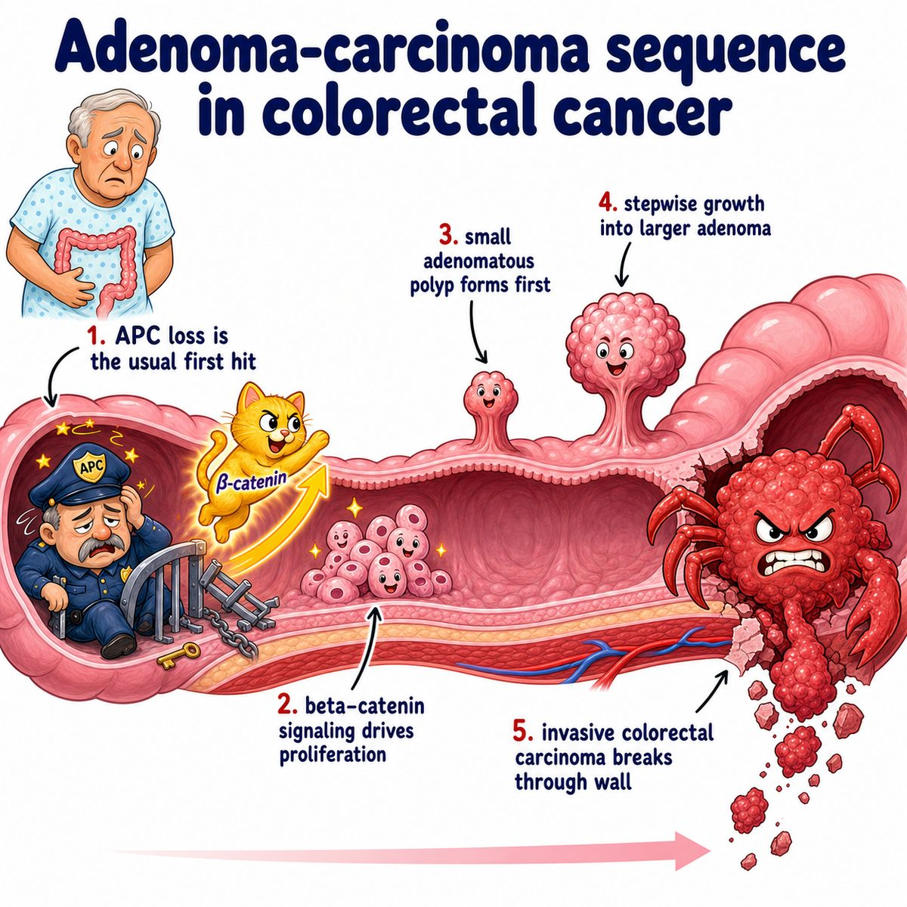
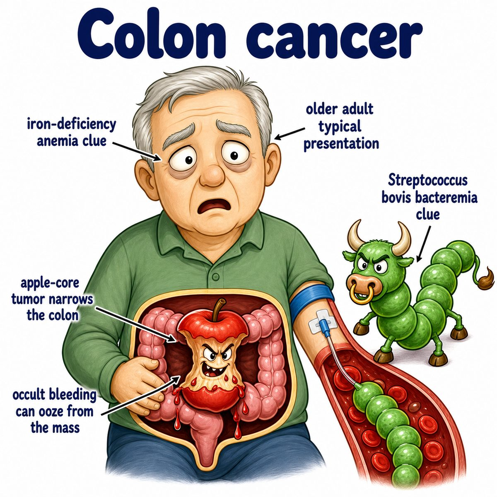
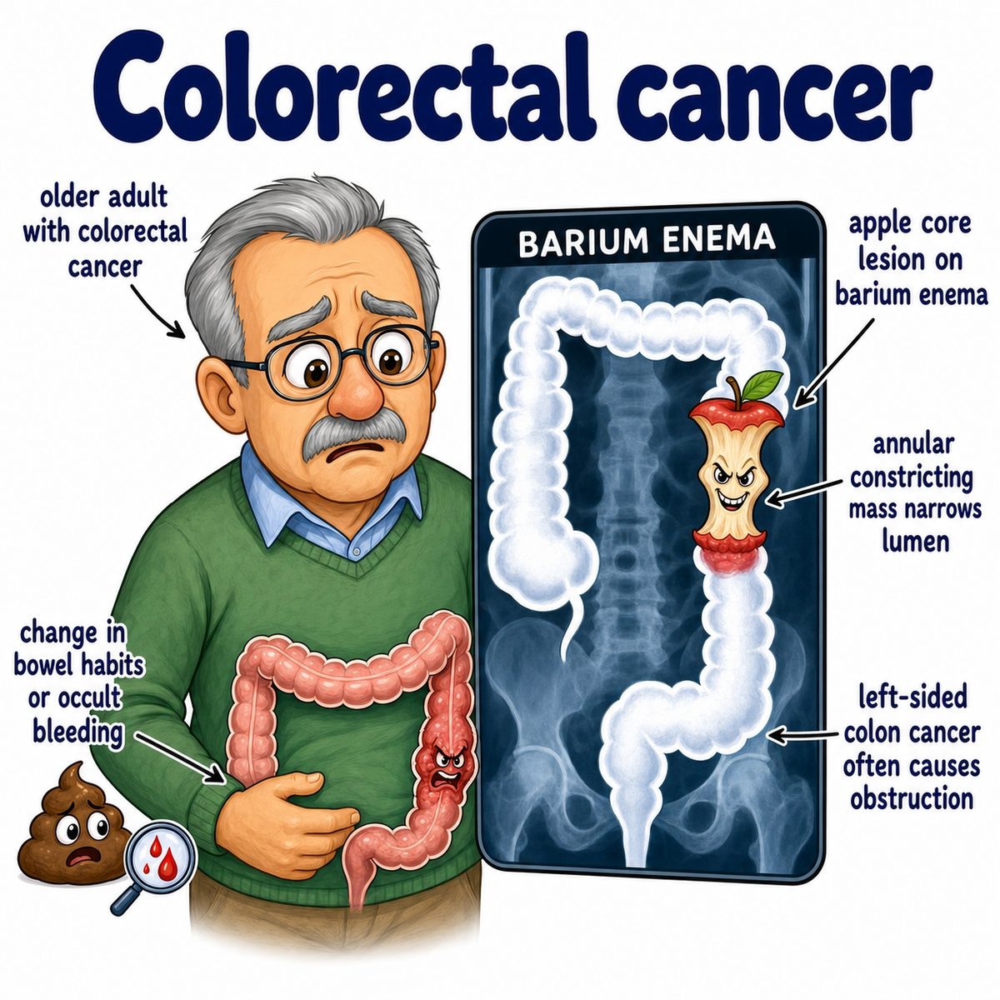

# Colon cancer

### Core idea

Colon cancer is a malignant tumor (cancer that can invade and spread) arising from the colon epithelium (lining cells of the large intestine).

Most colon cancers are:

* adenocarcinomas (cancers from gland-forming epithelial cells)

because the colon lining is full of glands that secrete mucus.

---

### How it usually forms

Most cases follow the adenoma-carcinoma sequence:

* normal colon mucosa (inner lining)
* adenomatous polyp (precancerous glandular growth)
* carcinoma (invasive cancer)

The classic mutation order is:

* APC loss
* KRAS activation
* p53 loss

APC is a tumor suppressor gene (gene that normally brakes cell growth), so losing it lets colon cells start forming polyps.

---

### Why the findings happen

* **Blood in stool:** tumor is fragile and bleeds into the lumen (inside tube of the bowel)
* **Iron deficiency anemia:** slow chronic blood loss lowers iron over time
* **Change in bowel habits:** tumor narrows or irritates the colon lumen
* **Weight loss:** cancer increases inflammation and metabolic demand
* **Liver metastasis:** colon venous drainage goes through the portal vein to the liver

Right-sided colon cancer often causes:

* occult bleeding (hidden blood)
* iron deficiency anemia

Left-sided colon cancer often causes:

* obstruction
* narrow stool caliber
* hematochezia (bright red blood per rectum)

---

### Important associations

Risk factors include:

* older age
* inflammatory bowel disease, especially ulcerative colitis
* familial adenomatous polyposis (FAP; inherited APC mutation causing many colon polyps)
* Lynch syndrome (inherited mismatch repair defect causing microsatellite instability)
* diet high in red/processed meat

Mismatch repair means DNA proofreading repair. If it fails, mutations accumulate faster.

---

## One-line intuition

Colon cancer usually starts as a polyp in the glandular colon lining, then gains mutations until it invades through the bowel wall and can spread to lymph nodes or liver.

---

## Pearl 🔥

HY Step 1: FAP is due to APC mutation on chromosome 5, while Lynch syndrome is due to mismatch repair gene defects and causes colon cancer without tons of polyps.