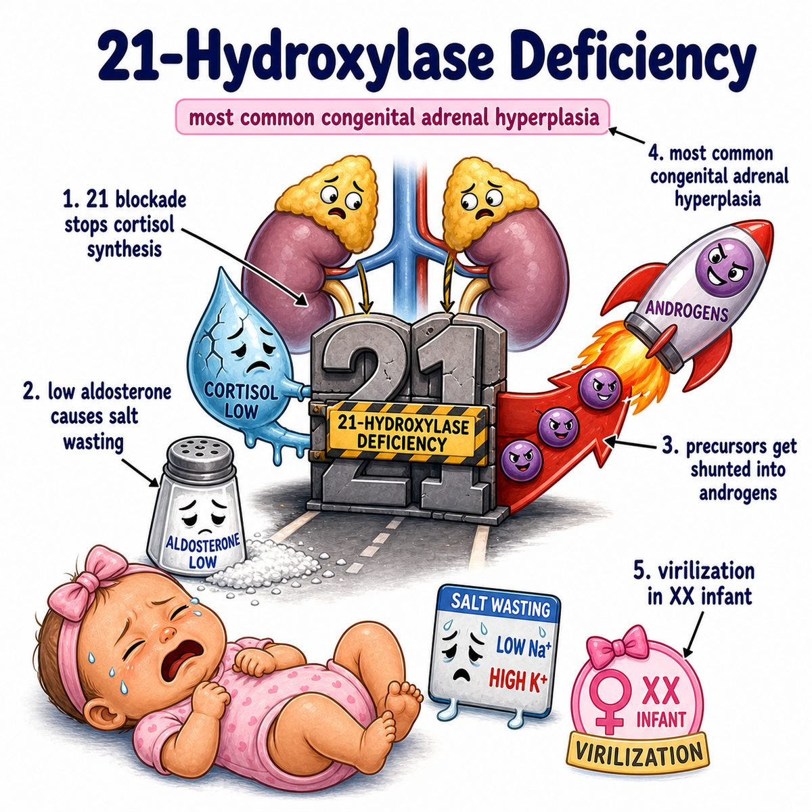

# Congenital adrenal hyperplasia

Congenital adrenal hyperplasia (CAH) = an inherited adrenal enzyme problem that causes abnormal steroid hormone production.

Break it down:

* congenital = present from birth
* adrenal = adrenal glands, which sit on top of the kidneys
* hyperplasia = increased number of cells, making the gland enlarged

Most Step 1 important cause:

* 21-hydroxylase deficiency

21-hydroxylase normally helps make:

* cortisol
* aldosterone

So if 21-hydroxylase is deficient:

* decreased cortisol
* decreased aldosterone
* increased androgens

Why?

Low cortisol means the pituitary releases more ACTH (adrenocorticotropic hormone).

ACTH keeps yelling at the adrenal gland:

> make more steroid hormone

But the pathway is blocked, so precursors cannot become cortisol/aldosterone normally.

Those precursors get shunted into androgen production instead.

So the adrenal becomes:

* bigger from chronic ACTH stimulation
* overproducing androgens

Classic findings:

* ambiguous genitalia/virilization in 46,XX infants because excess androgens masculinize external genitalia
* salt wasting because low aldosterone causes sodium loss
* hypotension because sodium/water are lost
* hyperkalemia because aldosterone normally helps excrete potassium
* increased 17-hydroxyprogesterone (17-OHP), a cortisol precursor that builds up before the blocked step

One-line intuition:

CAH is basically a blocked adrenal steroid pathway: the body tries harder with ACTH, the adrenal enlarges, and hormone precursors spill into androgen production.

## Pearl

21-hydroxylase deficiency = decreased cortisol, decreased aldosterone, increased androgens.

Contrast: 11-beta-hydroxylase deficiency also increases androgens, but causes hypertension because deoxycorticosterone (DOC), a mineralocorticoid-like precursor, builds up.