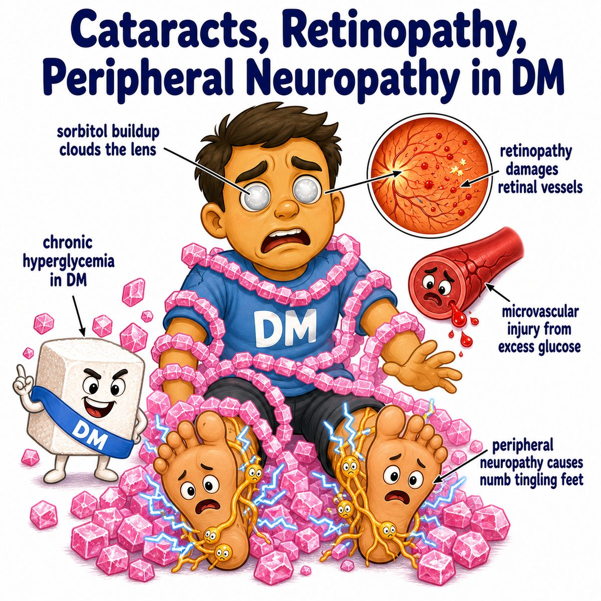
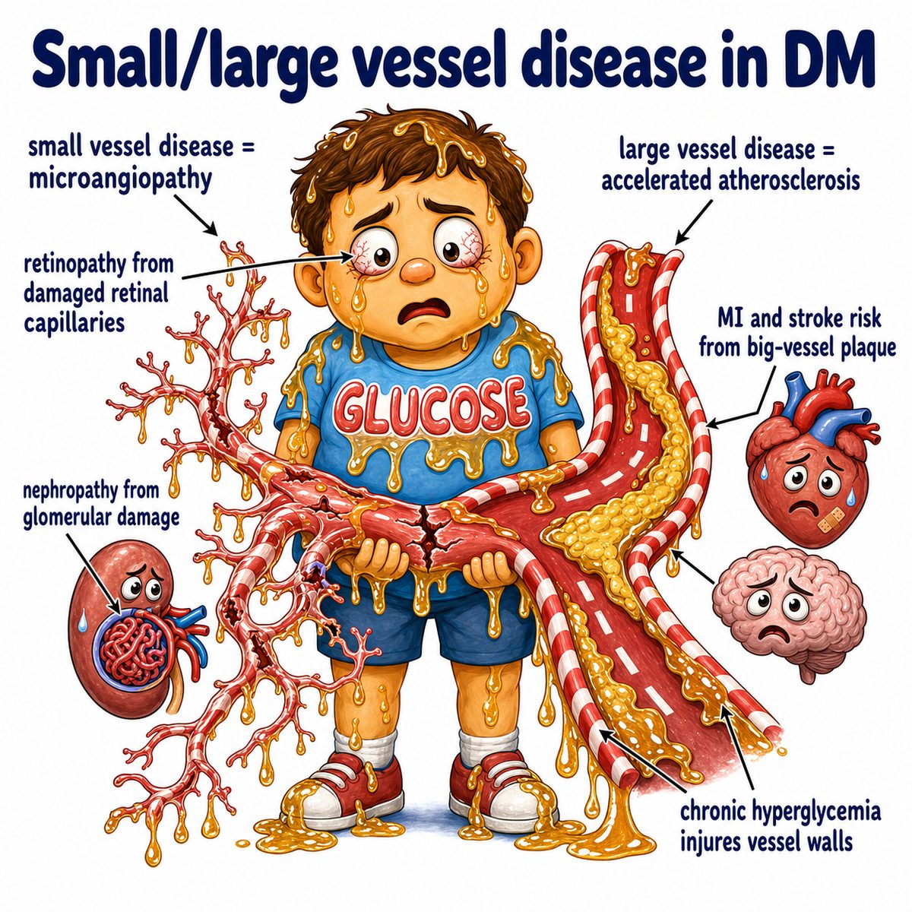

# Diabetes mellitus type 2

### Core idea

Type 2 diabetes mellitus is chronic high blood glucose (blood sugar) because the body has:

* insulin resistance (tissues do not respond well to insulin)
* relative insulin deficiency (the pancreas cannot make enough insulin for the body's needs)

Insulin is the hormone that lets glucose enter cells.

So the simple idea is:

> insulin is present, but the body is resistant to it.

---

### What happens

Normally:

* you eat glucose
* pancreatic beta cells (insulin-producing cells in the pancreas) release insulin
* insulin helps muscle and fat cells take up glucose
* blood glucose goes down

In type 2 diabetes:

* muscle/fat/liver cells ignore insulin
* pancreas makes more insulin at first
* beta cells eventually get exhausted
* blood glucose stays high

---

### Why symptoms happen

High glucose in the blood spills into urine when it exceeds kidney reabsorption capacity.

That causes:

* polyuria (excess urination): glucose pulls water into urine
* polydipsia (excess thirst): water loss makes the patient thirsty
* blurry vision: glucose shifts water in the lens
* infections: high glucose helps microbes grow

---

### Classic associations

Type 2 diabetes is associated with:

* obesity
* metabolic syndrome (insulin resistance + hypertension + abnormal lipids + central obesity)
* acanthosis nigricans (dark, velvety skin plaques from insulin resistance)
* family history

---

## One-line intuition

Type 2 diabetes is like the body "stopping listening" to insulin, so the pancreas yells louder with more insulin until it cannot keep up.

---

## Pearl 🔥

Type 2 diabetes has increased islet amyloid deposition, from amylin (IAPP; islet amyloid polypeptide), which is co-secreted with insulin by beta cells.