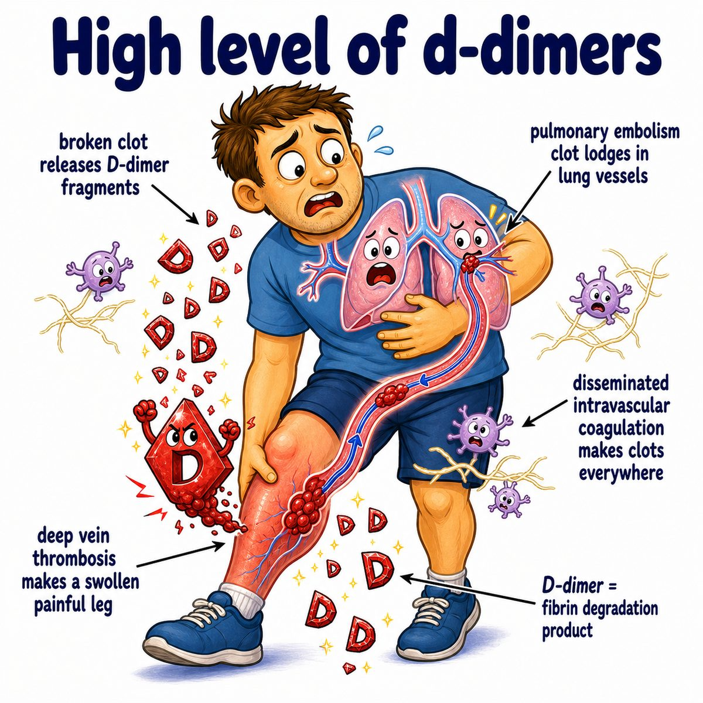

# Disseminated intravascular coagulation

### Core idea

Disseminated intravascular coagulation (DIC) is basically:

> clotting everywhere, then bleeding everywhere.

The body massively activates coagulation (clotting), so tiny clots form throughout small blood vessels.

But because clotting is happening so much, the body uses up:

* platelets
* fibrinogen
* clotting factors

So now the patient cannot clot normally and starts bleeding.

---

### Why both clotting and bleeding happen

Think of it like accidentally turning on the clotting system in the whole body.

First:

* tissue factor (protein that activates the extrinsic coagulation pathway) or inflammatory cytokines (immune signaling molecules) trigger widespread thrombin (enzyme that converts fibrinogen to fibrin) formation
* thrombin makes fibrin (clot-stabilizing protein)
* fibrin forms microthrombi (tiny clots) in small vessels

Then:

* platelets and clotting factors get consumed
* fibrinogen gets depleted
* bleeding risk increases

So DIC is a **consumption coagulopathy** (bleeding disorder due to consumption of clotting supplies).

---

### Classic causes

Common triggers:

* sepsis (life-threatening infection with systemic inflammation)
* trauma
* obstetric complications, especially amniotic fluid embolism (amniotic fluid entering maternal blood)
* malignancy (cancer), especially acute promyelocytic leukemia (APL, subtype of acute myeloid leukemia)

---

### Labs

Expected labs:

* low platelets
* increased PT (prothrombin time; extrinsic/common pathway test)
* increased PTT (partial thromboplastin time; intrinsic/common pathway test)
* low fibrinogen
* increased D-dimer (fibrin breakdown product)
* schistocytes (fragmented red blood cells) may be seen

Why D-dimer is high:

The body is making lots of fibrin clots, then breaking them down, so fibrin degradation products increase.

Why schistocytes can happen:

Red blood cells get sliced as they pass through small vessels filled with fibrin strands.

---

## One-line intuition

DIC is when a severe trigger makes the whole bloodstream start clotting, which uses up the clotting supplies and causes paradoxical bleeding.

---

## Pearl 🔥

DIC classically has **increased PT, increased PTT, low platelets, low fibrinogen, and increased D-dimer**.

Compare that to thrombotic thrombocytopenic purpura (TTP), where PT/PTT are usually normal because the coagulation factors are not being consumed.