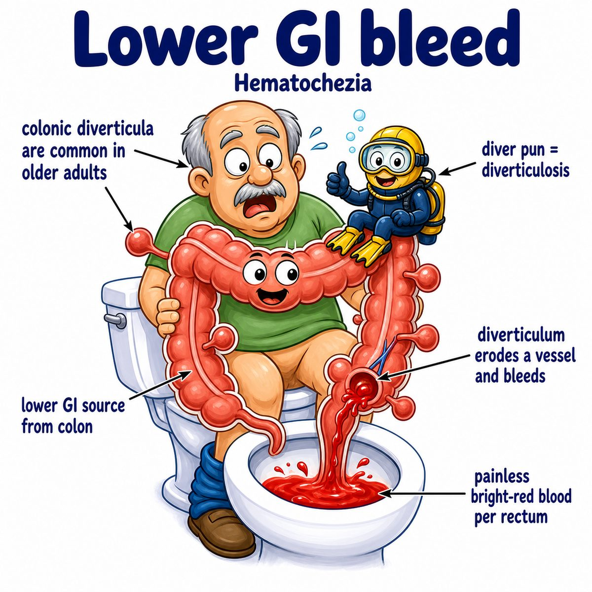

# Diverticulosis

Diverticulosis means having diverticula (small outpouchings/sacs) in the colon (large intestine).

Key distinction:

* diverticulosis = pouches are present
* diverticulitis = pouches are inflamed/infected

So diverticulosis by itself is often asymptomatic.

---

### Core idea

Think of the colon wall like a bike tire with weak spots.

When pressure inside the colon gets high, the inner lining can push outward through weak areas, forming little pouches.

These pouches are called diverticula.

---

### Why they form

Diverticula usually form where blood vessels penetrate the muscular wall of the colon.

That spot is weaker, so increased intraluminal pressure (pressure inside the bowel lumen) can push the mucosa (inner lining) and submucosa (support layer under mucosa) outward.

Important: most colonic diverticula are pseudodiverticula (false diverticula), meaning they do not contain all layers of the bowel wall.

---

### Where it usually happens

Most common site:

* sigmoid colon

Why sigmoid?

* it has a narrower lumen (inside tube space)
* narrower tube means higher pressure during stool movement

Higher pressure makes pouching more likely.

---

### Clinical relevance

Diverticulosis can cause:

* no symptoms
* painless lower gastrointestinal bleeding
* progression to diverticulitis

Diverticulitis causes:

* left lower quadrant abdominal pain
* fever
* leukocytosis (high white blood cell count)

---

## One-line intuition

Diverticulosis is just "colon wall pouches" from pressure pushing through weak spots, especially in the sigmoid colon.

---

## HY pearl

Diverticulosis is classically associated with painless hematochezia (bright red blood per rectum), while diverticulitis is painful inflammation, classically with left lower quadrant pain.