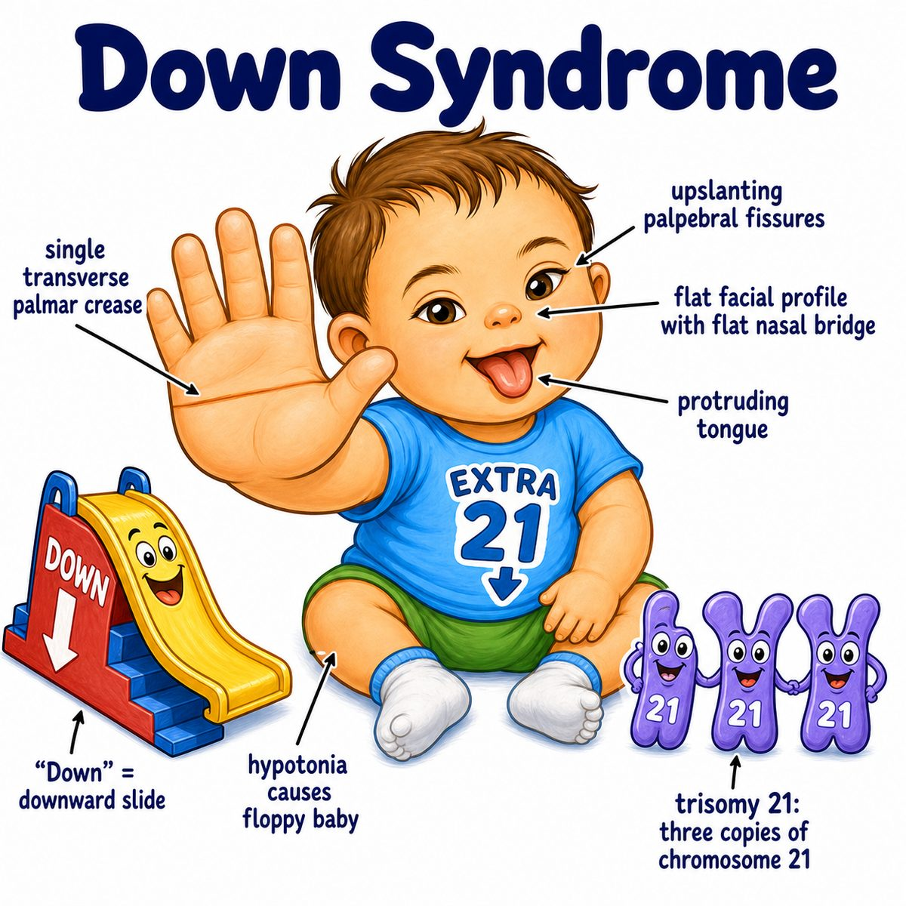
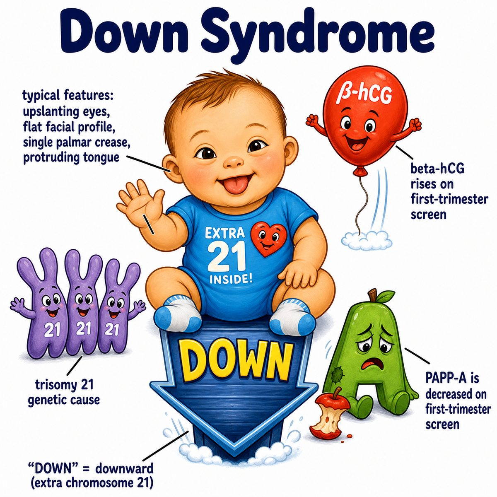

# Down syndrome

### Core idea

Down syndrome is a genetic condition caused by extra chromosome 21 material.

Most commonly:

* trisomy 21 = three copies of chromosome 21 instead of two
* karyotype (chromosome picture) = 47 chromosomes instead of 46

So the simplest way to think about it:

> extra chromosome 21 genes = abnormal development across multiple organ systems.

---

### Why the findings happen

The extra chromosome changes gene dosage (how much gene product is made), which affects fetal development.

Common findings:

* intellectual disability (impaired learning/development)
* hypotonia (low muscle tone)
* flat facial profile
* upslanting palpebral fissures (upward-slanting eye openings)
* epicanthal folds (skin folds near the inner eye corner)
* single transverse palmar crease (one crease across the palm)
* Brushfield spots (small pale spots on the iris)

---

### Important associations

Down syndrome is associated with:

* congenital heart disease, especially AVSD (atrioventricular septal defect)
* duodenal atresia (blocked duodenum, causing "double bubble" on imaging)
* Hirschsprung disease (missing enteric nerve cells causing severe constipation)
* increased risk of ALL (acute lymphoblastic leukemia) and AML (acute myeloid leukemia), especially acute megakaryoblastic leukemia
* early Alzheimer disease

Why Alzheimer risk goes up:

* APP (amyloid precursor protein) gene is on chromosome 21
* extra APP can increase amyloid buildup

---

### Mechanism

Most cases are due to nondisjunction (chromosomes fail to separate properly during egg or sperm formation).

Risk increases with maternal age because older eggs have been paused in meiosis (cell division that makes eggs/sperm) for longer, so chromosome separation errors become more likely.

---

## One-line intuition

Down syndrome = extra chromosome 21 material causing characteristic development changes plus heart/GI/blood/neuro associations.

---

## HY pearl

Think: Down syndrome = AV canal defect, duodenal atresia, Hirschsprung disease, leukemia, and early Alzheimer disease.