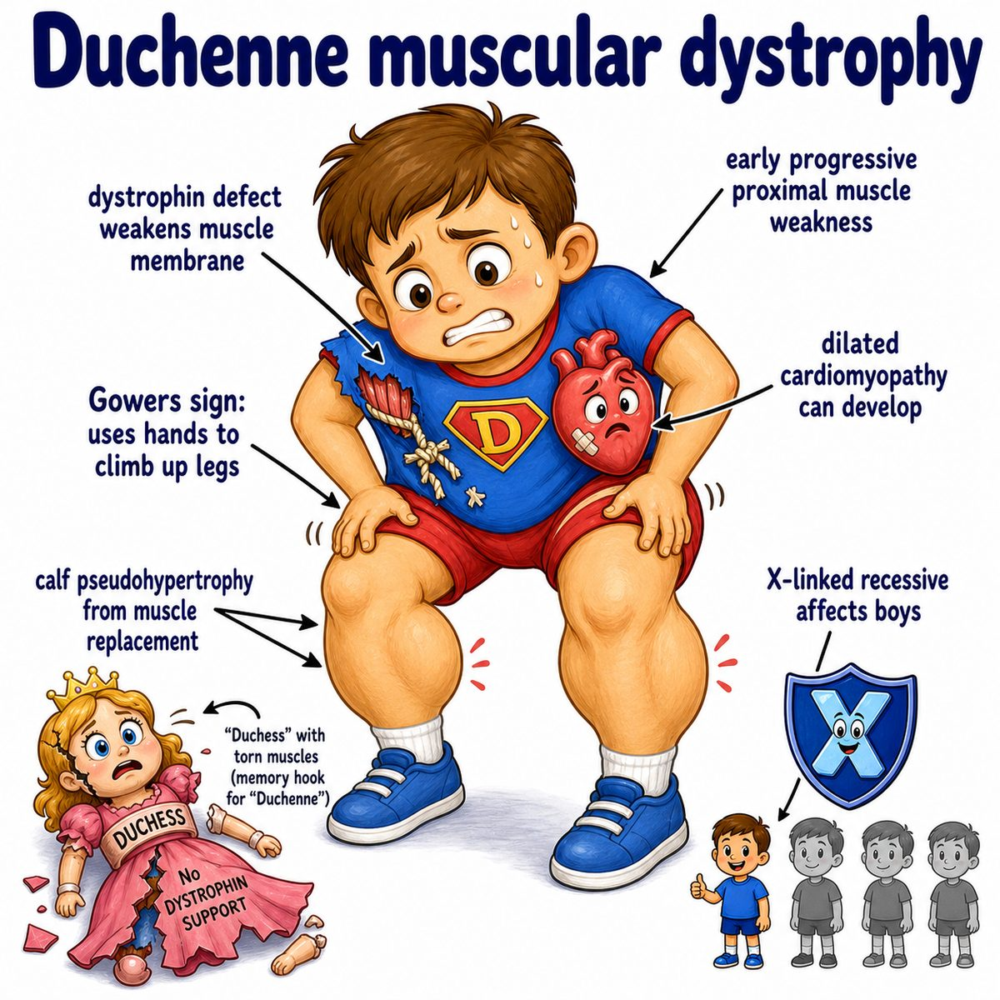
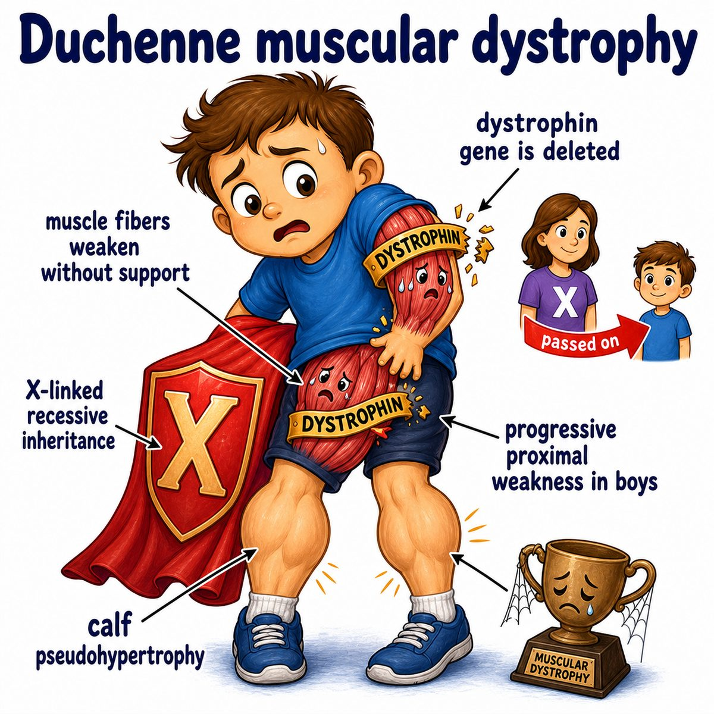
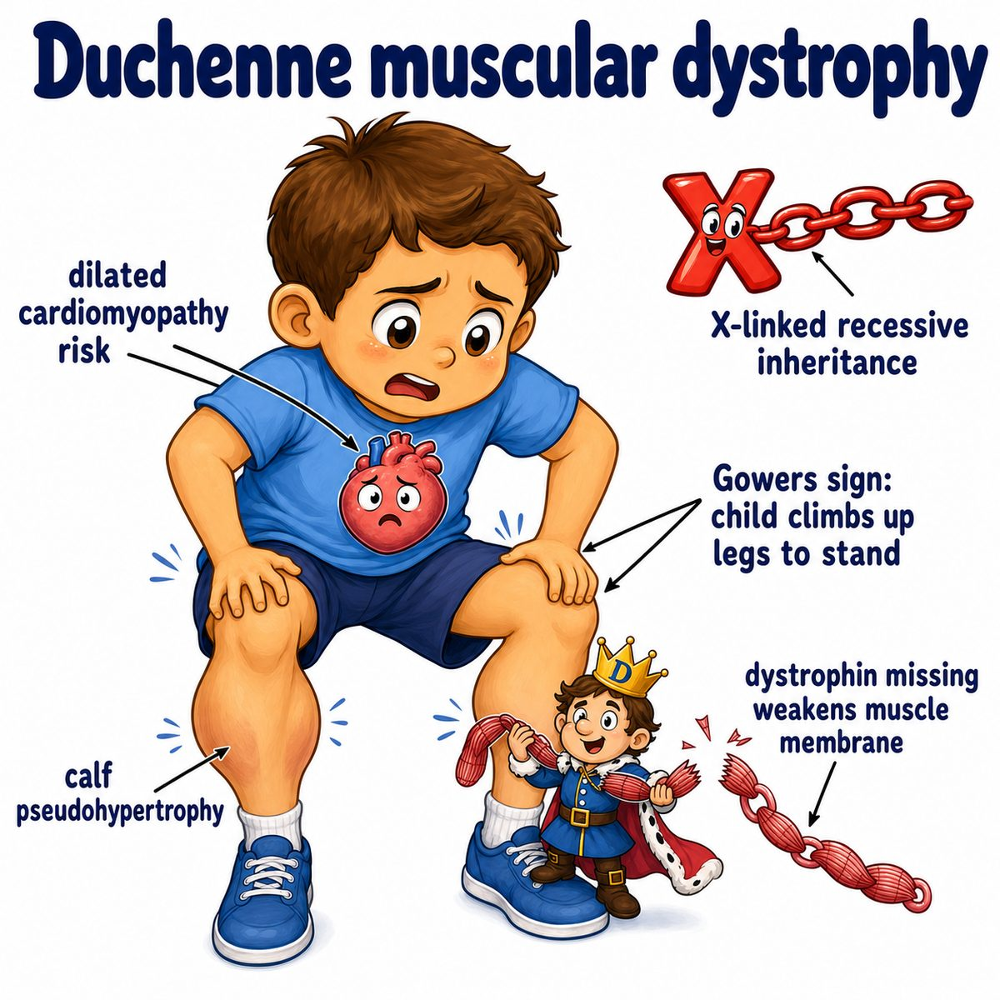

# Duchenne muscular dystrophy

Duchenne muscular dystrophy is an X-linked recessive disease where boys cannot make functional dystrophin.

X-linked recessive means the mutated gene is on the X chromosome, so males are affected more often.

Dystrophin is a muscle-stabilizing protein that connects:

* actin cytoskeleton inside the muscle cell
* sarcolemma (muscle cell membrane)
* extracellular matrix (support tissue outside the cell)

So dystrophin is basically a shock absorber for muscle cells.

---

### Core idea

Without dystrophin, muscle cells get damaged every time they contract.

Repeated contraction causes:

* sarcolemma tears
* calcium entering muscle cells
* muscle fiber death
* replacement by fat and connective tissue

That is why the disease causes progressive weakness.

---

### Classic findings

* proximal muscle weakness, especially hips and thighs
* delayed walking
* frequent falls
* Gowers sign
* calf pseudohypertrophy
* very high creatine kinase
* dilated cardiomyopathy later

Gowers sign means the child uses their hands to "walk up" their legs when standing up, because the hip/thigh muscles are too weak.

Calf pseudohypertrophy means the calves look big, but it is not true strong muscle. It is muscle being replaced by fat and connective tissue.

Creatine kinase is an enzyme inside muscle cells. It becomes high in blood because damaged muscle cells leak it out.

---

### Duchenne vs Becker

Duchenne:

* absent dystrophin
* more severe
* earlier onset

Becker muscular dystrophy:

* defective but partially functional dystrophin
* milder
* later onset

One-line intuition:

> Duchenne = no dystrophin, so muscle membrane breaks down fast.

---

## Pearl 🔥

Duchenne muscular dystrophy is classically due to a frameshift mutation in the DMD gene.

Frameshift mutation means the DNA reading frame is disrupted, so the protein is basically not made correctly at all.

Becker is usually an in-frame mutation, meaning the reading frame is preserved, so some partially useful dystrophin is still made.