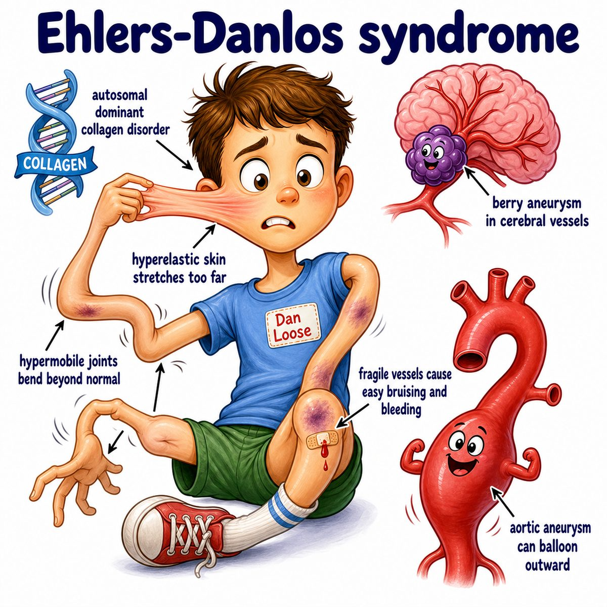

# Ehlers-Danlos syndrome

### Core idea

Ehlers-Danlos syndrome is a group of inherited connective tissue disorders.

Connective tissue = the body's "support material" that helps hold together:

* skin
* ligaments
* joints
* blood vessels
* organs

The main problem is abnormal collagen or collagen-related proteins.

Collagen = the structural protein that gives tissues strength.

So if collagen is weak, tissues become too stretchy and fragile.

---

### Classic findings

Think:

* hypermobile joints
* hyperextensible skin
* easy bruising
* poor wound healing
* atrophic scars

Atrophic scars = thin, sunken scars.

---

### Why the findings happen

* **Loose joints:** weak connective tissue in ligaments cannot hold joints tightly
* **Stretchy skin:** abnormal collagen makes skin more elastic than normal
* **Easy bruising:** fragile blood vessel support tissue breaks more easily
* **Poor wound healing/scars:** collagen is needed to repair wounds strongly

So the intuition is:

> defective collagen = defective body scaffolding.

---

### Types to know

High-yield forms:

* **Classic EDS (Ehlers-Danlos syndrome):** skin hyperextensibility + joint hypermobility
* **Hypermobile EDS:** mainly joint hypermobility and pain
* **Vascular EDS:** blood vessel/organ rupture risk

Vascular EDS is the scary one because vessels and hollow organs can tear.

---

### Inheritance

Many important EDS (Ehlers-Danlos syndrome) types are autosomal dominant.

Autosomal dominant = one bad copy of the gene can cause disease.

But some types are autosomal recessive.

Autosomal recessive = two bad copies are needed.

---

## One-line intuition

EDS is weak collagen/connective tissue, so skin stretches, joints move too much, wounds heal poorly, and vessels can be fragile.

---

## Pearl 🔥

Vascular EDS (Ehlers-Danlos syndrome) is classically associated with **COL3A1** mutations, affecting type III collagen, and can cause arterial or organ rupture.