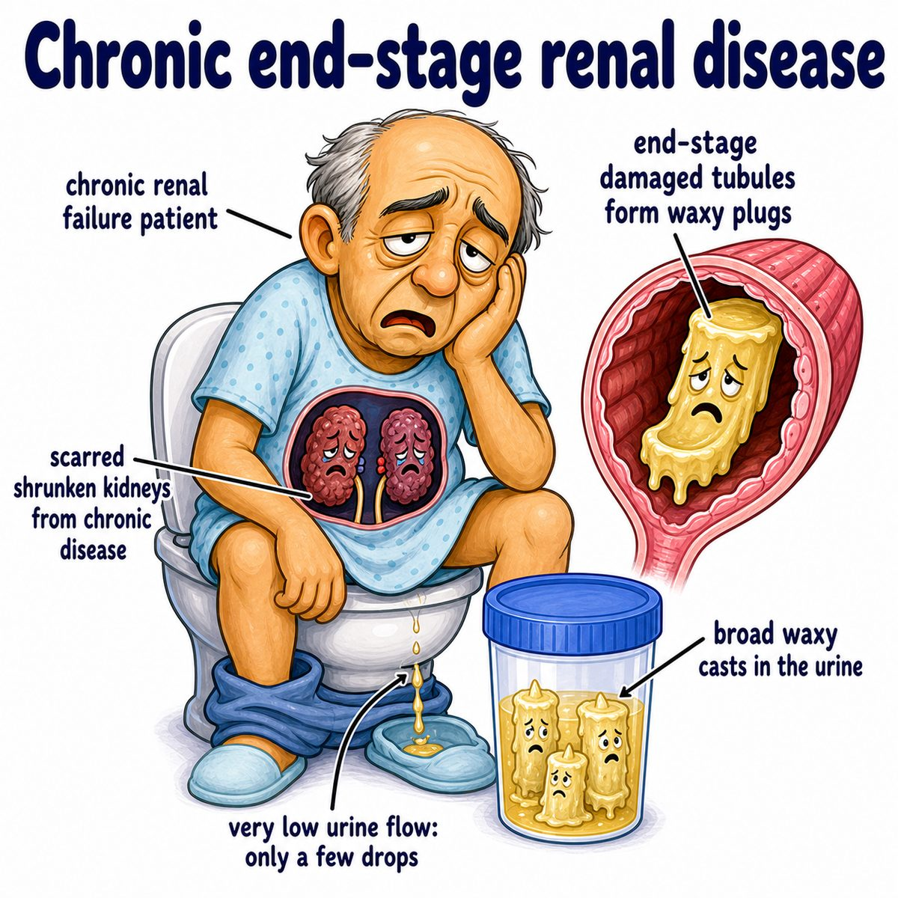

# End-stage renal disease

End-stage renal disease means the kidneys have failed so badly that they cannot keep the body in balance without renal replacement therapy.

Renal replacement therapy means:

* dialysis
* kidney transplant

Break it down:

* end-stage = final/severe stage
* renal = kidney
* disease = damage/pathology

So ESRD (end-stage renal disease) basically means:

> the kidneys are no longer doing enough filtering, fluid control, electrolyte control, or hormone production to sustain normal life.

---

### Core idea

Normal kidneys:

* remove urea/creatinine waste
* remove extra water
* regulate potassium, acid, phosphate
* make EPO (erythropoietin, a hormone that stimulates red blood cell production)
* activate vitamin D

In ESRD, too many nephrons (kidney filtering units) are destroyed, so the remaining nephrons cannot compensate anymore.

---

### Why the findings happen

* **Azotemia/uremia:** waste products build up in blood
* **Edema and hypertension:** kidneys cannot excrete sodium/water well
* **Hyperkalemia:** kidneys cannot dump potassium
* **Metabolic acidosis:** kidneys cannot excrete acid or regenerate bicarbonate well
* **Anemia:** damaged kidneys make less EPO (erythropoietin)
* **Bone disease:** less vitamin D activation plus phosphate retention causes secondary hyperparathyroidism

Secondary hyperparathyroidism means PTH (parathyroid hormone) is high because low calcium/high phosphate keeps stimulating the parathyroid glands.

---

### Common causes

Most common big Step 1 causes:

* diabetes mellitus
* hypertension
* chronic glomerulonephritis
* polycystic kidney disease

Diabetes damages glomeruli by glycation and hyperfiltration injury.

Hypertension damages small renal vessels, causing ischemia and nephron loss.

---

## One-line intuition

ESRD is when chronic kidney damage has destroyed so many nephrons that the body needs an artificial kidney filter or a new kidney.

---

## Pearl 🔥

ESRD is classically CKD (chronic kidney disease) stage 5, with GFR (glomerular filtration rate) less than 15 mL/min/1.73 m².