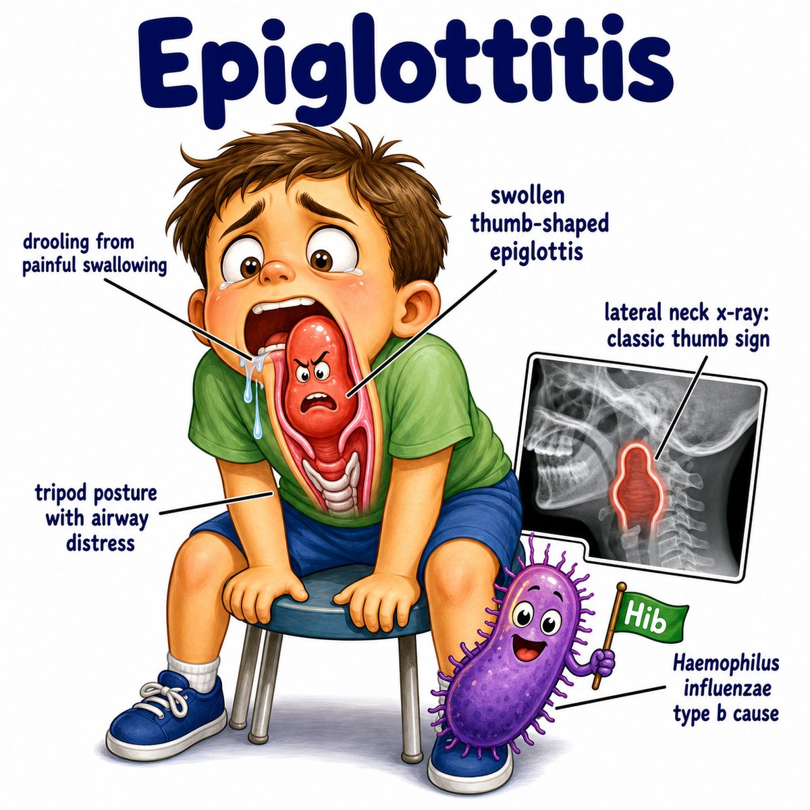

# Epiglottitis

### Core idea

Epiglottitis = inflammation/swelling of the epiglottis.

The epiglottis is the flap of cartilage that closes over the airway when you swallow.

So if it swells, it can block the airway.

That is why epiglottitis is an emergency.

---

### Classic presentation

Think:

* fever
* severe sore throat
* dysphagia (difficulty swallowing)
* drooling
* muffled voice
* stridor (high-pitched breathing sound from upper airway narrowing)
* tripod position, meaning leaning forward to breathe

The key intuition:

> swollen flap sitting right above the trachea = airway can suddenly close.

---

### Why the findings happen

* **Drooling:** swallowing hurts and the swollen epiglottis blocks normal swallowing
* **Muffled voice:** swelling distorts the upper airway/voice resonance
* **Stridor:** narrowed upper airway makes turbulent airflow
* **Tripod position:** leaning forward helps open the upper airway a little
* **Normal-looking throat sometimes:** the problem is deeper, near the larynx, not just the tonsils/pharynx

Larynx = voice box.

Pharynx = throat passage behind the nose/mouth.

---

### Cause

Classically caused by Hib (Haemophilus influenzae type b).

But because of the Hib vaccine, it is much less common in kids now.

Other bacteria can also cause it, especially in adults.

---

### Diagnosis clue

Lateral neck X-ray can show the:

* **thumbprint sign**

This is a swollen epiglottis that looks like a thumb on X-ray.

But if the patient looks unstable, do not delay airway management for imaging.

---

### Treatment priority

First priority:

* secure the airway

Then:

* IV antibiotics, meaning intravenous antibiotics

Do **not** aggressively examine the throat with a tongue depressor if epiglottitis is suspected, because irritating the airway can worsen obstruction.

---

## One-line intuition

Epiglottitis is a swollen airway flap that can suddenly plug the trachea, so airway comes before everything else.

---

## HY pearl

Epiglottitis = **thumbprint sign** on lateral neck X-ray.

Croup = **steeple sign** on AP (anteroposterior, front-to-back) neck X-ray.