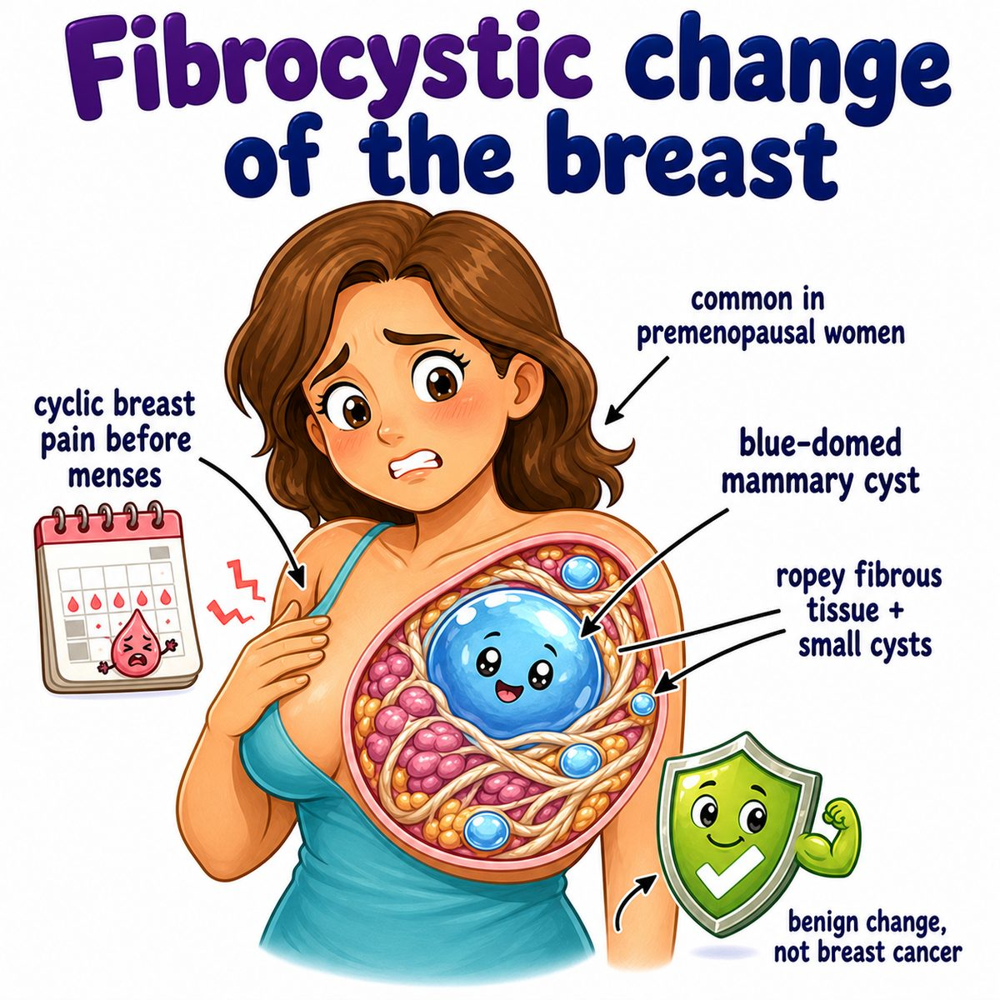

# Fibrocystic changes of breast

Fibrocystic changes of the breast = benign (non-cancerous) breast changes with:

* cysts (fluid-filled sacs)
* fibrosis (scar-like fibrous tissue)
* lumpiness/tenderness

Classic patient:

* reproductive-age woman
* cyclic breast pain, worse before menses (menstrual period)
* multiple, movable, tender lumps

---

### Core idea

Think:

> estrogen/progesterone-sensitive breast tissue gets swollen, cystic, and fibrotic.

So the breast feels:

* lumpy
* bumpy
* tender
* sometimes "rope-like"

The symptoms often fluctuate with the menstrual cycle because breast ducts and lobules respond to hormones.

---

### Why the findings happen

* **Cysts:** ducts/lobules dilate and fill with fluid
* **Fibrosis:** repeated irritation/rupture of cysts causes scar-like tissue
* **Pain before menses:** hormone-driven fluid retention and duct/lobule swelling
* **Movable lumps:** benign cystic/fibrous tissue is usually not fixed to skin or chest wall

---

### Histology buzzwords

Common benign findings:

* cystic dilation
* fibrosis
* apocrine metaplasia

Apocrine metaplasia means breast duct cells change into apocrine-type cells (cells with abundant pink cytoplasm and "snouts" from secretion).

---

### Cancer risk

Most fibrocystic change is **benign and not premalignant**.

But risk depends on the specific biopsy finding:

* nonproliferative changes = no major increased cancer risk
* proliferative disease without atypia = mildly increased risk
* atypical hyperplasia = clearly increased risk

Atypia means abnormal-looking cells.

---

## One-line intuition

Fibrocystic breast change is basically hormonally responsive breast tissue becoming cyst-filled and fibrotic, causing cyclic tender lumpiness.

---

## Pearl 🔥

Fibrocystic changes can mimic breast cancer clinically, so a new breast mass still needs proper evaluation, but Step 1 wants you to remember: **cyclic, tender, multiple/mobile lumps = benign fibrocystic change**.