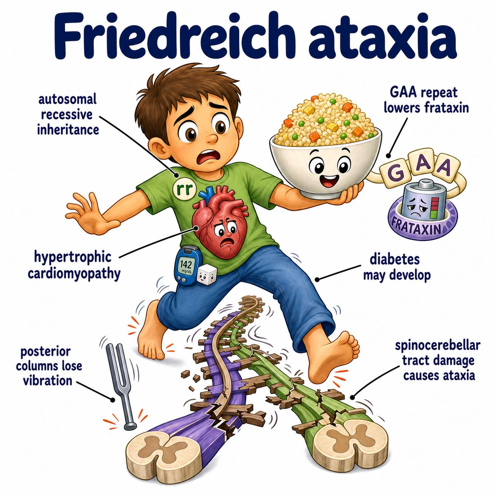
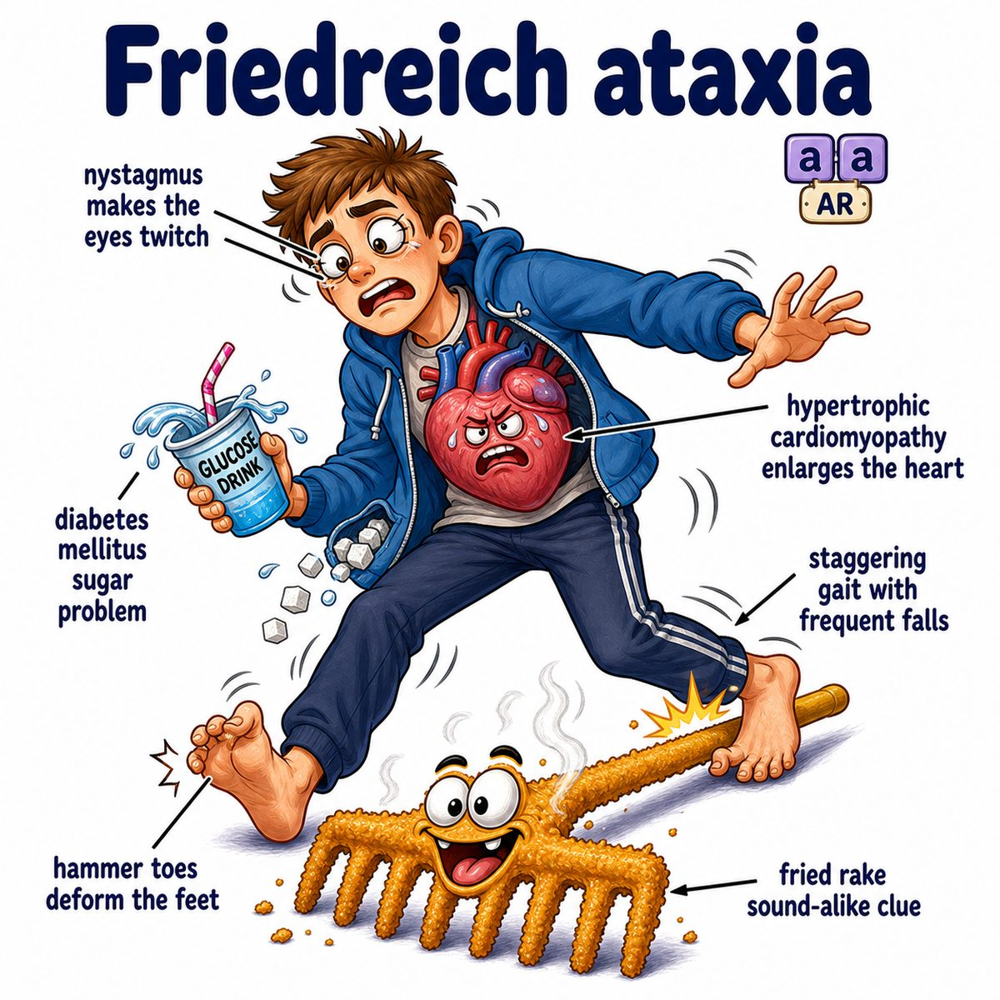

# Friedreich ataxia

### Core idea

Friedreich ataxia is an autosomal recessive (need 2 bad copies) trinucleotide repeat disorder.

The mutation is:

* GAA (guanine-adenine-adenine) repeat expansion
* in the FXN gene (frataxin gene)
* causing decreased frataxin

Frataxin is a mitochondrial protein, so low frataxin mainly hurts tissues that need lots of ATP (cell energy):

* nervous system
* heart
* pancreas

---

### What gets damaged

Mainly degeneration of:

* dorsal columns
* spinocerebellar tracts
* corticospinal tracts

Break that down:

* dorsal columns = vibration/proprioception pathway
* proprioception = knowing where your limbs are in space
* spinocerebellar tracts = unconscious coordination input to cerebellum
* corticospinal tracts = upper motor neuron pathway for voluntary movement

So the patient loses position sense + coordination.

---

### Classic findings

* gait ataxia (unsteady walking)
* dysarthria (slurred speech)
* loss of vibration/proprioception
* absent deep tendon reflexes
* Babinski sign sometimes, from corticospinal tract damage
* pes cavus (high-arched foot)
* scoliosis (curved spine)
* hypertrophic cardiomyopathy (thickened heart muscle)
* diabetes mellitus (high blood glucose from impaired insulin function)

---

### Why the symptoms happen

Low frataxin causes mitochondrial dysfunction.

Mitochondria normally help with:

* ATP production
* iron-sulfur cluster formation
* controlling oxidative stress

Without enough frataxin:

* neurons cannot maintain long spinal cord tracts well
* heart muscle gets stressed and thickens
* pancreatic beta cells can fail, causing diabetes mellitus

That is why Friedreich ataxia is not just "ataxia" - it is neuro + heart + endocrine.

---

## One-line intuition

Friedreich ataxia = GAA repeat knocks down frataxin, frying mitochondria in long spinal tracts and the heart.

---

## Pearl 🔥

Friedreich ataxia is a trinucleotide repeat disease, but unlike Huntington disease, it is autosomal recessive and caused by GAA repeat expansion in the FXN gene.