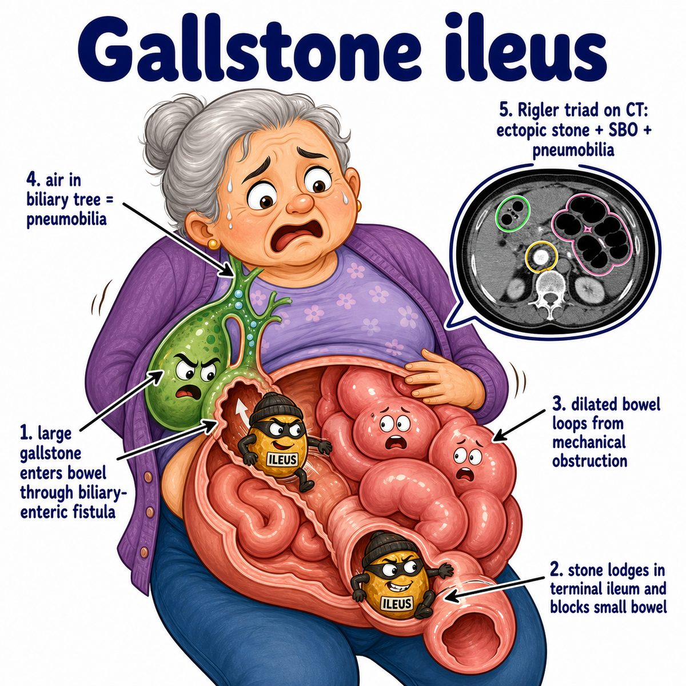

# Gallstone ileus

Gallstone ileus = small bowel obstruction caused by a gallstone.

Important: the word **ileus** is misleading here.

Usually:

* ileus = bowel is not moving well
* gallstone ileus = mechanical obstruction from a stone physically blocking the bowel

---

### Core idea

A large gallstone erodes from the gallbladder into the intestine through a fistula.

Fistula = abnormal connection between 2 epithelial surfaces.

Most commonly:

* gallbladder connects to duodenum
* stone enters bowel
* stone travels downstream
* stone gets stuck in distal ileum

Distal ileum = last part of small intestine before the colon.

---

### Why it happens

Chronic gallbladder inflammation makes the gallbladder wall stick to nearby bowel.

Then the stone keeps pressing and eroding until it creates a tunnel.

That tunnel is called a **cholecystoenteric fistula**:

* cholecysto- = gallbladder
* enteric = intestine

So the gallstone basically escapes the gallbladder and becomes a bowel foreign body.

---

### Why the distal ileum is common

The distal ileum is relatively narrow.

So a big stone may pass through earlier wider bowel, then finally get trapped near the ileocecal valve.

Ileocecal valve = valve between ileum and cecum, where small intestine enters large intestine.

---

### Classic imaging clue

Rigler triad:

* pneumobilia
* small bowel obstruction
* ectopic gallstone

Pneumobilia = air in the biliary tree.

Ectopic gallstone = gallstone outside its normal location, like inside the bowel.

Why pneumobilia happens:

Air from the intestine travels backward through the fistula into the biliary system.

---

## One-line intuition

A gallstone digs a tunnel into the gut, rolls down the intestine, and plugs the narrow distal ileum.

---

## Pearl 🔥

Gallstone ileus is a **mechanical obstruction**, not a true paralytic ileus.