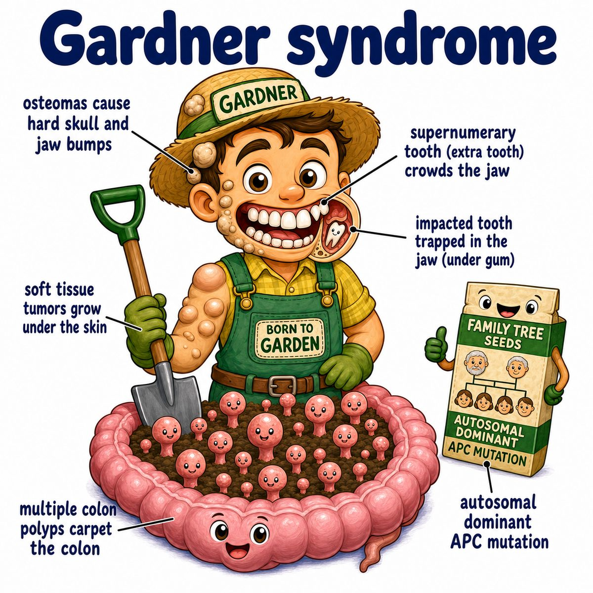

# Gardner syndrome

### Core idea

Gardner syndrome is a variant of FAP (familial adenomatous polyposis) caused by an APC (adenomatous polyposis coli) tumor suppressor gene mutation.

Think:

* colon polyps
* osteomas (benign bone tumors)
* epidermoid cysts (skin cysts)
* dental abnormalities, like extra or impacted teeth
* desmoid tumors (locally aggressive fibrous tumors)

---

### Why the findings happen

APC normally acts like a brake on the Wnt signaling pathway (a growth pathway that tells cells to divide).

If APC is mutated:

* the brake is lost
* beta-catenin builds up
* cells keep getting growth signals
* lots of adenomatous polyps form in the colon

Those colon polyps are premalignant, meaning they can turn into cancer.

---

### The classic association

Gardner syndrome = FAP plus extraintestinal findings.

Extraintestinal means outside the intestines.

So instead of just:

* hundreds to thousands of colon polyps

you also see:

* skull/jaw osteomas
* epidermoid cysts
* supernumerary teeth (extra teeth)
* desmoid tumors
* CHRPE (congenital hypertrophy of the retinal pigment epithelium), which is a pigmented retinal lesion

---

## One-line intuition

Gardner syndrome is “APC mutation causing tons of colon polyps plus random growths in bone, skin, teeth, and soft tissue.”

---

## Pearl 🔥

Untreated FAP (familial adenomatous polyposis) has a near-100% risk of colorectal cancer, so prophylactic colectomy (preventive colon removal) is often needed.