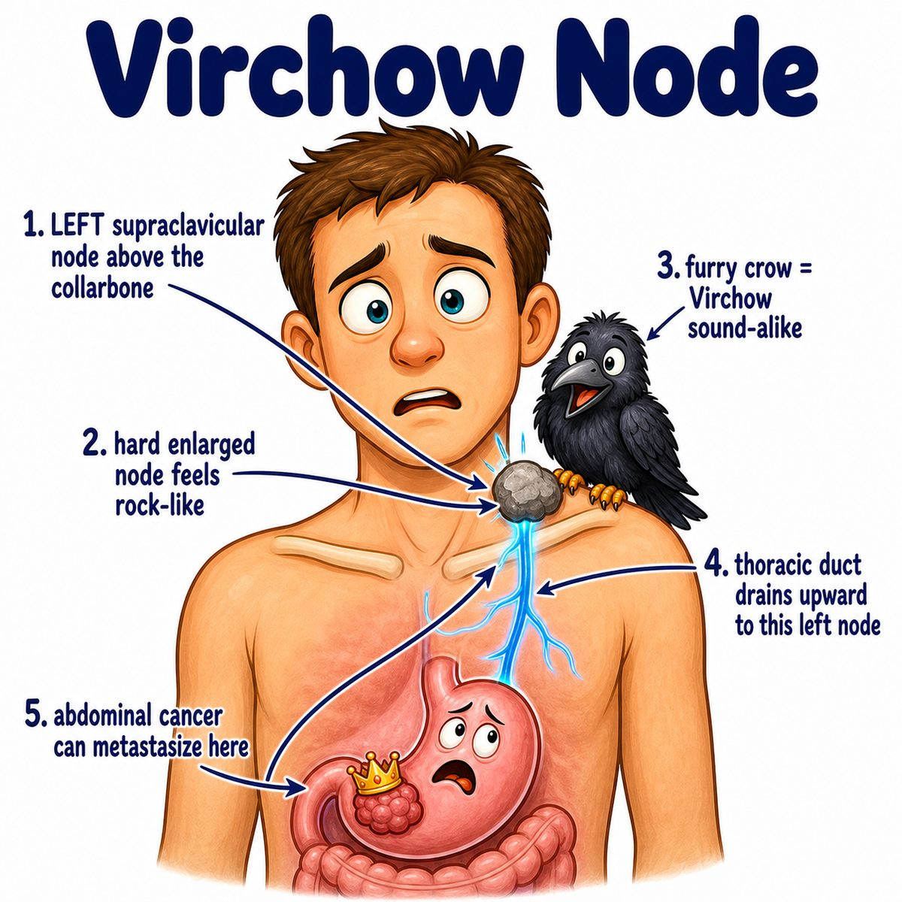

# Gastric adenocarcinoma

Gastric adenocarcinoma = cancer of the stomach gland cells.

Break it down:

* gastric = stomach
* adeno- = gland
* carcinoma = malignant epithelial cancer

So this is:

> malignant cancer arising from gland-forming epithelial cells in the stomach lining.

Most stomach cancers are adenocarcinomas.

---

### Core idea

It usually starts in the mucosa (innermost stomach lining), because that is where the mucus-secreting gland cells live.

Then it can invade deeper layers:

* mucosa
* submucosa
* muscle layer
* serosa
* nearby lymph nodes/organs

So staging depends a lot on how deep it has invaded and whether it spread to lymph nodes.

---

### Major risk factors

Classic risks:

* **H. pylori** (Helicobacter pylori) infection
* chronic atrophic gastritis
* intestinal metaplasia (stomach lining starts looking more intestine-like)
* smoked/salted foods
* smoking
* pernicious anemia
* partial gastrectomy

Why H. pylori matters:

chronic inflammation damages the mucosa over years → atrophy → intestinal metaplasia → dysplasia (precancerous abnormal cells) → adenocarcinoma.

---

### Two big histologic patterns

**Intestinal type**

* forms gland-like structures
* linked to H. pylori, chronic gastritis, intestinal metaplasia
* more common in older patients

**Diffuse type**

* poorly cohesive cells that do not stick together well
* often has signet-ring cells
* can thicken the whole stomach wall, causing linitis plastica

Linitis plastica = “leather bottle stomach,” where the stomach becomes stiff and thickened.

---

### Why symptoms happen

* **Weight loss/anorexia:** cancer + inflammation decreases appetite and increases metabolic demand
* **Early satiety:** stiff or mass-filled stomach cannot expand normally
* **Epigastric pain:** tumor irritates/invades the stomach wall
* **Melena** (black tarry stool): slow upper GI (gastrointestinal) bleeding from ulcerated tumor
* **Virchow node:** left supraclavicular lymph node metastasis from abdominal cancer
* **Sister Mary Joseph nodule:** umbilical metastasis
* **Krukenberg tumor:** ovarian metastasis, classically from gastric signet-ring adenocarcinoma

---

## One-line intuition

Gastric adenocarcinoma is stomach gland-cell cancer that often develops after chronic mucosal injury, then invades through the stomach wall and spreads through lymphatics.

---

## Pearl 🔥

Diffuse gastric adenocarcinoma can be associated with **CDH1** mutation, which affects E-cadherin, a cell adhesion protein. Less adhesion = cells spread diffusely instead of forming nice glands.