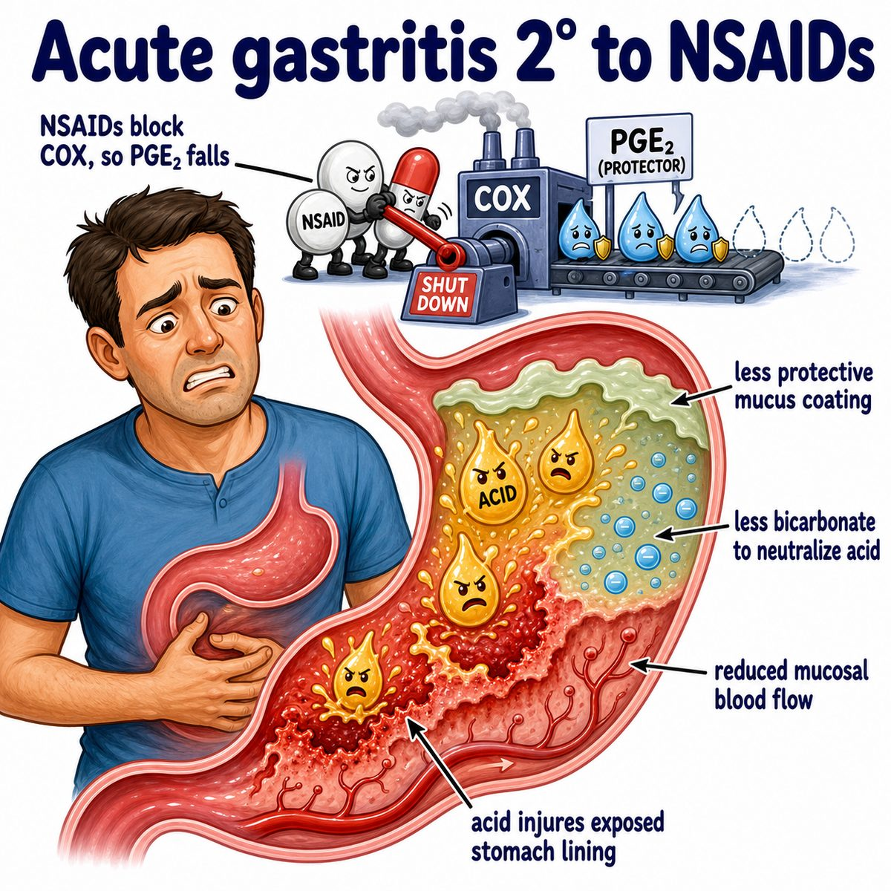

# Gastritis

Gastritis = inflammation of the gastric mucosa (stomach lining).

Core idea:

* the stomach normally protects itself from acid with mucus, bicarbonate (base that neutralizes acid), and prostaglandins (protective lipid signaling molecules)
* gastritis happens when that protective barrier is damaged or inflammation is triggered
* then acid can irritate the stomach lining

---

### Common causes

Big ones for Step 1:

* **H. pylori (Helicobacter pylori):** bacteria that live in the stomach mucus layer
* **NSAIDs (nonsteroidal anti-inflammatory drugs):** aspirin, ibuprofen, naproxen
* alcohol
* severe physiologic stress, like burns, trauma, sepsis (dangerous whole-body infection)
* autoimmune gastritis, where the immune system attacks parietal cells (acid-producing stomach cells)

---

### Why H. pylori causes gastritis

H. pylori makes **urease** (enzyme that breaks down urea).

Urease converts:

* urea -> ammonia

Ammonia is basic, so it helps neutralize stomach acid around the bacteria.

So H. pylori can survive in the stomach, crawl through mucus, and cause chronic inflammation.

That inflammation can lead to:

* gastritis
* peptic ulcers (sores in stomach or duodenum)
* gastric adenocarcinoma (stomach gland cancer)
* MALT lymphoma (mucosa-associated lymphoid tissue lymphoma, a cancer of immune tissue in mucosa)

---

### Why NSAIDs cause gastritis

NSAIDs inhibit **COX (cyclooxygenase)** enzymes.

COX normally helps make prostaglandins.

Prostaglandins normally increase:

* mucus
* bicarbonate
* blood flow to the stomach lining

So:

NSAIDs ↓ prostaglandins -> ↓ stomach protection -> acid injures mucosa -> gastritis/ulcers.

---

### Symptoms

Can be asymptomatic, but classically:

* epigastric pain (upper middle abdominal pain)
* nausea/vomiting
* bloating
* early satiety (feeling full quickly)
* bleeding if erosive

---

## One-line intuition

Gastritis is when the stomach lining loses its protection or gets chronically inflamed, so acid and immune cells irritate the mucosa.

---

## Pearl 🔥

Autoimmune gastritis attacks parietal cells, causing low intrinsic factor (protein needed to absorb vitamin B12), which can lead to pernicious anemia with megaloblastic anemia.