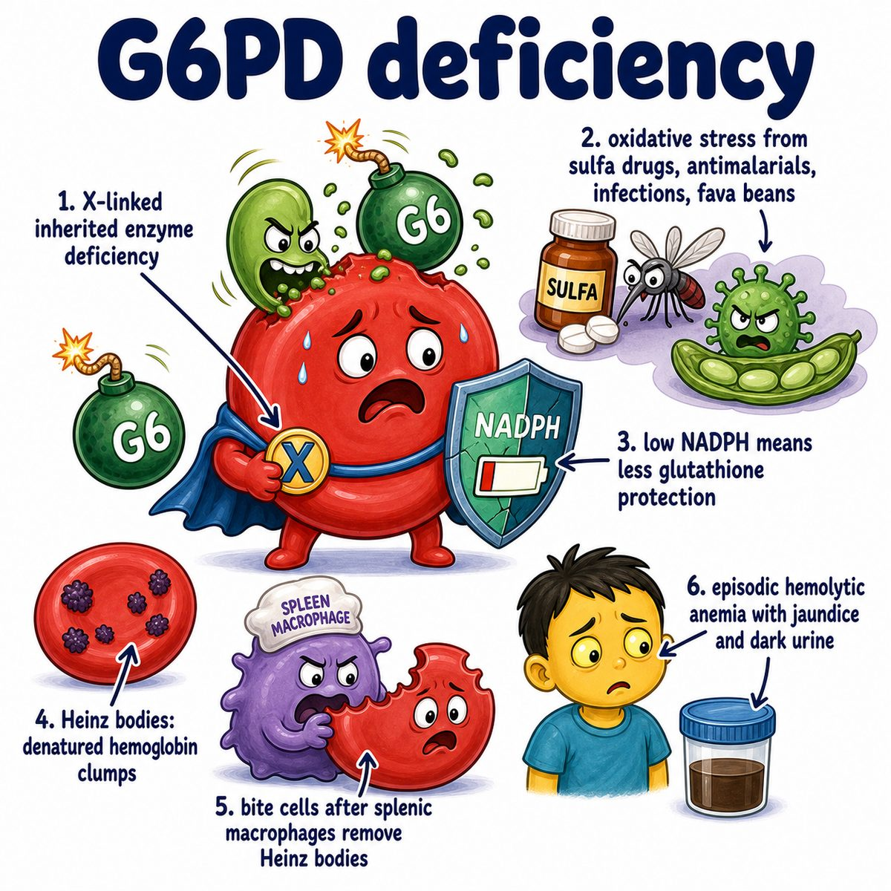

# Glucose-6-phosphate dehydrogenase deficiency

### Core idea

Glucose-6-phosphate dehydrogenase deficiency, aka **G6PD deficiency** (glucose-6-phosphate dehydrogenase deficiency), is an **X-linked recessive** enzyme deficiency where red blood cells cannot handle oxidative stress well.

G6PD normally helps make **NADPH** (nicotinamide adenine dinucleotide phosphate), which keeps **glutathione** reduced.

Reduced glutathione protects red blood cells from oxidants.

So:

> low G6PD = low NADPH = low reduced glutathione = red blood cells get oxidatively damaged and hemolyze.

---

### Why red blood cells are affected most

Red blood cells are extra vulnerable because they do not have mitochondria or nuclei.

So they depend heavily on the **pentose phosphate pathway** (glucose shunt pathway that makes NADPH) to protect themselves from oxidative damage.

If G6PD is deficient, oxidants damage hemoglobin.

Damaged hemoglobin clumps into:

* **Heinz bodies** (oxidized denatured hemoglobin inclusions inside red blood cells)

Then the spleen removes those clumps, leaving:

* **bite cells** (red blood cells with membrane chunks removed by splenic macrophages)

---

### Common triggers

Hemolysis can happen after oxidative stress from:

* infections
* fava beans
* sulfa drugs
* dapsone
* primaquine
* nitrofurantoin

The presentation is episodic:

* jaundice
* dark urine
* fatigue
* back/abdominal pain sometimes
* anemia after a trigger

---

### One-line intuition

G6PD deficiency means red blood cells cannot make enough NADPH, so oxidants damage hemoglobin, the spleen bites out the damaged parts, and the cells hemolyze.

---

## Pearl 🔥

G6PD deficiency is classically:

* **X-linked recessive**
* protective against malaria
* associated with **Heinz bodies** and **bite cells**

HY trigger list: **fava beans, infections, sulfa drugs, primaquine, dapsone, nitrofurantoin**.