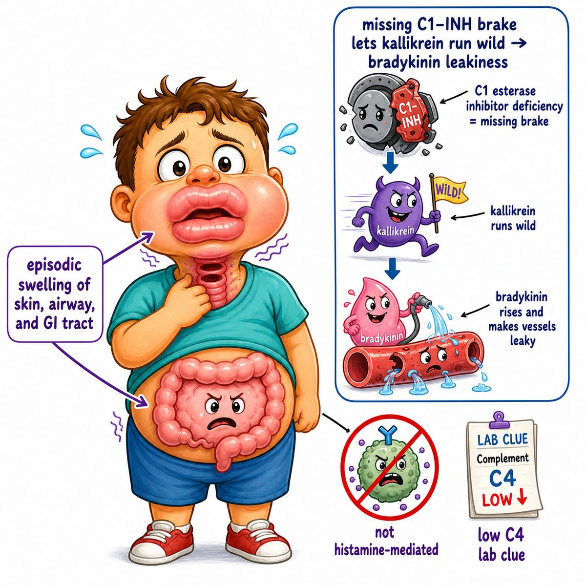

# Hereditary angioedema

Hereditary angioedema is an autosomal dominant disease where patients get recurrent episodes of deep swelling.

Autosomal dominant means one mutated copy of the gene can cause disease.

The classic defect is low or dysfunctional C1 esterase inhibitor, also called C1-INH (C1 esterase inhibitor).

---

### Core idea

C1-INH normally acts like a brake on bradykinin production.

Bradykinin is a peptide that makes blood vessels leaky.

So if C1-INH is missing or broken:

* less brake
* more bradykinin
* more vascular leak
* swelling of skin, gut, or airway

---

### What swells

Common sites:

* lips/face
* hands/feet
* GI tract (gastrointestinal tract)
* larynx (voice box/upper airway)

GI swelling can cause severe crampy abdominal pain because the bowel wall becomes edematous.

Laryngeal swelling is dangerous because it can obstruct the airway.

---

### Why this is not a typical allergy

This is bradykinin-mediated, not histamine-mediated.

That means it usually has:

* no urticaria (hives)
* poor response to antihistamines
* poor response to epinephrine
* poor response to steroids

Intuition:

Allergic angioedema is like mast cells dumping histamine.

Hereditary angioedema is like the bradykinin leak pathway getting stuck on.

---

### Labs

Typical Step 1 pattern:

* low C4 (complement component 4)
* low C1-INH level in type I
* normal level but low function of C1-INH in type II

C4 is low because uncontrolled complement pathway activation consumes it.

---

### Treatment idea

Acute attacks can be treated with:

* C1-INH replacement
* icatibant, a bradykinin B2 receptor blocker
* ecallantide, a kallikrein inhibitor

Kallikrein is an enzyme that helps generate bradykinin, so blocking kallikrein lowers bradykinin production.

---

## One-line intuition

Hereditary angioedema = missing C1-INH brake causes excess bradykinin, making vessels leaky and causing episodic deep swelling without hives.

---

## HY pearl

ACE inhibitors (angiotensin-converting enzyme inhibitors) can worsen or trigger angioedema because ACE normally breaks down bradykinin.