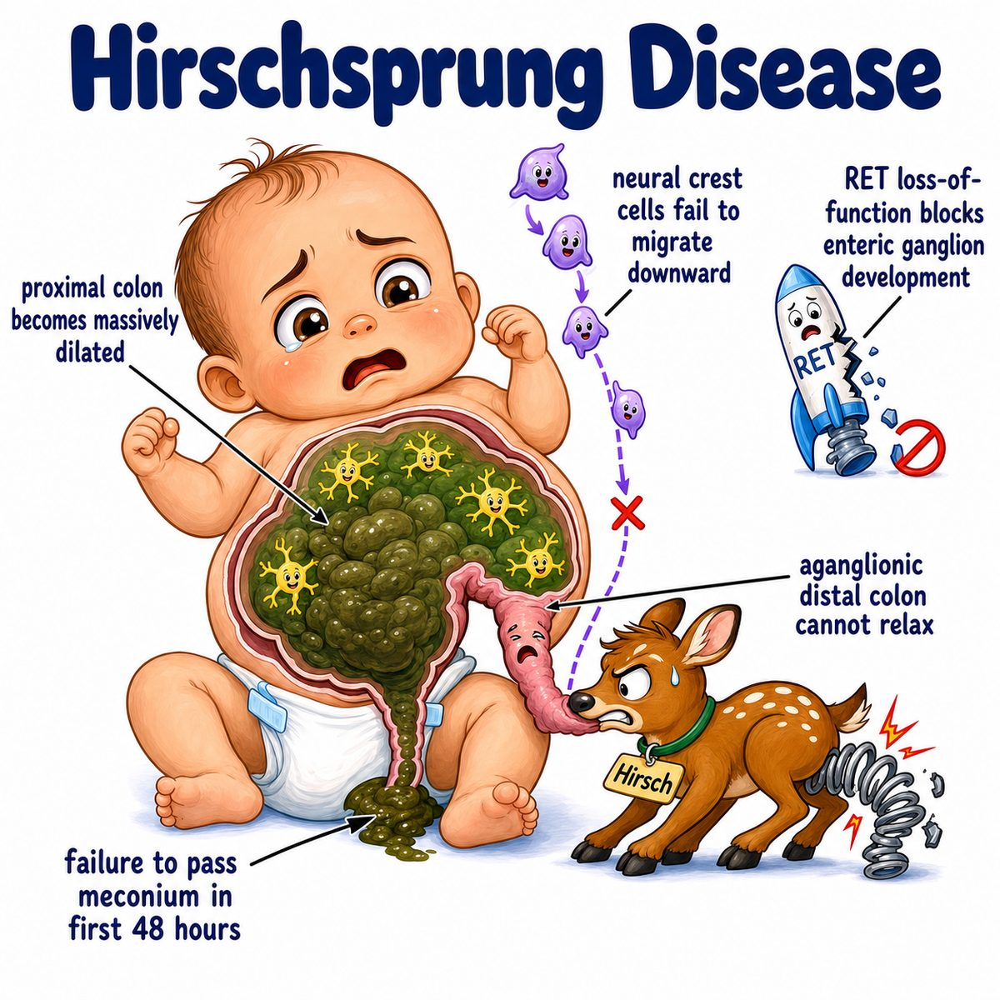

# Hirschsprung disease

Hirschsprung disease is congenital aganglionic megacolon.

Break that down:

* congenital = present at birth
* aganglionic = no ganglion cells
* megacolon = enlarged colon

The core problem is failure of neural crest cells to migrate into the distal colon.

Neural crest cells normally form:

* Meissner plexus (submucosal nerve plexus)
* Auerbach plexus (myenteric nerve plexus)

These plexuses help the bowel relax and move stool forward.

---

### Why constipation happens

The aganglionic segment cannot relax.

So that distal bowel becomes:

* narrow
* spastic
* functionally obstructed

Then stool backs up behind it, causing dilation of the normal proximal colon.

That is why the disease is called megacolon: the big colon is actually upstream from the tight, nerve-less segment.

---

### Classic presentation

Think newborn who has:

* failure to pass meconium within 48 hours
* abdominal distension
* bilious vomiting
* chronic constipation later if milder

Meconium = the first newborn stool.

---

### Diagnosis

Gold standard is rectal biopsy.

Biopsy shows:

* absent ganglion cells
* hypertrophied nerve trunks
* increased AChE (acetylcholinesterase) staining

Contrast enema may show a transition zone:

* distal narrow segment
* proximal dilated colon

---

## One-line intuition

The distal colon has no enteric nerves, so it stays clamped shut, and stool piles up behind it.

---

## Pearl

Hirschsprung disease is associated with Down syndrome, and the classic Step 1 clue is failure to pass meconium in the first 48 hours of life.