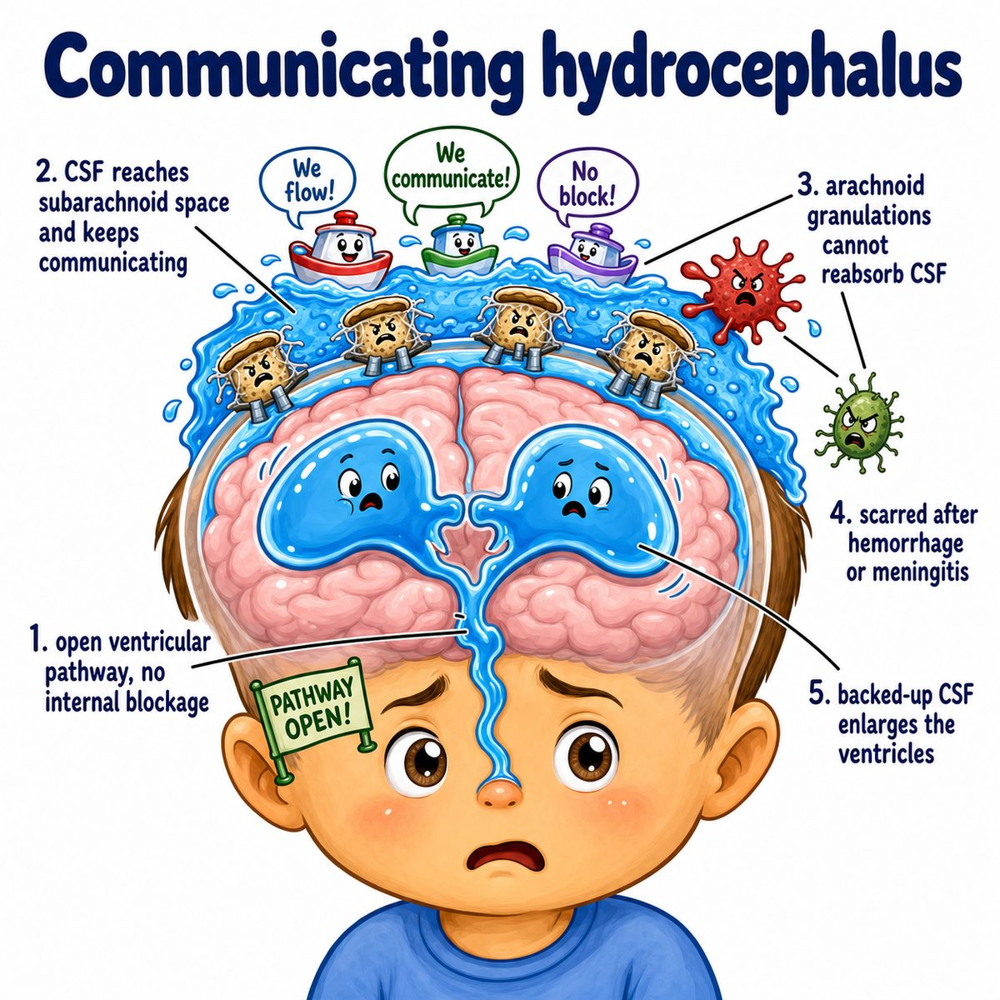
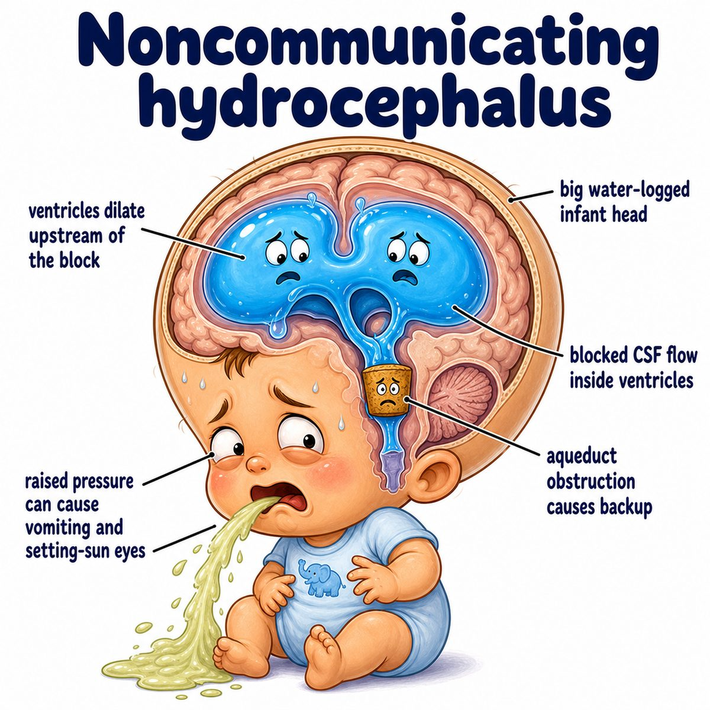

# Hydrocephalus

Hydrocephalus means too much CSF (cerebrospinal fluid) building up in the ventricles (fluid-filled spaces inside the brain).

Break the word apart:

* hydro = water/fluid
* cephalus = head

So literally:

> fluid in the head.

But more specifically, it is CSF accumulating in the brain ventricles.

---

### Core idea

Normally CSF is:

* made by the choroid plexus (CSF-producing tissue inside ventricles)
* flows through the ventricles
* exits around the brain/spinal cord
* gets reabsorbed into venous blood

Hydrocephalus happens when:

* too much CSF is made
* CSF flow is blocked
* CSF is not absorbed well

The ventricles expand because fluid is trapped inside them.

---

### Why the symptoms happen

The skull is a closed box.

So if CSF increases, it pushes on brain tissue and raises ICP (intracranial pressure, pressure inside the skull).

That causes:

* headache
* vomiting
* papilledema (optic disc swelling from increased ICP)
* altered mental status
* enlarged head in infants because skull sutures are not fused yet

---

### Types

**Noncommunicating hydrocephalus** = obstructive hydrocephalus.

There is a blockage inside the ventricular pathway.

Classic cause:

* aqueductal stenosis (narrowing of the cerebral aqueduct between the 3rd and 4th ventricles)

Intuition:

> CSF cannot get past the blocked pipe, so ventricles before the blockage enlarge.

**Communicating hydrocephalus** = ventricles still communicate with each other, but CSF cannot be absorbed well after it exits.

Classically due to:

* subarachnoid hemorrhage (bleeding into the subarachnoid space)
* meningitis (infection/inflammation of meninges)

Why?

Blood or inflammation can scar arachnoid granulations (structures that reabsorb CSF into venous blood).

---

### Normal pressure hydrocephalus

Normal pressure hydrocephalus is usually in older adults.

Classic triad:

* gait disturbance
* urinary incontinence
* dementia/cognitive decline

Mnemonic:

> wet, wobbly, wacky

Even though it says "normal pressure," the ventricles are enlarged and stretch nearby brain fibers.

---

## One-line intuition

Hydrocephalus is a plumbing problem: CSF builds up, ventricles dilate, and the brain gets compressed.

---

## Pearl 🔥

For Step 1, aqueductal stenosis is a classic cause of noncommunicating hydrocephalus, and it causes dilation of the lateral ventricles + 3rd ventricle, but not the 4th ventricle.