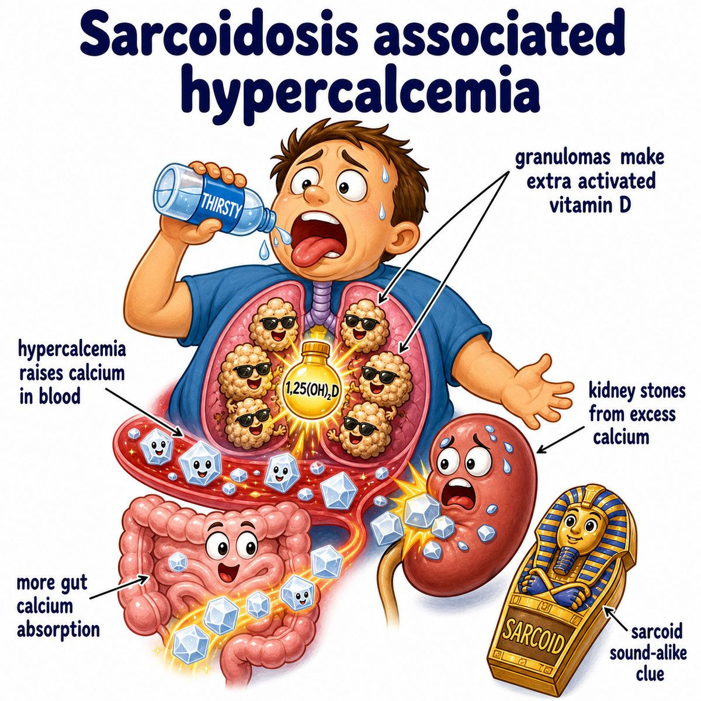

# Hypercalcemia

Hypercalcemia = high calcium in the blood.

Usually this means serum calcium is above about:

* 10.5 mg/dL total calcium
* or elevated ionized calcium, which is the active free Ca2+ form

---

### Core idea

Too much calcium makes the body “slow and dry.”

Classic symptoms:

* **stones** = kidney stones
* **bones** = bone pain from bone resorption
* **groans** = abdominal pain, constipation, nausea
* **psychiatric overtones** = confusion, fatigue, depression

---

### Why the findings happen

* **Kidney stones:** extra Ca2+ gets filtered into urine and can precipitate into stones
* **Polyuria/polydipsia:** high Ca2+ impairs kidney concentrating ability, so patients pee more and get dehydrated
* **Constipation:** high Ca2+ decreases smooth muscle excitability in the gut
* **Weakness/fatigue/confusion:** neurons and muscles become less excitable
* **Bone pain:** if PTH (parathyroid hormone) is high, osteoclast activity increases and calcium leaves bone

PTH = parathyroid hormone, the hormone that raises blood calcium.

---

### Most important causes

Think:

* **primary hyperparathyroidism**
* **malignancy**

These are the big two.

Primary hyperparathyroidism usually has:

* high calcium
* high PTH
* low phosphate

Malignancy-related hypercalcemia often has:

* high calcium
* low PTH
* high PTHrP sometimes

PTHrP = parathyroid hormone-related peptide, a tumor-made protein that acts like PTH.

---

### ECG finding

Hypercalcemia causes:

* **shortened QT interval**

Why?

Calcium helps drive the plateau phase of the cardiac action potential. When extracellular Ca2+ is high, ventricular repolarization happens faster overall, so the ST segment shortens and the QT interval becomes short.

---

## One-line intuition

Hypercalcemia is too much Ca2+ in blood, making muscles/gut/brain sluggish, kidneys waste water, stones form, and the ECG QT interval get short.

---

## Pearl 🔥

For Step 1, if calcium is high, first look at **PTH (parathyroid hormone)**:

* high PTH = primary hyperparathyroidism
* low PTH = malignancy or another non-parathyroid cause