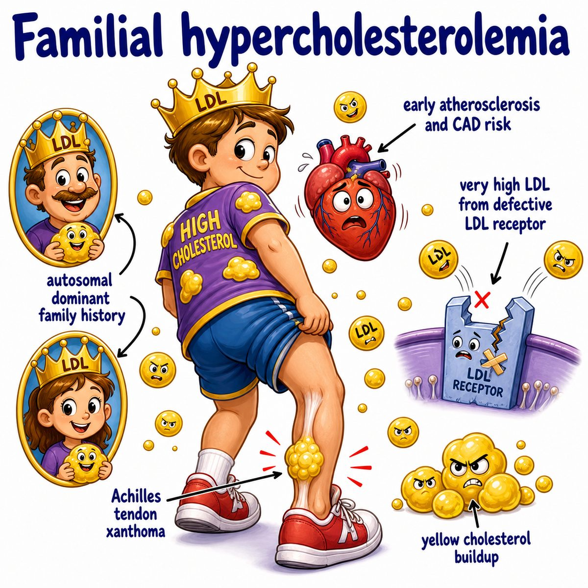

# Hypercholesterolemia

Hypercholesterolemia = high cholesterol in the blood.

Break it down:

* hyper- = high
* cholesterol = waxy lipid (fat-like molecule)
* -emia = in the blood

So literally:

> too much cholesterol in the blood.

---

### Core idea

The main dangerous part is usually high LDL (low-density lipoprotein), aka "bad cholesterol."

LDL (low-density lipoprotein) carries cholesterol from the liver into tissues/blood vessels.

If LDL (low-density lipoprotein) is too high, it can deposit cholesterol into artery walls.

That leads to:

* atherosclerosis (plaque buildup in arteries)
* coronary artery disease (narrowing of heart arteries)
* myocardial infarction (heart attack)
* stroke

---

### Why plaques form

LDL (low-density lipoprotein) gets into damaged artery lining.

Macrophages (immune cells that eat debris) ingest the oxidized LDL (low-density lipoprotein).

Those macrophages become foam cells (fat-filled macrophages).

Foam cells accumulate and form fatty streaks, which can progress into atherosclerotic plaques.

So the intuition is:

> high LDL (low-density lipoprotein) gives arteries more cholesterol burden, and immune cleanup cells become fat-loaded plaque builders.

---

### Familial hypercholesterolemia

Familial hypercholesterolemia = inherited high cholesterol.

Classically caused by defective LDL receptors (low-density lipoprotein receptors).

LDL receptors (low-density lipoprotein receptors) normally clear LDL (low-density lipoprotein) from blood by bringing it into cells, especially liver cells.

If the receptor is defective:

* less LDL (low-density lipoprotein) is cleared
* blood LDL (low-density lipoprotein) rises
* atherosclerosis happens early

This is usually autosomal dominant (one mutated copy is enough to cause disease).

---

### Classic findings

High cholesterol can cause:

* xanthomas (yellow cholesterol deposits in skin/tendons)
* xanthelasma (yellow cholesterol deposits on eyelids)
* corneal arcus (cholesterol ring around the cornea)
* premature myocardial infarction (early heart attack), especially in familial hypercholesterolemia

---

### Treatment intuition

Statins inhibit HMG-CoA reductase (3-hydroxy-3-methylglutaryl coenzyme A reductase), the rate-limiting enzyme in cholesterol synthesis.

Less liver cholesterol makes the liver upregulate LDL receptors (low-density lipoprotein receptors).

More LDL receptors (low-density lipoprotein receptors) means more LDL (low-density lipoprotein) gets pulled out of blood.

So:

> statins lower cholesterol synthesis, but their big blood effect is increasing LDL (low-density lipoprotein) clearance.

---

## One-line intuition

Hypercholesterolemia means too much blood cholesterol, especially LDL (low-density lipoprotein), which gets trapped in artery walls and drives atherosclerotic plaque formation.

---

## HY pearl

Familial hypercholesterolemia is most commonly due to LDL receptor (low-density lipoprotein receptor) defects and causes high LDL (low-density lipoprotein), tendon xanthomas, and early coronary artery disease.