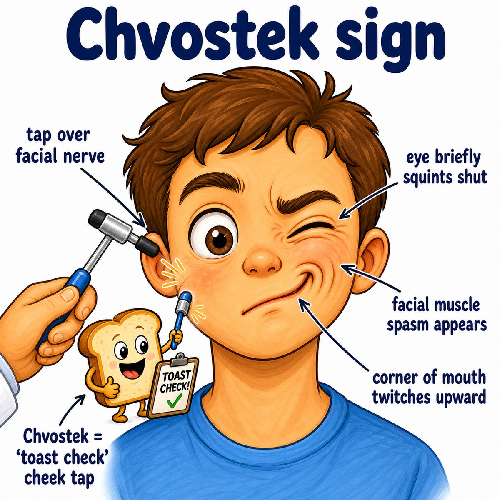
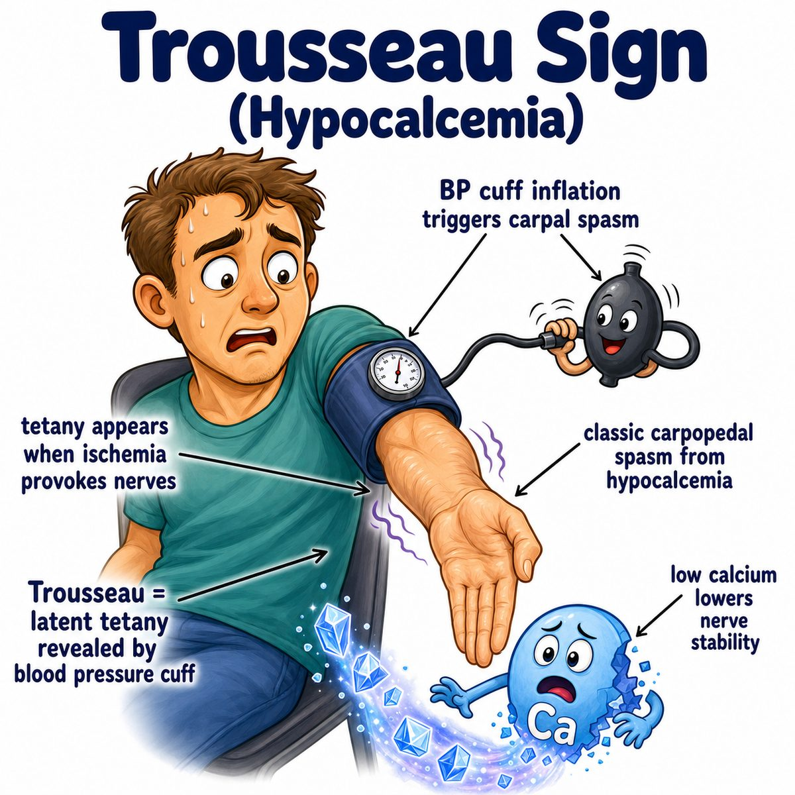

# Hypocalcemia

### Core idea

Hypocalcemia = low blood calcium.

Calcium helps stabilize nerve and muscle membranes, so when calcium is low, nerves fire too easily.

That causes:

* tingling around mouth/fingers
* muscle cramps
* tetany (sustained muscle contraction)
* seizures
* QT prolongation on ECG (electrocardiogram)

---

### Why low calcium causes twitching/spasm

Normally, extracellular calcium helps keep sodium channels harder to open.

If calcium is low:

* sodium channels open more easily
* nerves become hyperexcitable
* muscles contract too easily

So the intuition is:

> low calcium = unstable nerves = twitching, spasms, tetany.

---

### Classic exam signs

**Chvostek sign:** tapping the facial nerve causes facial twitching.

**Trousseau sign:** inflating a BP (blood pressure) cuff causes carpopedal spasm, meaning hand/wrist spasm.

Trousseau is more specific for hypocalcemia.

---

### Why QT gets prolonged

Hypocalcemia prolongs phase 2 of the cardiac action potential.

Phase 2 = plateau phase, where calcium enters cardiac cells.

So low calcium makes the plateau last longer, which shows up as:

* prolonged ST segment
* prolonged QT interval

QT interval = ventricular depolarization + repolarization time.

---

### Common causes

Think: low PTH (parathyroid hormone), low vitamin D, or calcium getting trapped/bound.

High-yield causes:

* post-thyroidectomy hypoparathyroidism
* vitamin D deficiency
* chronic kidney disease
* hypomagnesemia (low magnesium)
* acute pancreatitis
* massive blood transfusion due to citrate binding calcium
* respiratory alkalosis, which lowers ionized calcium

Ionized calcium = the free, active calcium in blood.

---

## One-line intuition

Hypocalcemia makes nerves and muscles too excitable, so you get tingling, spasms/tetany, seizures, and prolonged QT.

---

## Pearl 🔥

After thyroid surgery, new tingling or muscle cramps should make you think hypocalcemia from accidental parathyroid gland damage/removal.