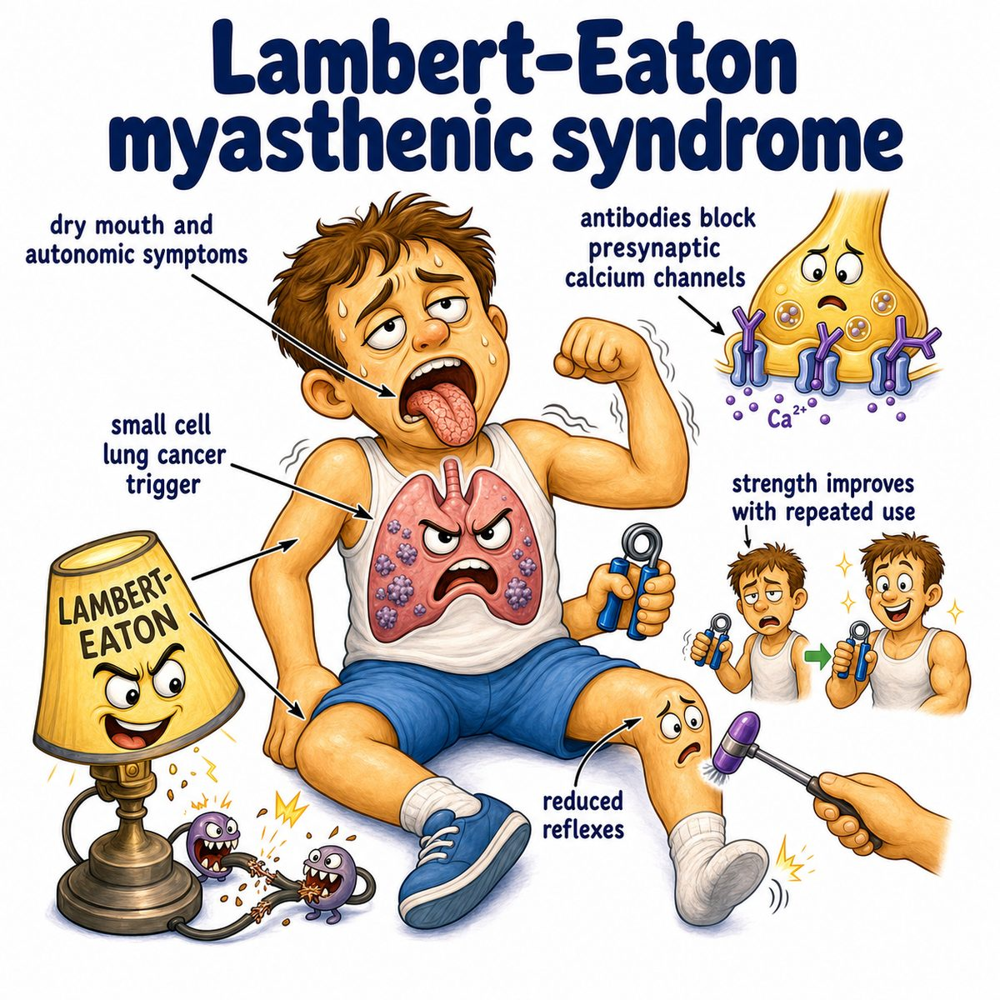

# Lambert-Eaton myasthenic syndrome

### Core idea

Lambert-Eaton myasthenic syndrome, or LEMS (Lambert-Eaton myasthenic syndrome), is an autoimmune disease of the presynaptic neuromuscular junction.

Presynaptic = nerve side.

The immune system attacks P/Q-type VGCCs (voltage-gated calcium channels) on the motor nerve terminal.

---

### Why weakness happens

Normally:

* nerve signal reaches the nerve terminal
* calcium enters through VGCCs (voltage-gated calcium channels)
* calcium triggers ACh (acetylcholine) release
* ACh binds muscle receptors
* muscle contracts

In LEMS:

* antibodies block presynaptic calcium channels
* less calcium enters the nerve terminal
* less ACh (acetylcholine) gets released
* muscle contraction is weak

So the problem is:

> nerve wants to talk to muscle, but cannot release enough ACh.

---

### Classic findings

LEMS causes:

* proximal muscle weakness, especially hips/thighs
* decreased reflexes
* autonomic symptoms, like dry mouth, constipation, erectile dysfunction

Autonomic = involuntary body functions controlled by nerves, like sweating, saliva, gut motility, and blood pressure.

---

### Why strength improves with repeated use

This is the key intuition.

With repeated muscle use:

* calcium slowly builds up inside the presynaptic nerve terminal
* even though calcium channels are blocked, the extra accumulated calcium helps release more ACh
* strength and reflexes can temporarily improve

That is why LEMS gets better with use.

This is opposite-ish of MG (myasthenia gravis), where weakness typically worsens with repeated use because the postsynaptic ACh receptors are the problem.

Postsynaptic = muscle side.

---

### Cancer association

LEMS is classically paraneoplastic.

Paraneoplastic = symptoms caused by an immune response to cancer, not by direct tumor invasion.

Most important association:

* SCLC (small cell lung carcinoma)

Reason:

* SCLC can express calcium-channel-like antigens
* immune system attacks the tumor
* antibodies cross-react with presynaptic VGCCs (voltage-gated calcium channels)

---

### Testing clue

On EMG (electromyography), repeated stimulation or brief exercise can cause an incremental response.

Incremental response = muscle electrical signal gets bigger after repeated stimulation.

Why?

* repeated stimulation builds up calcium
* more ACh is released
* muscle response improves

---

## One-line intuition

LEMS is a presynaptic calcium-channel problem: too little calcium enters, so too little ACh is released, causing proximal weakness that improves with repeated use.

---

## Pearl 🔥

LEMS = presynaptic VGCC (voltage-gated calcium channel) antibodies + SCLC (small cell lung carcinoma) association + strength improves with use.