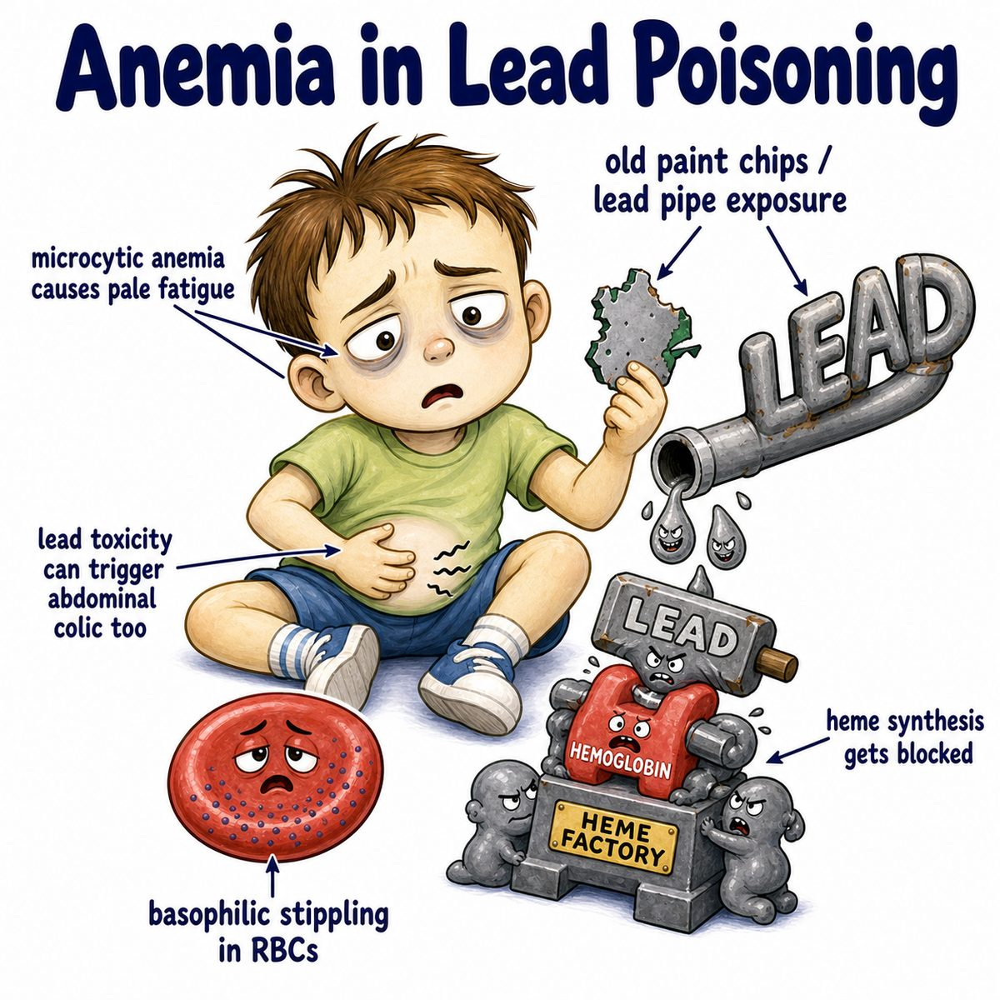
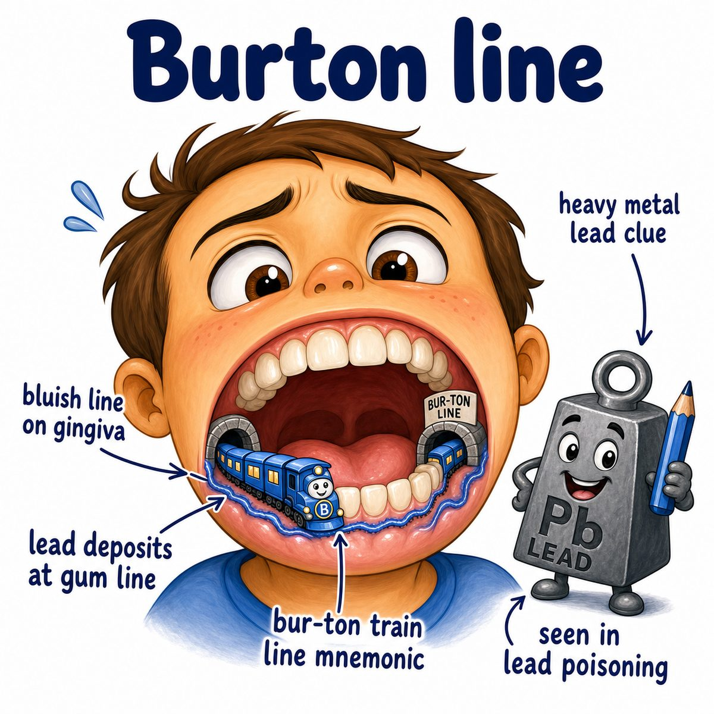
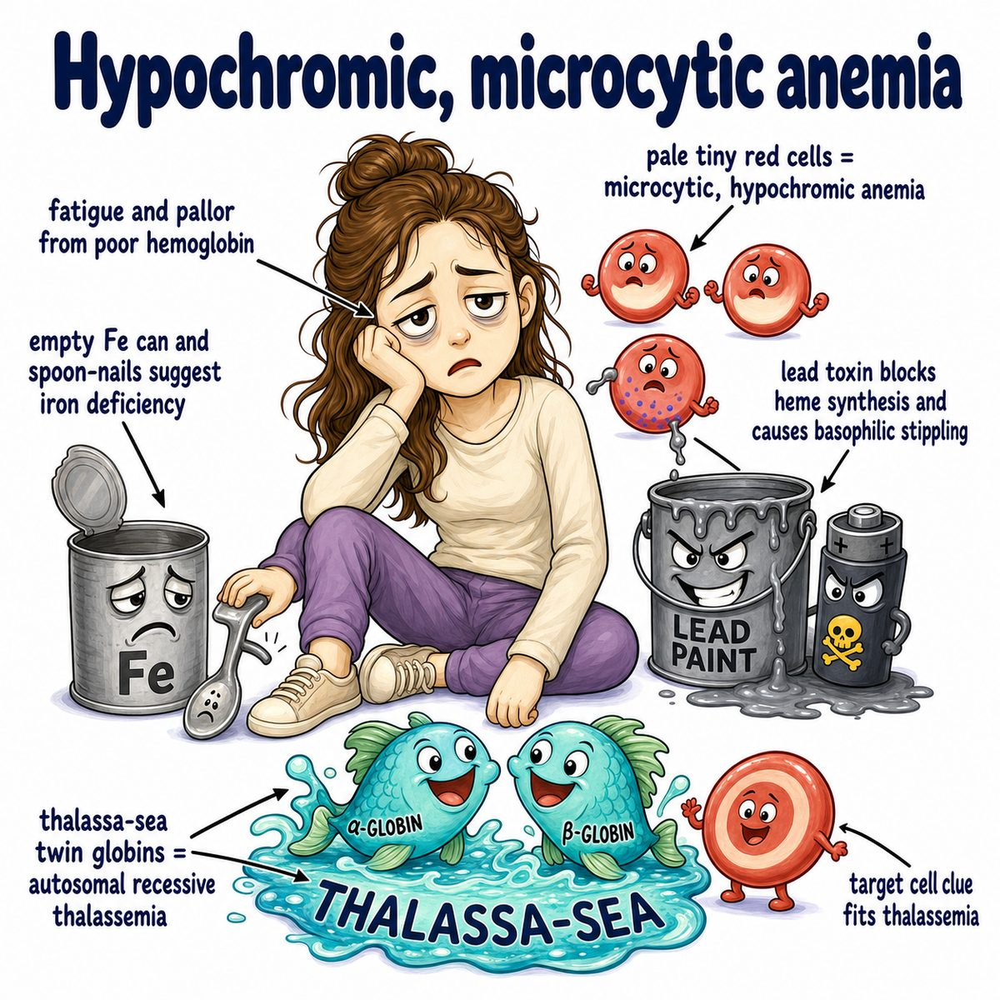

# Lead poisoning

Lead poisoning is toxicity from excess lead, especially in:

* kids exposed to old paint/dust
* contaminated water
* occupational exposure
* retained bullets
* imported cosmetics, ceramics, or herbal products

Core idea:

Lead blocks heme synthesis.

Heme = the iron-containing part of hemoglobin that helps red blood cells carry oxygen.

---

### What enzymes does lead inhibit?

Lead inhibits:

* ALA dehydratase
* ferrochelatase

ALA (aminolevulinic acid) dehydratase normally helps convert ALA into porphobilinogen.

Ferrochelatase normally puts iron into protoporphyrin to make heme.

So if lead blocks these enzymes:

* less heme is made
* hemoglobin production falls
* red blood cells become microcytic

Microcytic = small red blood cells.

---

### Why basophilic stippling happens

Basophilic stippling = blue dots inside red blood cells from leftover ribosomal RNA.

RNA (ribonucleic acid) should normally be cleaned up as red blood cells mature.

Lead messes with that cleanup, so the RNA clumps stay visible as little blue granules.

So the smear clue is:

* microcytic anemia
* basophilic stippling

---

### Classic symptoms

Think of lead as damaging:

* blood
* brain
* belly
* kidneys
* nerves

Findings:

* abdominal pain
* constipation
* developmental delay or learning problems in kids
* irritability
* seizures/encephalopathy in severe cases
* wrist drop from radial nerve palsy in adults
* Burton lines, which are blue-black gum lines
* proximal renal tubular dysfunction

Encephalopathy = brain dysfunction.

Radial nerve palsy = weakness of wrist/finger extension.

---

### X-ray clue

In children, lead can show dense metaphyseal lines.

Metaphysis = the growing region near the end of long bones.

Why?

Lead deposits near growing bone, so you see bright dense bands near the growth plates.

---

## One-line intuition

Lead poisons heme-making enzymes and the nervous system, giving microcytic anemia with basophilic stippling plus neuro/GI symptoms.

GI = gastrointestinal.

---

## Pearl 🔥

Lead poisoning causes increased free erythrocyte protoporphyrin because ferrochelatase is blocked, so protoporphyrin cannot combine with iron to become heme.

Erythrocyte = red blood cell.