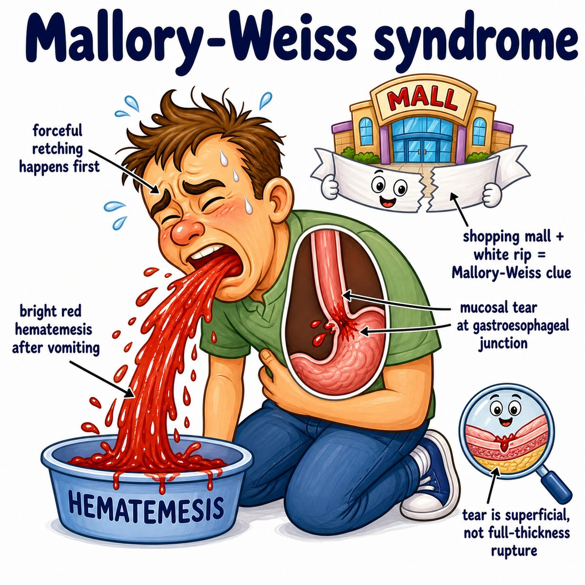

# Mallory-Weiss syndrome

### Core idea

Mallory-Weiss syndrome is a **mucosal tear** at the gastroesophageal junction, meaning the inner lining tears where the esophagus meets the stomach.

Classic story:

* repeated vomiting/retching
* then hematemesis (vomiting blood)

---

### Why vomiting causes it

Forceful retching suddenly increases pressure inside the stomach.

That pressure pulls/stretches the junction between:

* esophagus
* stomach

So the mucosa (inner lining) splits longitudinally, causing bleeding.

---

### Key distinction

Mallory-Weiss syndrome:

* partial-thickness mucosal tear
* bleeding is the main issue

Boerhaave syndrome:

* full-thickness esophageal rupture
* severe chest pain, mediastinitis (inflammation/infection in the mediastinum, the central chest space)

---

## One-line intuition

Mallory-Weiss = vomiting tears the inner lining near the stomach, so the patient vomits blood.

---

## HY pearl

Mallory-Weiss tears usually heal on their own, but active bleeding can be treated with upper endoscopy (camera procedure through the mouth to view/treat the upper gastrointestinal tract).