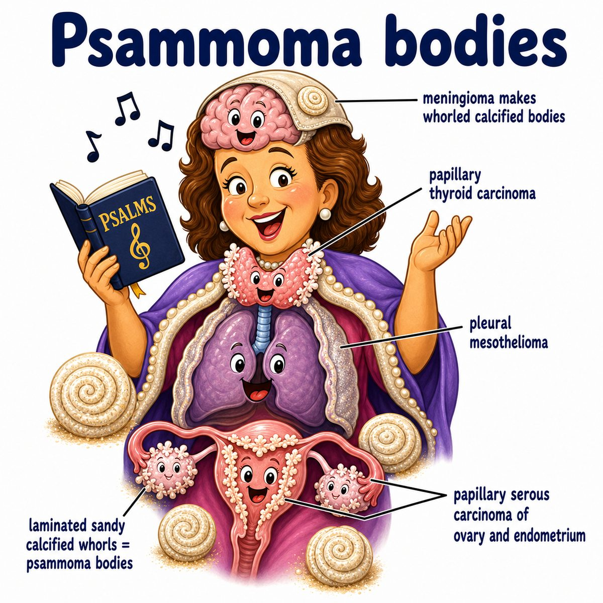

# Mesothelioma

### Core idea

Mesothelioma is a malignant cancer of mesothelial cells.

Mesothelium = thin slippery lining around organs.

Most commonly it affects the:

* pleura (lining around the lungs)

But it can also affect:

* peritoneum (lining of the abdominal cavity)
* pericardium (lining around the heart)
* tunica vaginalis (lining around the testis)

---

### Biggest association

Classic cause:

* asbestos exposure

Asbestos fibers get inhaled and can lodge near the pleura.

Over years, they cause chronic irritation, inflammation, DNA damage, and eventually malignant transformation.

That is why mesothelioma usually has a long latency period:

* often decades after exposure

---

### What happens in the pleura

Pleural mesothelioma grows along the pleural surface and can form a thick tumor rind around the lung.

This can cause:

* pleural thickening
* pleural effusion (fluid in the pleural space)
* dyspnea (shortness of breath)
* chest pain
* cough

Reasoning:

If the pleura becomes thick and stiff, the lung cannot expand well.

So the patient feels short of breath even if the airways themselves are not the main problem.

---

### Key Step 1 association

Asbestos exposure is associated with:

* mesothelioma
* bronchogenic carcinoma (lung cancer)
* pleural plaques
* asbestosis (interstitial lung fibrosis from asbestos)

Important distinction:

Smoking greatly increases the risk of bronchogenic carcinoma in asbestos-exposed patients.

But smoking does **not** strongly increase mesothelioma risk.

---

## One-line intuition

Mesothelioma = asbestos-associated cancer of the organ lining, especially the pleura around the lungs.

---

## Pearl 🔥

Mesothelioma is linked to asbestos exposure, but bronchogenic carcinoma is still the most common cancer caused by asbestos.