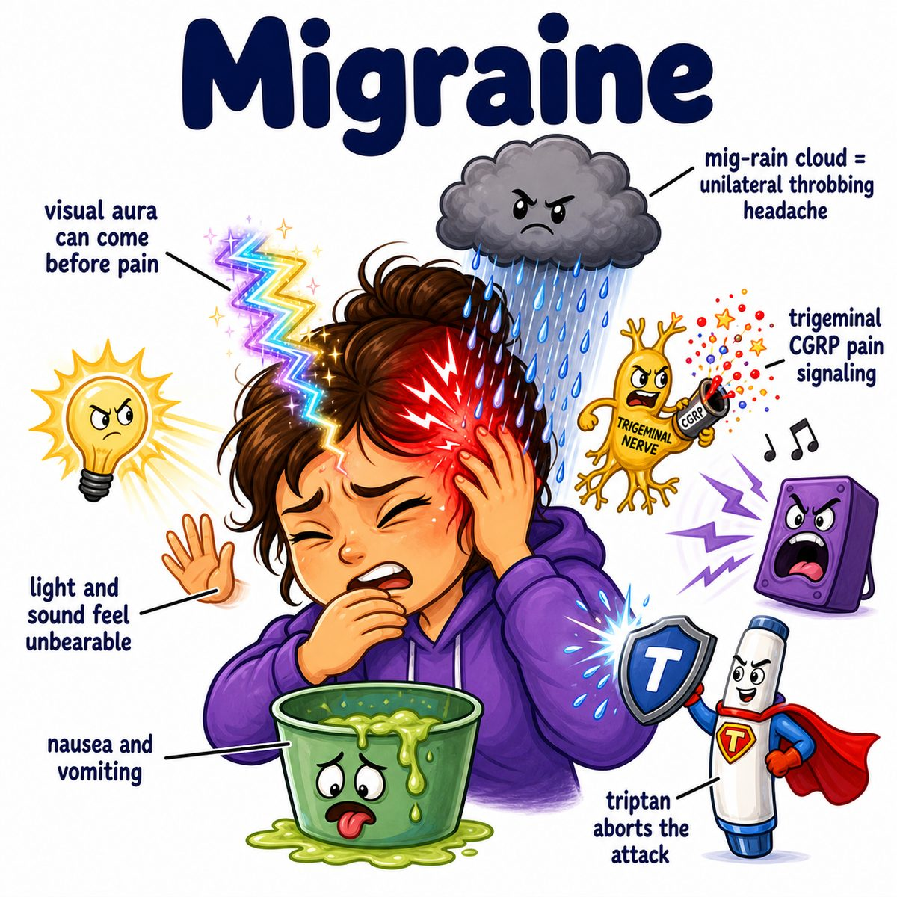

# Migraine

Migraine is a recurrent neurologic headache disorder.

Classic features:

* unilateral head pain
* pulsating/throbbing quality
* nausea/vomiting
* photophobia (light sensitivity)
* phonophobia (sound sensitivity)
* worse with activity

Some patients get an aura, meaning a temporary neurologic symptom before or during the headache.

Common aura symptoms:

* flashing lights
* zig-zag lines
* blind spots
* tingling/numbness
* speech difficulty

---

### Core idea

Migraine is not just “blood vessel dilation.”

It is mainly abnormal brain excitability + trigeminovascular activation.

Trigeminovascular means:

* trigeminal nerve = CN V (cranial nerve 5), major face/head pain nerve
* vascular = blood vessels

So migraine pain comes from irritation of pain fibers around brain blood vessels and meninges (brain coverings).

---

### Why the symptoms happen

* **Throbbing head pain:** trigeminal pain fibers get activated around meningeal vessels
* **Nausea/vomiting:** brainstem/autonomic pathways are activated
* **Photophobia/phonophobia:** sensory processing becomes hypersensitive
* **Aura:** cortical spreading depression, a slow wave of abnormal electrical activity across cortex

Cortical spreading depression means:

* cortical = brain cortex
* spreading = moves across brain tissue
* depression = temporary decreased neuronal activity after excitation

This wave especially affects the visual cortex, so visual aura is common.

---

### Important trigger connection

Common triggers include:

* sleep changes
* stress
* fasting
* alcohol
* menstruation
* certain foods

These do not “cause” migraine by themselves.

They lower the threshold in someone whose brain is already migraine-prone.

---

## One-line intuition

Migraine is a hypersensitive brain attack where trigeminal pain pathways turn on, causing throbbing head pain plus sensory overload.

---

## Pearl 🔥

Triptans treat acute migraine by activating 5-HT1B/1D receptors (serotonin 1B/1D receptors), which decreases CGRP (calcitonin gene-related peptide) release from trigeminal neurons.