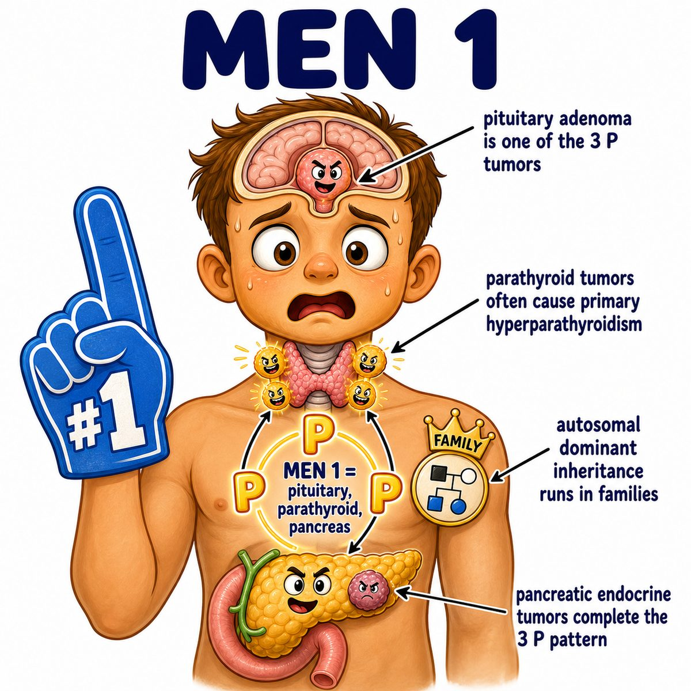

# Multiple endocrine neoplasia type 1

### Core idea

Multiple endocrine neoplasia type 1, or MEN1 (multiple endocrine neoplasia type 1), is an autosomal dominant (one mutated copy is enough) tumor syndrome.

It causes tumors in the classic **3 P's**:

* **Parathyroid**
* **Pancreas**
* **Pituitary**

Think:

> MEN1 = 3 P's.

---

### What gene is mutated?

MEN1 is due to mutation of the **MEN1 gene**, which codes for **menin**.

Menin is a tumor suppressor protein (a protein that normally slows uncontrolled cell growth).

So if menin is lost:

* cells lose a growth brake
* endocrine glands are more likely to form tumors
* multiple glands can be affected at the same time

---

### Main findings

**Parathyroid tumors** are usually the most common.

They cause primary hyperparathyroidism (too much parathyroid hormone, or PTH), leading to:

* hypercalcemia (high calcium)
* kidney stones
* bone pain
* constipation/abdominal pain
* psychiatric symptoms

Why?

PTH increases serum calcium by pulling calcium from bone, increasing kidney calcium reabsorption, and increasing vitamin D activation.

---

### Pancreatic tumors

Pancreatic endocrine tumors can make hormones like:

* gastrin
* insulin
* glucagon
* vasoactive intestinal peptide, or VIP

High-yield one:

* **gastrinoma** = too much gastrin
* too much gastrin = too much stomach acid
* too much stomach acid = recurrent peptic ulcers

This is called Zollinger-Ellison syndrome (gastrinoma causing severe acid hypersecretion and ulcers).

---

### Pituitary tumors

Pituitary adenomas (benign pituitary gland tumors) can secrete hormones.

Common one:

* prolactinoma (prolactin-secreting pituitary tumor)

High prolactin can cause:

* galactorrhea (milk production not due to breastfeeding)
* amenorrhea (absent menstrual periods)
* infertility
* low libido

Why?

High prolactin suppresses GnRH (gonadotropin-releasing hormone), which lowers LH (luteinizing hormone) and FSH (follicle-stimulating hormone).

---

## One-line intuition

MEN1 is a broken tumor suppressor syndrome where endocrine glands, especially the **parathyroid, pancreas, and pituitary**, grow tumors.

---

## Pearl 🔥

MEN1 = **3 P's**:

* Parathyroid hyperplasia/adenoma
* Pancreatic endocrine tumors
* Pituitary adenoma

Do not confuse with MEN2 (multiple endocrine neoplasia type 2), which is associated with **RET** mutation and medullary thyroid carcinoma.