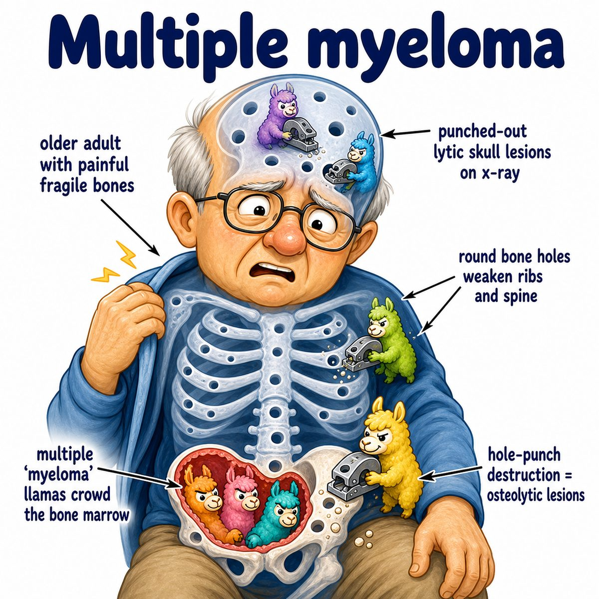
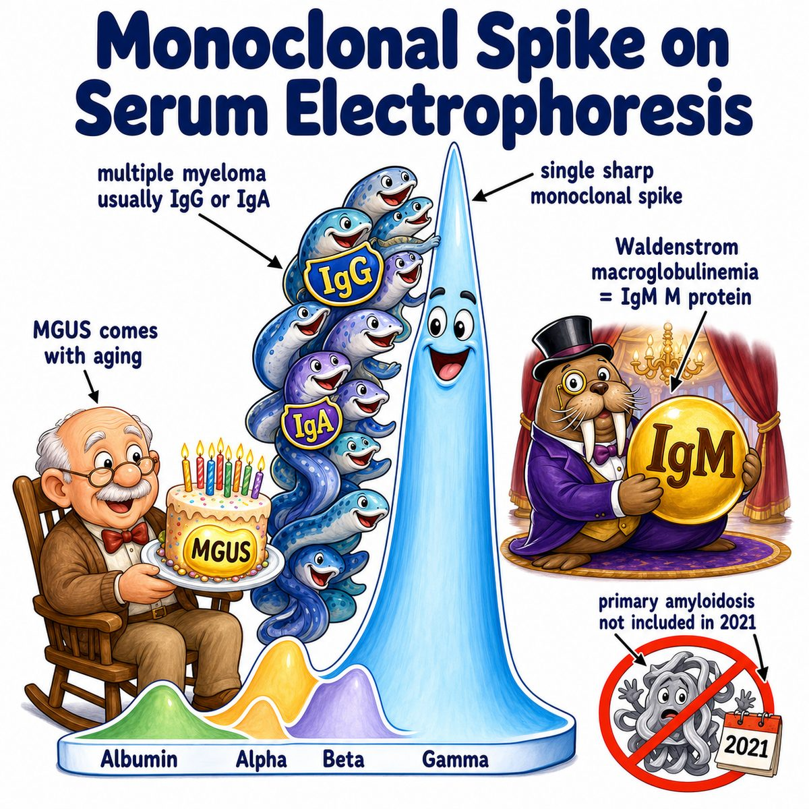
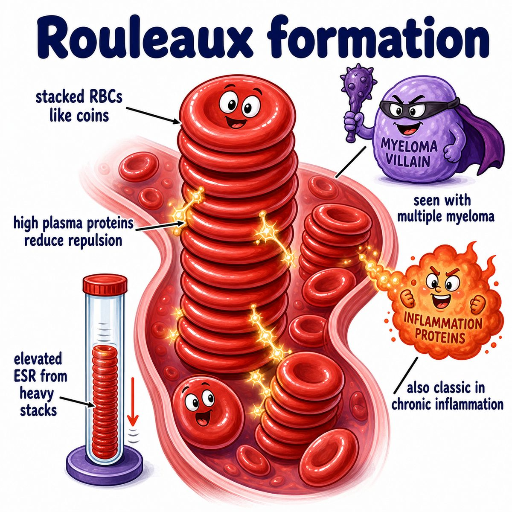

# Multiple myeloma

Multiple myeloma is a cancer of plasma cells.

Plasma cells are mature B cells that normally make antibodies.

So in multiple myeloma:

* one abnormal plasma cell clone grows too much
* it makes a ton of one identical antibody
* that identical antibody is called M protein

M protein = monoclonal protein, meaning protein made from one clone.

---

### Core idea

Think:

> plasma cell cancer living in bone marrow.

Because it lives in bone marrow, it causes problems with:

* bones
* blood cell production
* kidneys
* calcium

Classic findings are remembered with CRAB:

* **C = hyperCalcemia**: high calcium in blood
* **R = Renal failure**: kidney damage
* **A = Anemia**: low red blood cells
* **B = Bone lesions**: punched-out lytic bone lesions

---

### Why the findings happen

**Bone pain / punched-out bone lesions**

Myeloma cells activate osteoclasts.

Osteoclasts are cells that break down bone.

So bone gets eaten away, causing:

* bone pain
* fractures
* punched-out lytic lesions on x-ray

Lytic means bone is being destroyed.

---

**Hypercalcemia**

If bone is broken down, calcium leaves bone and enters blood.

That causes hypercalcemia, which can cause:

* constipation
* confusion
* kidney stones
* abdominal pain

---

**Anemia**

The bone marrow gets crowded by malignant plasma cells.

So there is less room to make normal red blood cells.

That causes anemia, meaning low red blood cells.

---

**Kidney damage**

The abnormal plasma cells can make excess light chains.

Light chains are small antibody pieces.

These can spill into urine and are called Bence Jones proteins.

They damage renal tubules, meaning kidney filtering tubes.

---

### Blood smear clue

Multiple myeloma can show rouleaux formation.

Rouleaux means red blood cells stacked like coins.

Why?

Too much antibody protein in the blood makes red blood cells stick together in stacks.

---

### One-line intuition

Multiple myeloma is one plasma cell clone overgrowing in bone marrow, making too much antibody protein and destroying bone.

---

## Pearl

Multiple myeloma is associated with an M spike on serum protein electrophoresis.

Serum protein electrophoresis is a test that separates blood proteins, and the M spike represents a large amount of one monoclonal antibody.